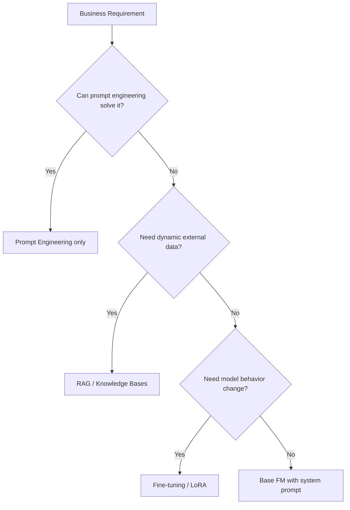

# Lecture 01 — Solution Architecture Design with FMs (Well-Architected GenAI Lens)

## Concept Overview

When building GenAI solutions on AWS, apply the **AWS Well-Architected Framework** extended by the **Generative AI Lens**. The lens adds GenAI-specific best practices on top of the six Well-Architected pillars, covering the full GenAI lifecycle: scope → model selection → customization → development → deployment → continuous improvement.

The exam tests whether you can **translate business requirements into architectural decisions** — choosing the right FM, integration pattern, and deployment strategy for a given scenario.

## Key Points

- The GenAI Lens is a **custom lens** for AWS Well-Architected Tool — download and import it from the [AWS GitHub repo](https://github.com/aws-samples/sample-well-architected-custom-lens)
- Covers **6 pillars** adapted for GenAI:

| Pillar | GenAI Focus |
|---|---|
| Operational Excellence | Output quality, traceability, lifecycle automation |
| Security | Endpoint protection, harmful output mitigation, prompt security |
| Reliability | Throughput handling, graceful degradation, artifact versioning |
| Performance Efficiency | Inference optimization, data retrieval performance |
| Cost Optimization | Model selection, inference cost balance, prompt engineering for tokens |
| Sustainability | Minimize compute for training, customization, and storage |

- **Task 1.1 skills tested:**
  - Design architectures aligned to business and technical constraints
  - Build PoCs to validate feasibility before full-scale deployment (using Amazon Bedrock)
  - Create standardized reusable components using the Well-Architected Framework

## AWS Services Involved

| Service | Role |
|---|---|
| Amazon Bedrock | Managed FM access — primary platform for GenAI solutions |
| Amazon SageMaker AI | Custom model training/deployment, Model Registry |
| Amazon Q | Business productivity GenAI applications |
| AWS Well-Architected Tool | Review workloads against GenAI Lens best practices |
| AWS Lambda | Flexible integration, dynamic model switching |
| Amazon API Gateway | API layer for FM interactions, provider switching |
| AWS AppConfig | Dynamic configuration for model routing |
| AWS Step Functions | Circuit breaker patterns, resilient orchestration |
| Amazon Bedrock Cross-Region Inference | Resilience when a model lacks regional availability |

## Architecture Decision Hierarchy

## Common Misconceptions

- **Bedrock vs SageMaker**: Bedrock = managed FM access (no infra). SageMaker = custom model lifecycle (training, hosting, registry). Use Bedrock first.
- **Skip the PoC**: The exam explicitly tests PoC before full deployment as a best practice (Skill 1.1.2).
- **GenAI Lens replaces standard framework**: It *extends* it — all six standard pillars still apply.
- **Cross-Region Inference is just for latency**: Also for **resilience** when a specific FM isn't available in your primary region.

## Exam Tips

- Task 1.1 questions are scenario-based: pick architecturally sound approaches (PoC first, right FM, correct pattern)
- Key distinction: **Bedrock** (managed FM) vs **SageMaker AI** (custom/self-managed model)
- "Standardized reusable components" = Well-Architected Framework + GenAI Lens templates
- Dynamic model switching without code changes = API Gateway + Lambda + AppConfig
- Circuit breaker pattern for FM failures = AWS Step Functions
- **RAG = change what the model knows (no retraining)**
- **Fine-tuning = change how the model behaves**

## Gotchas

- Cross-Region Inference ≠ Multi-Region deployment: Cross-Region Inference is a Bedrock feature that automatically routes to available regions for a model.
- The GenAI Lens JSON must be **imported** into Well-Architected Tool — not built-in by default.
- For the exam, PoC = specifically **Amazon Bedrock** to test FM feasibility.

## Source

- [AWS AIP-C01 Exam Guide — Domain 1](https://docs.aws.amazon.com/aws-certification/latest/ai-professional-01/ai-professional-01-domain1.html)
- [Well-Architected Generative AI Lens](https://docs.aws.amazon.com/wellarchitected/latest/generative-ai-lens/generative-ai-lens.html) (updated Nov 19, 2025)
