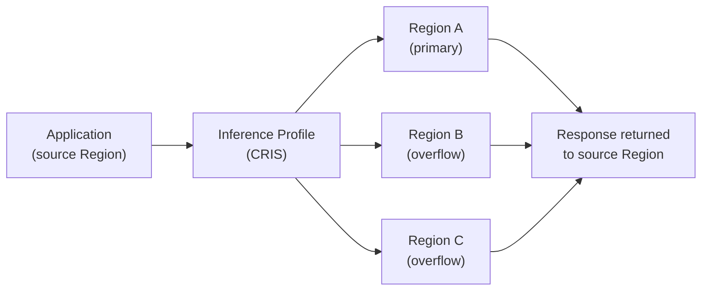
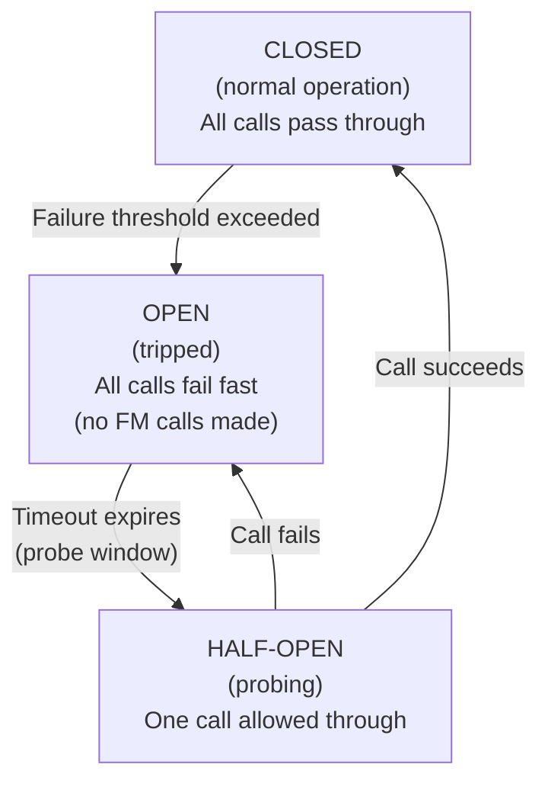

# Lecture 02 — FM Selection, Cross-Region Inference, and Circuit Breakers

## Concept Overview

Selecting the right foundation model is the first architectural decision in any GenAI solution. Once a model is chosen, you must ensure it is available, resilient, and cost-effective under production load. This lecture covers three tightly linked skills: how to pick the right FM for a task, how Cross-Region Inference extends availability and throughput, and how the circuit breaker pattern protects your application from FM failures.

---

## Part 1: Foundation Model Selection

### Dimensions to evaluate

| Dimension | What to ask |
|-----------|-------------|
| **Modality** | Text-only? Multimodal (image/video/audio input)? Image generation? Embeddings? |
| **Context window** | How many tokens does the task require? (RAG, long docs, agents) |
| **Latency** | Is this real-time / user-facing, or batch? |
| **Cost** | Cost per 1k input/output tokens; budget constraints |
| **Compliance / data residency** | Is the model available in the required region? Is it HIPAA eligible? |
| **Customizability** | Does the use case require fine-tuning? Does the model support it in Bedrock? |
| **Task benchmarks** | Which model family excels at the specific task (coding, reasoning, summarization, structured output)? |

### Model catalog in Bedrock

- Amazon Bedrock hosts models from **Amazon (Nova, Titan)**, **Anthropic (Claude)**, **Meta (Llama)**, **Mistral**, **Cohere**, **AI21**, **Stability AI**
- Access is managed per-model via **Model Access** (IAM + optional use-case form for some Anthropic models)
- Use **Model Evaluation** (built into Bedrock) to compare models on your own datasets before committing

### Key selection rule for the exam

> **Match the task to the model family's strength.** Do not default to the largest or most expensive model. The exam frequently tests whether you recognize when a smaller, cheaper model is sufficient.

### Inference modes (know all three for the exam)

| Mode | How it works | When to use |
|------|-------------|-------------|
| **On-Demand** | Pay-per-token, no pre-committed capacity | Variable/unpredictable workloads, default choice |
| **Provisioned Throughput** | Reserved model units (MUs) for dedicated capacity | Predictable, high-volume workloads; required for **custom models** |
| **Cross-Region Inference** | Routes requests across regions via inference profiles | Burst handling, resilience, global throughput |

> **Critical exam fact**: Custom and fine-tuned models **require** Provisioned Throughput — they cannot use on-demand inference.

---

## Part 2: Cross-Region Inference (CRIS)

### What it is

Cross-Region Inference lets you invoke a foundation model via an **inference profile** that routes traffic across multiple AWS Regions, rather than calling a single region directly. There are two types:

| Feature | Geographic CRIS | Global CRIS |
|---------|----------------|-------------|
| **Data boundary** | Stays within a geography (US, EU, APAC) | Any commercial AWS Region worldwide |
| **Throughput** | Higher than single-region | Highest available |
| **Cost** | Standard pricing | ~10% cheaper |
| **Best for** | Data residency / compliance requirements | Maximum performance & cost optimization |
| **SCP requirement** | Allow all destination Regions in the profile | Allow `"aws:RequestedRegion": "unspecified"` |

### How it works

### Key facts (exam-critical)

- **No additional routing cost** — priced based on the source Region you call from
- **No manual Region enablement required** — CRIS can route to Regions not manually enabled in your account
- **All data stays on the AWS network** — encrypted in transit, never on the public internet
- **CloudTrail logging** — check `additionalEventData.inferenceRegion` to see which Region actually processed the request
- **Primary use case**: handle throughput bursts and improve availability for models with **limited regional availability** (not just latency)

### Exam trap

> Cross-Region Inference is **not** the same as deploying your model to multiple regions and load balancing manually. It is a managed Bedrock feature using **inference profiles** — a specific resource type with its own ARN.

---

## Part 3: Intelligent Prompt Routing

A related but distinct feature worth knowing:

- **Intelligent Prompt Routing** (Bedrock feature): routes each prompt to the most cost-effective model in a family that can still meet quality expectations
- Currently supports **Anthropic** and **Meta** families
- Works only for **English prompts**
- Eliminates the need for custom routing logic in your application

> **CRIS vs Prompt Routing**: CRIS routes *the same model* across regions for throughput/resilience. Prompt Routing routes *across different models* in the same family for cost/quality optimization.

---

## Part 4: Circuit Breaker Pattern for FM Calls

### Problem it solves

When an FM endpoint is slow or unavailable, naive retry loops:
- Exhaust your API quota
- Drive up cost (you're paying for failed calls)
- Cascade failures to dependent services

### Circuit breaker states

### AWS implementation

| Mechanism | Role |
|-----------|------|
| **AWS Step Functions** | Orchestrates retry logic with `Retry` / `Catch` states; implements the circuit breaker state machine |
| **Step Functions `Retry`** | Exponential backoff with jitter, max attempts — handles transient errors |
| **Step Functions `Catch`** | Routes to fallback state on terminal failure — implements fallback logic |
| **Amazon EventBridge** | Can trigger probing calls during half-open window |
| **Amazon DynamoDB / SSM Parameter Store** | Stores circuit state (`OPEN`/`CLOSED`) for distributed microservices |

### Retry vs Circuit Breaker — know the difference

| Pattern | Use when | Behavior |
|---------|----------|---------|
| **Retry with backoff** | Transient/temporary failures | Waits and retries the same call |
| **Circuit breaker** | Prolonged/repeated failures | Stops calling entirely; fast-fails until service recovers |

> **Exam rule**: If the question involves *repeated* failures, cascading timeouts, or protecting downstream systems — the answer involves a **circuit breaker** (Step Functions). If the question involves *occasional* transient errors — **retry with exponential backoff** is sufficient.

---

## AWS Services Involved

| Service | Role |
|---------|------|
| Amazon Bedrock | FM catalog, on-demand and provisioned inference |
| Bedrock Inference Profiles | CRIS endpoints (geographic or global) |
| Bedrock Model Evaluation | Compare models on custom datasets before selection |
| Bedrock Intelligent Prompt Routing | Route prompts to cheapest model that meets quality bar |
| AWS Step Functions | Circuit breaker state machine, retry/catch orchestration |
| Amazon DynamoDB / SSM Parameter Store | Distributed circuit state storage |
| AWS CloudTrail | Audit log of which Region processed each CRIS request |

---

## Common Misconceptions

- **"Cross-Region Inference is just for latency"** — No. Primary use case is **throughput bursts and resilience** for models with limited regional availability.
- **"Custom models can use on-demand inference"** — No. Custom/fine-tuned models **require** Provisioned Throughput.
- **"Retry logic and circuit breakers are the same thing"** — No. Retries handle transient errors; circuit breakers prevent calling a known-failed service.
- **"CRIS routes to different models"** — No. CRIS routes the **same model** across regions. Prompt Routing routes across **different models**.
- **"Geographic CRIS is slower than single-region"** — No. It provides **higher throughput** than single-region while keeping data within a geographic boundary.

---

## Exam Tips

- Know the three inference modes and when each is required (especially: custom models → Provisioned Throughput)
- Geographic CRIS = compliance/data residency. Global CRIS = max throughput + ~10% cost savings.
- Step Functions = circuit breaker for FM calls. This is an explicit Task 1.2 pattern.
- Model selection is about matching task requirements, not defaulting to the largest model.
- Intelligent Prompt Routing ≠ CRIS — different dimension of optimization (model vs region).

---

## Gotchas

- CRIS can route to Regions not manually enabled in your account — no manual Region setup required.
- CloudTrail `additionalEventData.inferenceRegion` is the only way to know which Region processed a CRIS request.
- Provisioned Throughput is purchased in **Model Units (MUs)**, not tokens — it is a capacity reservation, not a per-call price.
- Bedrock Model Access is per-account, per-region — enabling a model in `us-east-1` does not auto-enable it in `us-west-2`.

---

## Source

- [Increase throughput with cross-Region inference](https://docs.aws.amazon.com/bedrock/latest/userguide/cross-region-inference.html)
- [Geographic cross-Region inference](https://docs.aws.amazon.com/bedrock/latest/userguide/geographic-cross-region-inference.html)
- [Global cross-Region inference](https://docs.aws.amazon.com/bedrock/latest/userguide/global-cross-region-inference.html)
- [Intelligent prompt routing](https://docs.aws.amazon.com/bedrock/latest/userguide/prompt-routing.html)
- [Amazon Bedrock foundation model information](https://docs.aws.amazon.com/bedrock/latest/userguide/foundation-models-reference.html)
- [Circuit breaker pattern - AWS Prescriptive Guidance](https://docs.aws.amazon.com/prescriptive-guidance/latest/cloud-design-patterns/circuit-breaker.html)
- [Handling errors in Step Functions workflows](https://docs.aws.amazon.com/step-functions/latest/dg/concepts-error-handling.html)
