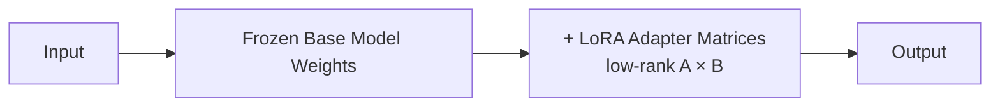
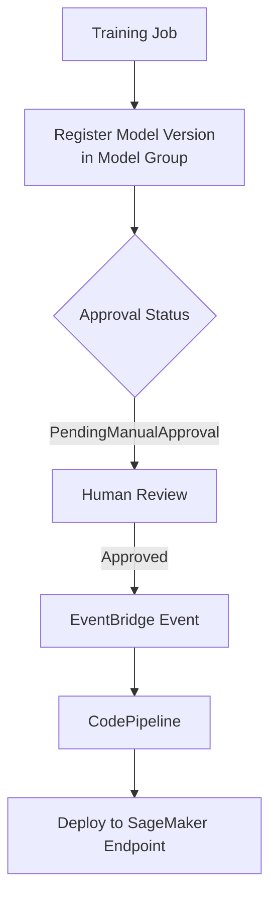

# Lecture 03 — FM Customization: LoRA, SageMaker Model Registry, and Deployment

## Concept Overview

When a foundation model performs well generally but not well enough for a specific domain or task, you customize it. AWS provides two main platforms: Amazon Bedrock (fully managed) and Amazon SageMaker (more control, custom training pipelines and model lifecycle management).

## Key Points

- Bedrock fine-tuning = 3 methods: **Supervised**, **Reinforcement**, **Distillation** (plus **Continued Pre-Training** for unlabeled domain corpus)
- **LoRA is NOT available in Bedrock's native fine-tuning** — Bedrock performs full-rank fine-tuning only
- **LoRA is available via SageMaker** (HyperPod, Training Jobs) for Nova, Llama 3, GPT OSS models
- Custom Bedrock models **require Provisioned Throughput** to deploy — no on-demand inference
- **SageMaker Model Registry** = versioning + approval workflow + CI/CD integration
- Approval status change triggers **EventBridge → CodePipeline** for automated deployment

## AWS Services Involved

| Service | Role |
| ------- | ---- |
| Amazon Bedrock | Managed fine-tuning (Supervised, Reinforcement, Distillation, CPT) |
| SageMaker HyperPod | Large-scale distributed training with LoRA/PEFT support |
| SageMaker Training Jobs | Nova, Llama fine-tuning with LoRA on single/multi-node |
| SageMaker Model Registry | Model versioning, approval gates, lineage, CI/CD hooks |
| Amazon EventBridge | Detects approval status change → triggers deployment pipeline |
| AWS CodePipeline | Automates deployment of approved model versions |
| Bedrock Provisioned Throughput | Required capacity unit for deploying custom fine-tuned models |

## Bedrock Customization Methods

| Method | Input | Mechanism | Use When |
|--------|-------|-----------|----------|
| Supervised Fine-Tuning | Labeled input→output pairs | Adjusts model weights for specific task | You have labeled task data |
| Reinforcement Fine-Tuning | Prompts + Lambda reward functions | Iterative feedback-based alignment | No labeled pairs; you can define quality programmatically |
| Distillation | Prompts only | Teacher model generates responses → student is fine-tuned | Want small, cheap model with large model quality |
| Continued Pre-Training | Unlabeled domain corpus | Improves domain knowledge before task fine-tuning | Large unlabeled corpus; precedes supervised FT |

## LoRA (Low-Rank Adaptation)

A **Parameter-Efficient Fine-Tuning (PEFT)** technique that freezes base model weights and injects small trainable adapter matrices at transformer layers.

**When to use LoRA (via SageMaker) over Bedrock full fine-tuning:**
- Training data exceeds Bedrock customization data limits
- You want faster, cheaper training with PEFT regularization
- You already have Bedrock fine-tuned results and want further optimization
- Smaller task-specific datasets (LoRA resists overfitting better)

**Supported via SageMaker:** Amazon Nova (Micro, Lite, Pro, Nova 2), Llama 3 70B, GPT OSS 120B, JumpStart models

## SageMaker Model Registry Workflow

**Key concepts:**
- **Model Group** = tracks all versions solving the same problem
- **Model Version** = each training run; stores metrics, lineage, model card
- **Collections** = group multiple Model Groups into categories
- **Approval Status**: `PendingManualApproval` → `Approved` → auto-deploy

## SageMaker Deployment Options

| Option | Best For |
|--------|----------|
| Real-Time Inference | Low-latency, synchronous, always-on |
| Serverless Inference | Intermittent traffic |
| Asynchronous Inference | Large payloads, queue-based |
| Batch Transform | Offline bulk inference on S3 datasets |
| Bedrock Provisioned Throughput | Custom Bedrock fine-tuned models (required) |

## Common Misconceptions

- **"LoRA changes the base model"** — No, base weights are frozen; only adapters are trained
- **"Fine-tuned Bedrock models use on-demand inference"** — No, Provisioned Throughput required
- **"Distillation requires labeled data"** — Optional; Bedrock auto-generates from teacher model
- **"SageMaker Model Registry is just storage"** — It's a lifecycle system with approval gates and CI/CD hooks
- **"Reinforcement fine-tuning needs input-output pairs"** — No, prompts + Lambda reward functions
- **"LoRA is available in Bedrock fine-tuning"** — No, LoRA requires the SageMaker path

## Exam Tips

- If scenario mentions **unlabeled corpus + task fine-tuning** → Continued Pre-Training → Supervised FT (two-step)
- If scenario mentions **governance trail / version approval** → SageMaker Model Registry
- If scenario mentions **LoRA or PEFT** → answer points to SageMaker, not Bedrock console
- If scenario asks **how to deploy a custom Bedrock model** → Provisioned Throughput (never on-demand)
- **Distillation** is the only method where you don't need your own training data at all

## Gotchas

- Bedrock fine-tuning is single-region (e.g., `us-east-1` or `us-west-2` depending on model)
- LoRA PEFT has a max sequence length of 65,536 tokens (vs full-rank SFT which may support more)
- Reinforcement Fine-Tuning reward functions are implemented as **AWS Lambda functions**
- Model Registry approval change fires an **EventBridge** event — this is the CI/CD trigger hook

## Source

- [Bedrock custom models overview](https://docs.aws.amazon.com/bedrock/latest/userguide/custom-models.html)
- [Bedrock fine-tuning supported models](https://docs.aws.amazon.com/bedrock/latest/userguide/custom-model-fine-tuning.html)
- [Nova SFT with LoRA PEFT](https://docs.aws.amazon.com/nova/latest/userguide/nova-sft-1.html)
- [SageMaker Model Registry](https://docs.aws.amazon.com/sagemaker/latest/dg/model-registry.html)
- [Well-Architected GenAI Lens: GENSUS01-BP02](https://docs.aws.amazon.com/wellarchitected/latest/generative-ai-lens/gensus01-bp02.html)
