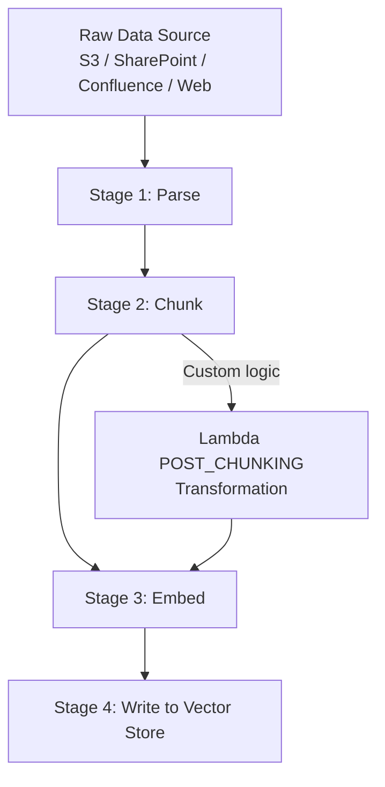

# Lecture 04 — Data Validation and Processing Pipelines

## Concept Overview

Before data can power a RAG system, it must be **ingested** — transformed from raw files into searchable vector embeddings. Bedrock Knowledge Bases manages this pipeline, but understanding each stage is critical for making the right architectural decisions (and for the exam).

## The 4-Stage Ingestion Pipeline



## AWS Services Involved

| Service | Role |
|---------|------|
| Amazon Bedrock Knowledge Bases | Manages the full ingestion pipeline |
| Amazon Bedrock Data Automation (BDA) | Advanced parser for complex/multimodal documents |
| AWS Lambda | POST_CHUNKING custom transformation |
| Amazon S3 | Primary data source; also stores multimodal extraction output |
| Amazon Redshift / Glue | Structured data sources (Text-to-SQL path) |
| Vector stores | OpenSearch Serverless, Aurora, Neptune, Pinecone, Redis, MongoDB Atlas |

## Stage 1 — Parse

Converts raw files (PDF, HTML, DOCX, images) into text Bedrock can process.

| Parser Option | Use Case |
|---|---|
| **Default parser** | Plain text, markdown, HTML — no extra cost |
| **Amazon Bedrock Data Automation (BDA)** | Complex PDFs, charts, tables, multimodal documents |
| **Foundation Model parser** | Custom parsing via prompt — maximum control, higher cost |

> **Key constraint:** Parsing strategy is **immutable** after you connect a data source. You cannot change it — create a new data source instead.

### FM Parser vs BDA

| | BDA | FM Parser |
|---|---|---|
| Control | Low (template-driven blueprints) | High (prompt-driven) |
| Cost | Lower | Higher (FM invocation per doc) |
| Best for | Standard doc types (invoices, forms, medical records) | Custom/unusual document formats |
| Multimodal | Yes | Yes |

## Stage 2 — Chunk

Splits parsed documents into retrievable units. Also **immutable** after data source connection.

| Strategy | API Value | Best For |
|---|---|---|
| **No chunking** | `NONE` | Short, self-contained docs |
| **Fixed-size** | `FIXED_SIZE` | Uniform token budgets, predictable retrieval |
| **Hierarchical** | `HIERARCHICAL` | Two-level: large parent + small child chunks |
| **Semantic** | `SEMANTIC` | Meaning-preserving splits, better for prose |

Default if omitted: ~300 tokens with sentence-boundary preservation.

## Stage 3 — Embed

The embedding model converts each chunk to a vector. For multimodal content (images, charts):
- **Amazon Titan Multimodal Embeddings G1**
- **Cohere Embed v3**

## Stage 4 — Write to Vector Store

Supported: OpenSearch Serverless, Neptune, Aurora (pgvector), Pinecone, Redis Enterprise, MongoDB Atlas.

## Data Source Types

| Type | Sources | Retrieval Method |
|---|---|---|
| **Unstructured** | S3, Confluence, SharePoint, Salesforce, Web Crawler, Custom | Vector similarity search |
| **Structured** | Amazon Redshift, AWS Glue / Lake Formation | Text-to-SQL (no embeddings) |

Structured data bypasses vector embedding entirely — Bedrock converts natural language to SQL.

## Customization: Lambda POST_CHUNKING Transformation

Inject a Lambda after chunking to:
- Apply custom chunking logic
- Attach **chunk-level metadata** (category, author, timestamp) for retrieval filtering

```json
{
  "transformations": [{
    "transformationFunction": {
      "transformationLambdaConfiguration": { "lambdaArn": "arn:aws:..." }
    },
    "stepToApply": "POST_CHUNKING"
  }],
  "intermediateStorage": { "s3Location": { "uri": "s3://..." } }
}
```

## Sync vs Direct Ingestion

| Method | API | When to Use |
|---|---|---|
| **Sync** | `StartIngestionJob` | Batch updates, incremental re-index |
| **Direct ingestion** | `KnowledgeBaseDocuments` | Real-time updates without full sync |

## Common Misconceptions

- **"I can change chunking strategy later"** — No. Both parsing and chunking are immutable. Create a new data source.
- **"RAG only uses vector databases"** — Structured data (Redshift, Glue) uses SQL-based retrieval, not vectors.
- **"Lambda replaces the chunking stage"** — Lambda is POST_CHUNKING; it runs after Stage 1 parse and Stage 2 chunk.
- **"Semantic chunking fixes table retrieval issues"** — No. Tables broken by the default parser need a better parser (BDA), not just a different chunking strategy.

## Exam Tips

- PDFs with tables/charts/images → **BDA parser** or **FM parser**, not default
- Metadata filtering at retrieval time → must attach metadata at ingestion via **POST_CHUNKING Lambda**
- Real-time KB updates → `KnowledgeBaseDocuments` API (direct ingestion), not `StartIngestionJob`
- Structured data + Bedrock KB → **Text-to-SQL via Redshift** (no vector embeddings)
- Poor retrieval on structured content (tables) → fix the **parser first**; poor retrieval on prose → look at **chunking strategy**

## Gotchas

- Parsing and chunking strategy are **both immutable** — plan before connecting a data source
- Multimodal parsers (BDA, FM) require specifying an **S3 URI** for storing extracted images/charts
- Lambda transformation requires an **intermediate S3 location** for chunk I/O
- `NONE` chunking + Lambda = effectively a fully custom chunking pipeline

## Source

- [Turning data into a knowledge base](https://docs.aws.amazon.com/bedrock/latest/userguide/kb-how-data.html)
- [Customize ingestion for a data source](https://docs.aws.amazon.com/bedrock/latest/userguide/kb-data-source-customize-ingestion.html)
- [Sync your data with your Amazon Bedrock knowledge base](https://docs.aws.amazon.com/bedrock/latest/userguide/kb-data-source-sync-ingest.html)
