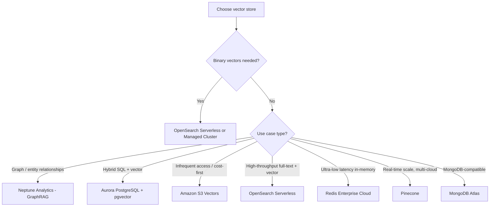

# Lecture 05 — Vector Store Design: OpenSearch, Aurora pgvector, Neptune, S3 Vectors

## Concept Overview

A **vector store** holds the numerical embeddings (vectors) that RAG systems generate from your source documents. When a user query arrives, the embedding model converts it to a vector, and the vector store finds the most semantically similar stored vectors via approximate nearest-neighbor (ANN) search. The retrieved chunks are then injected into the prompt as context.

Amazon Bedrock Knowledge Bases integrates with multiple vector stores. You either let Bedrock **quick-create** a managed index, or pre-configure your own index and connect it.

---

## Vector Stores Supported by Bedrock Knowledge Bases

| Store | Type | Best For |
|-------|------|----------|
| Amazon OpenSearch Serverless | AWS-native, serverless | Full-text + vector, high throughput, default choice |
| Amazon OpenSearch Managed Clusters | AWS-native, cluster | Same + binary vectors, control over cluster config |
| Amazon Aurora PostgreSQL (pgvector) | Relational DB | Hybrid SQL + vector workloads, ACID transactions |
| Amazon Neptune Analytics | Graph analytics | GraphRAG — connected knowledge, entity relationships |
| Amazon S3 Vectors | Serverless object store | Cost-optimized, long-term or infrequent-access vectors |
| Pinecone | Third-party | Real-time vector search at scale, multi-cloud |
| Redis Enterprise Cloud | Third-party in-memory | Ultra-low latency (sub-millisecond) |
| MongoDB Atlas | Third-party document DB | MongoDB-compatible apps needing semantic search |

---

## Key Points

- **Binary vectors** are only supported on **OpenSearch Serverless** and **OpenSearch Managed Clusters**. All other stores use float32 (standard floating-point) embeddings.
- **Quick-create flow**: Bedrock can auto-provision an index in OpenSearch Serverless, Aurora, and S3 Vectors. For others, you must pre-configure the index and provide field mapping details.
- Every vector index requires three mapped fields:
  - **vectorField** — stores the embedding vectors
  - **textField** — stores the raw text chunks
  - **metadataField** — stores Bedrock-managed metadata (source URI, chunk ID, etc.)
- **Aurora-specific**: if you want metadata filtering on Aurora, you must define additional fields manually. Other stores handle metadata filtering differently and don't require pre-configured fields.
- **Embeddings model dimensions must match vector store config.** Mismatch = ingestion failure.

---

## AWS Services Involved

| Service | Role |
|---------|------|
| Amazon Bedrock Knowledge Bases | Orchestrates ingestion, vectorization, retrieval |
| Bedrock Embeddings (Titan, Cohere) | Converts text → vectors |
| Amazon OpenSearch Serverless | Default managed vector index, supports FAISS engine |
| Amazon OpenSearch Managed Cluster | Self-managed cluster, supports HNSW / IVF indexing |
| Amazon Aurora PostgreSQL + pgvector | HNSW / IVFFlat indexing, ACID transactions |
| Amazon Neptune Analytics | Graph-native vector storage + graph traversals |
| Amazon S3 Vectors | Serverless, cost-optimized — up to 90% savings vs. specialized DBs |
| AWS Secrets Manager | Stores credentials for Aurora, Pinecone, Redis, MongoDB |

---

## Choosing the Right Vector Store — Decision Tree

---

## Vector Index Configuration (OpenSearch Serverless example)

| Config Field | Typical Value | Notes |
|---|---|---|
| Engine | faiss | Used for ANN search in OpenSearch Serverless |
| Distance metric | Euclidean (L2) | Recommended for float32; cosine also supported |
| Dimensions | 1,536 (Titan v1) / 1,024 (Titan v2, Cohere) | Must match the embedding model |
| Index type | HNSW | Hierarchical Navigable Small World — best recall vs latency trade-off |

---

## Embedding Model → Dimension Reference

| Embedding Model | Dimensions |
|---|---|
| Amazon Titan G1 Embeddings - Text | 1,536 |
| Amazon Titan V2 Embeddings - Text | 1,024 / 512 / 256 (configurable) |
| Cohere Embed English | 1,024 |
| Cohere Embed Multilingual | 1,024 |

---

## S3 Vectors — Key Facts for Exam

- **Newest** Bedrock KB vector store option
- Native S3 storage model — up to **2 billion vectors per index**, up to **10,000 indexes per bucket**
- Up to **90% cost savings** versus purpose-built vector DBs
- Best for **infrequent retrieval** (query latency ~100ms, not real-time)
- Bedrock handles auto-ingestion and vectorization
- Fully serverless — no infrastructure to manage

---

## Neptune Analytics — GraphRAG

- Ideal when your knowledge base has **interconnected entities** (e.g., products → suppliers → contracts)
- Combines **graph traversals** with vector similarity search in a single query
- Powers **GraphRAG** patterns: retrieve related nodes via graph, rank by vector similarity
- Capacity units + storage pricing; auto-scaling

---

## Common Misconceptions

- **"DynamoDB is a supported vector store for Bedrock KB"** — False. DynamoDB has no native vector search. It can store metadata/references, but is not a Bedrock KB vector store.
- **"OpenSearch Managed = OpenSearch Serverless with more control"** — Partially true, but the key functional difference is that Managed Clusters support binary vectors and allow you to tune cluster topology, while Serverless is pay-per-use with auto-scaling.
- **"Any vector store can use binary embeddings"** — False. Only OpenSearch (Serverless + Managed) supports binary vectors in Bedrock KB.
- **"You always need to create the index yourself"** — False. Quick-create flow lets Bedrock auto-provision the index for OpenSearch Serverless, Aurora, and S3 Vectors.
- **"S3 Vectors is just S3 with embeddings in a file"** — False. S3 Vectors is a first-class vector storage service with native ANN search, not flat file storage.

---

## Exam Tips

- **Binary vector → OpenSearch only.** This is a hard constraint.
- **GraphRAG → Neptune Analytics.** Any scenario mentioning knowledge graphs, entity links, connected data.
- **Cost optimization with infrequent access → S3 Vectors** (90% savings framing is very exam-friendly).
- **ACID + SQL + vector → Aurora PostgreSQL.** Financial systems, transactional workloads needing relational integrity.
- **Quick-create** is available for OpenSearch Serverless, Aurora, and S3 Vectors — reduces ops overhead.
- Know the three field mappings: `vectorField`, `textField`, `metadataField`.
- Dimension mismatch between embedding model and vector store config causes **ingestion failure**.

---

## Gotchas

- Metadata **filtering** on Aurora requires you to explicitly define extra fields at index-creation time. Other stores do not have this requirement.
- Embedding model choice **constrains** which vector stores you can use (based on dimension support).
- Third-party stores (Pinecone, Redis, MongoDB) require credentials stored in **Secrets Manager** — Bedrock retrieves them at ingestion/query time.
- OpenSearch Serverless charges for **OCU (OpenSearch Compute Units)** — both indexing OCU and search OCU — even when idle. S3 Vectors has no idle cost.

---

## Source

- [Prerequisites for using a vector store — Amazon Bedrock](https://docs.aws.amazon.com/bedrock/latest/userguide/knowledge-base-setup.html)
- [Vector database comparison — AWS Prescriptive Guidance](https://docs.aws.amazon.com/prescriptive-guidance/latest/choosing-an-aws-vector-database-for-rag-use-cases/vector-db-comparison.html)
- [Vector database options — AWS Prescriptive Guidance](https://docs.aws.amazon.com/prescriptive-guidance/latest/choosing-an-aws-vector-database-for-rag-use-cases/vector-db-options.html)
