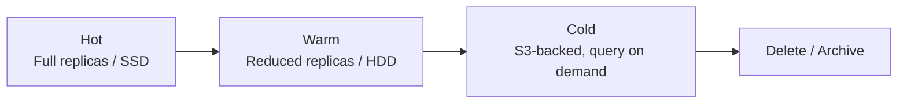
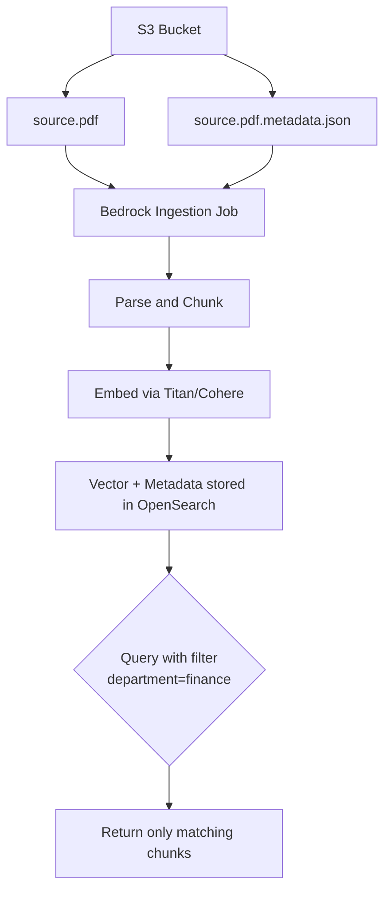

# Lecture 06 — Vector Store Metadata, Indexing, and Maintenance

## Concept Overview

Covers how metadata attaches to vector chunks, how indexes are configured for performance and cost, and how Bedrock Knowledge Bases keeps its vector store current. These are the operational details the exam tests after the "which store to use" decisions from Lecture 05.

## Key Points

- Metadata sidecar: `<filename>.<ext>.metadata.json` placed alongside the source file in S3
- Metadata enables **filtering** at query time — narrows vector search to relevant documents
- **Aurora requires pre-defined columns** per attribute; all other stores use a flexible string field
- OpenSearch index **engine must be `faiss`** (not `nmslib`) for Bedrock metadata support
- Dimension count **must match** the chosen embedding model — mismatch fails ingestion
- **Auto-optimize** automates HNSW tuning from S3 dataset; results in 30–60 min
- Sync is **incremental** — only changed documents are reprocessed
- **Metadata-only optimization** skips re-embedding when only `.metadata.json` changes
- ISM controls hot → warm → cold → delete lifecycle for OpenSearch managed clusters

## AWS Services Involved

| Service | Role |
|---------|------|
| Amazon Bedrock Knowledge Bases | Manages ingestion, sync, metadata attachment, and filtering |
| Amazon OpenSearch Serverless | Stores float32/binary vectors; supports faiss engine, auto-optimize |
| Amazon Aurora (pgvector) | Relational vector store — requires explicit column schema for metadata |
| Amazon S3 | Source data + `.metadata.json` sidecars |
| `StartIngestionJob` API | Programmatic trigger for incremental sync |

## Metadata in Bedrock Knowledge Bases

### Sidecar metadata files

For each source file in S3, create a paired file: `<filename>.<ext>.metadata.json`

```
s3://my-bucket/docs/
  annual-report-2025.pdf
  annual-report-2025.pdf.metadata.json
```

Contents:
```json
{
  "metadataAttributes": {
    "year": "2025",
    "department": "finance",
    "confidential": "true"
  }
}
```

Bedrock attaches these key-value pairs to **every chunk** derived from that document. At query time, filter: `department = "finance" AND year = "2025"`.

### CSV special case

CSVs embed metadata inline using `documentStructureConfiguration`. Supports **one content field** per CSV. All other columns become metadata.

### Aurora exception

Aurora pgvector requires a **dedicated column per metadata attribute** in the table schema — columns must be pre-defined before ingestion. All other stores use a single flexible string field.

## Vector Index Configuration

### OpenSearch Serverless — required fields

| Parameter | What it controls | Bedrock requirement |
|-----------|-----------------|---------------------|
| **Engine** | Search algorithm | Must be `faiss` (not `nmslib`) |
| **Dimensions** | Must match embedding model | Titan G1 = 1536, Titan V2 = 1024/512/256, Cohere = 1024 |
| **Distance metric** | Similarity measure | Euclidean for float32 |
| **Text chunk field** | Stores raw chunk text | Filterable: **true** |
| **bedrock-metadata field** | Stores KB internal metadata | Filterable: **false** |

### HNSW parameters

| Parameter | Effect |
|-----------|--------|
| `ef_construction` | Index build quality — higher = better recall, slower build |
| `m` | Graph connections per node — higher = better recall, more memory |
| `ef_search` | Search breadth — higher = better recall, higher latency |

### Quantization

| Method | Compression | Notes |
|--------|-------------|-------|
| Binary Quantization (BQ) | 32x | Only on OpenSearch; required for binary vectors |
| Scalar Quantization (SQ) | 4x | Good recall/cost balance |

### Auto-optimize

Automated HNSW tuning without manual experimentation:
1. Upload vector dataset to S3 as Parquet or JSONL (single format per folder)
2. Set acceptable recall and latency thresholds
3. Job runs on AWS-managed infra — zero impact on your collection
4. Recommendations delivered in **30–60 minutes**

## Data Maintenance — Incremental Sync

Trigger sync via console or `StartIngestionJob` API. Sync is **incremental**:

| Scenario | Bedrock action |
|----------|---------------|
| No changes detected | Document skipped entirely |
| Content or metadata changed | Full re-ingest: parse → chunk → embed → index |
| New document added | Only new doc is ingested |
| Document deleted | Chunks removed from vector store |

### Metadata-only optimization (cost saver)

When **only** `.metadata.json` sidecars change (no content, not CSV, no custom Lambda):
- Bedrock retrieves existing embeddings → merges new metadata → writes back
- **No embedding model call** — avoids per-token embedding charges
- **Not available** for: CSV files, data sources with custom transformation Lambda

### Index State Management (ISM) — OpenSearch lifecycle



ISM automates hot → warm → cold → delete transitions. Critical for cost as knowledge base grows.

## Metadata Sidecar Flow



## Common Misconceptions

| Misconception | Reality |
|---------------|---------|
| "Metadata filtering works the same across all vector stores" | Aurora needs per-column schema; others use a flexible string field |
| "Every sync re-processes all documents" | Sync is incremental — only changed/new/deleted docs are touched |
| "Changing a .metadata.json always triggers re-embedding" | Metadata-only optimization avoids re-embedding (except CSV files) |
| "nmslib engine works fine for Bedrock Knowledge Bases" | Only `faiss` engine supported; nmslib breaks metadata filtering |
| "Auto-optimize requires changes to your live collection" | Runs on separate AWS-managed infra; zero impact on your collection |

## Exam Tips

- **Filter without re-embedding:** Use `.metadata.json` sidecars + metadata filtering at query time
- **Metadata-only cost saving:** Only applies when PDFs/docs change metadata — NOT for CSVs
- **Broken metadata filtering after migration:** Root cause is usually `nmslib` engine — must create new index with `faiss`
- **No ML expertise for HNSW tuning:** Auto-optimize — upload S3 dataset, set thresholds, get config in 30–60 min
- **Ingestion failure cause #1:** Dimension count mismatch between index and embedding model

## Gotchas

- Aurora pgvector: adding a new metadata attribute requires adding a new column before ingestion
- CSV metadata changes **always** trigger full re-ingestion (no metadata-only shortcut)
- After sync completes, non-Aurora stores may take **a few minutes** before new vectors are queryable
- Auto-optimize requires dataset in S3 as Parquet or JSONL — mixed formats in one folder are rejected
- `nmslib` → `faiss` migration requires creating a **new** vector index and **new** knowledge base

## Source

- [Bedrock KB: Include metadata in a data source](https://docs.aws.amazon.com/bedrock/latest/userguide/kb-metadata.html)
- [Bedrock KB: Sync your data](https://docs.aws.amazon.com/bedrock/latest/userguide/kb-data-source-sync-ingest.html)
- [Bedrock KB: Vector store prerequisites](https://docs.aws.amazon.com/bedrock/latest/userguide/knowledge-base-setup.html)
- [OpenSearch: Auto-optimize](https://docs.aws.amazon.com/opensearch-service/latest/developerguide/serverless-auto-optimize.html)
- [OpenSearch: Index State Management](https://docs.aws.amazon.com/opensearch-service/latest/developerguide/ism.html)
