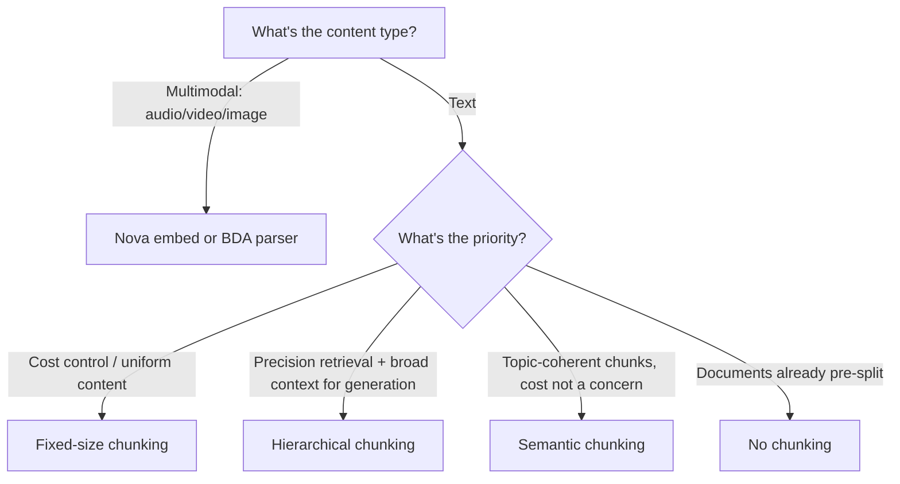

# Lecture 07 — Chunking Strategies: Fixed-Size, Hierarchical, and Semantic

## Concept Overview

When ingesting documents into an Amazon Bedrock Knowledge Base, Bedrock splits them into **chunks** before converting to vector embeddings. Chunk boundaries directly affect retrieval accuracy — too large introduces noise, too small loses context.

Bedrock supports four strategies: standard (fixed-size / default / no chunking), hierarchical, semantic, and multimodal.

## Key Points

### Standard Chunking

| Mode | Behavior |
|------|----------|
| **Default** | ~300 tokens per chunk; respects sentence boundaries |
| **Fixed-size** | Configurable max tokens + overlap % between consecutive chunks |
| **No chunking** | Entire document = 1 chunk; requires pre-splitting files externally |

- No chunking disables `x-amz-bedrock-kb-document-page-number` metadata filter and page-number citations.
- Parsed/converted content respects logical document boundaries (pages, sections) — Bedrock won't merge across them even if token limit allows.

### Hierarchical Chunking

```
Document
├── Parent chunk (large, e.g. 512 tokens)
│   ├── Child chunk A (small, e.g. 100 tokens)  ← retrieved for precision
│   └── Child chunk B
```

- **Retrieval flow:** child chunks match the query → replaced with parent chunks before sending to the model.
- Configure: `parent token size`, `child token size`, `overlap tokens`.
- Return count may be **less than requested** — child→parent replacement deduplicates results.
- Not recommended with S3 vector bucket; >8000 combined tokens risks metadata size limits.

### Semantic Chunking

- Uses NLP + an FM to detect topic/meaning boundaries.
- Parameters:
  - `max_tokens` — upper bound per chunk
  - `buffer_size` — surrounding sentences combined for boundary embedding (buffer=1 → 3 sentences; buffer=3 → 7 sentences)
  - `breakpoint_percentile_threshold` — higher = fewer, larger chunks; lower = more, smaller chunks
- **Extra cost:** invokes an FM during ingestion.

### Multimodal Chunking

| Parser | Behavior |
|--------|----------|
| **Nova multimodal embeddings** | Chunking at embedding level; 1–30s audio/video chunks (default 5s) |
| **BDA parser** | Converts to text first, then applies standard text chunking |

- For video files (even with embedded audio): only `video_chunk_duration` applies.
- `audio_chunk_duration` only applies to standalone audio files.

## AWS Services Involved

| Service | Role |
|---------|------|
| Amazon Bedrock Knowledge Bases | Executes chunking during data source ingestion |
| Amazon S3 | Source data store |
| Bedrock Data Automation (BDA) | Parser for multimodal → text before chunking |
| Amazon Nova (multimodal embed) | Native multimodal chunking at embedding level |

## Common Misconceptions

- **"Semantic chunking is always better"** — More expensive and slower to ingest; fixed-size often performs equally well for structured/uniform text.
- **"Hierarchical chunking returns more results"** — Child-to-parent replacement can *reduce* the returned count.
- **"No chunking is fine for large documents"** — Entire file as one chunk bloats context and degrades retrieval precision.
- **"Text chunking strategies apply to images/video"** — Text strategies only affect text documents.

## Exam Tips



- Semantic chunking costs extra — FM invoked at ingestion time.
- Hierarchical chunking solves the **precision vs. context trade-off**: retrieve with child, generate with parent.
- Buffer size in semantic chunking controls boundary detection granularity, not chunk size directly.

## Gotchas

- Fixed-size **overlap** prevents context from being cut mid-sentence; it's a percentage between consecutive chunks.
- Hierarchical chunking + S3 vector bucket = avoid (metadata size limit risk at >8000 combined tokens).
- No chunking: loses page-number citation AND `x-amz-bedrock-kb-document-page-number` metadata filter.
- Video with embedded audio: only `video_chunk_duration` applies — `audio_chunk_duration` is ignored.

## Source

- [How content chunking works for knowledge bases — Amazon Bedrock User Guide](https://docs.aws.amazon.com/bedrock/latest/userguide/kb-chunking.html)
- [Customize ingestion for a data source](https://docs.aws.amazon.com/bedrock/latest/userguide/kb-data-source-customize-ingestion.html)
