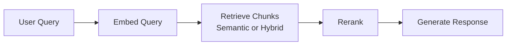
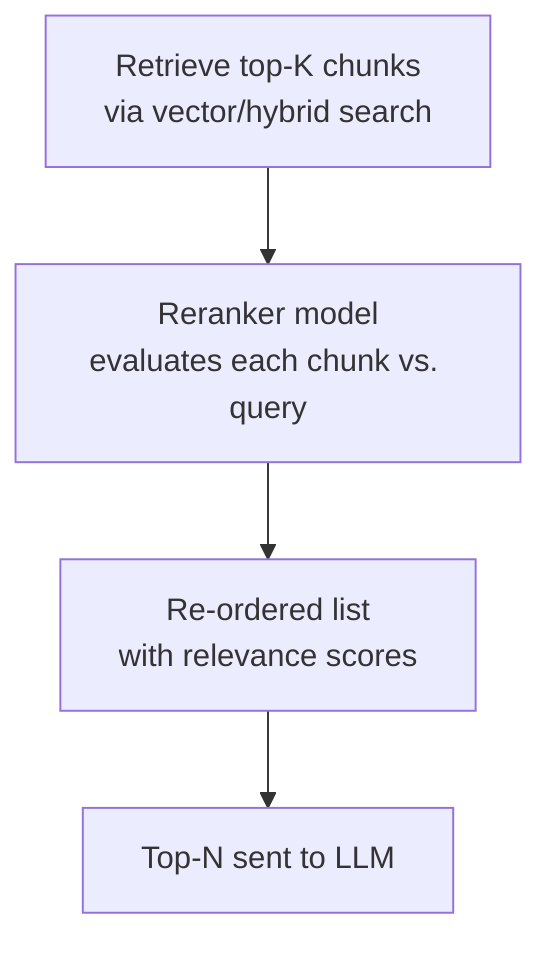

# Lecture 08 — Embeddings, Hybrid Search, and Reranking

## Concept Overview

The retrieval pipeline in Bedrock Knowledge Bases has three layers:

**Embeddings** convert text into dense numeric vectors so similarity can be measured mathematically. **Search strategy** controls whether retrieval uses vector similarity only (semantic) or combines it with keyword matching (hybrid). **Reranking** is a second-pass re-scoring of retrieved chunks using a cross-encoder model before they reach the LLM.

---

## Key Points

### 1. Embedding Models

Bedrock Knowledge Bases uses these models at ingestion and query time:

| Model | Dimensions | Vector Types |
|---|---|---|
| Amazon Titan Embeddings G1 - Text | 1536 | Float only |
| Amazon Titan Text Embeddings V2 | 256, 512, 1024 | Float **and binary** |
| Cohere Embed English v3 | 1024 | Float and binary |
| Cohere Embed Multilingual v3 | 1024 | Float and binary |
| Titan Multimodal Embeddings G1 | 1024 | Float only |
| Cohere Embed v3 (Multimodal) | 1024 | Float and binary |

**Binary vectors** trade a small accuracy loss for significantly smaller storage and faster ANN lookups. Titan V2's flexible dimensions (256/512/1024) let you tune the cost/accuracy trade-off — smaller = cheaper storage, larger = better recall.

---

### 2. Search Strategy (`overrideSearchType`)

Configured in `KnowledgeBaseVectorSearchConfiguration`:

| Strategy | How it Works | When Available |
|---|---|---|
| `SEMANTIC` (default) | ANN vector similarity only | All vector store types |
| `HYBRID` | Vector similarity **+** BM25 keyword search combined | **OpenSearch Serverless only**, requires a filterable text field |
| AUTO (omit field) | Bedrock selects the best strategy | All |

**Hybrid search helps when:**
- Queries contain exact proper nouns, product codes, or IDs that embeddings may not capture well
- Domain-specific terminology doesn't map reliably into vector space

**Constraint:** HYBRID is **only** available on Amazon OpenSearch Serverless. Aurora pgvector and other stores support SEMANTIC only. Setting HYBRID on an unsupported store returns a validation error.

---

### 3. Reranking

Reranking is a **separate model pass** that re-scores already-retrieved chunks for query relevance:

- **Provider:** Cohere Rerank models (accessed through Bedrock)
- **API:** `Rerank` endpoint on the **Agents for Amazon Bedrock Runtime**
- **Integration point:** Set `rerankingConfiguration` inside `KnowledgeBaseVectorSearchConfiguration`
- **IAM required:** `bedrock:Rerank` + `bedrock:InvokeModel`

**Why reranking matters:**
Vector search retrieves the top-K most *similar* chunks. Reranking re-scores them by *relevance* to the query intent — these are not the same thing. Similarity is cosine distance; relevance accounts for query semantics.

---

## AWS Services Involved

| Service | Role |
|---|---|
| Amazon Bedrock Knowledge Bases | Orchestrates embedding, retrieval, reranking |
| Amazon Titan Text Embeddings V2 | Default recommended embedding model |
| Cohere Embed (English/Multilingual) | Alternative embeddings, multilingual use cases |
| Amazon OpenSearch Serverless | Only vector store that supports HYBRID search |
| Cohere Rerank (via Bedrock) | Cross-encoder reranking model |
| Agents for Bedrock Runtime | API endpoint for `Retrieve` and `Rerank` calls |

---

## Common Misconceptions

- **"HYBRID search is available on all vector stores."** — False. Only OpenSearch Serverless with a filterable text field supports it. Aurora pgvector and DynamoDB support SEMANTIC only.
- **"Reranking replaces the embedding step."** — No. Reranking is a second pass *after* vector retrieval, not a replacement.
- **"Larger embedding dimensions always perform better."** — Not always. Titan V2 at 256 dims can suffice for many tasks at lower cost. Choose based on your accuracy vs. cost requirement.
- **"The Guardrails filter applies to retrieved chunks."** — False (exam-tested!). Guardrails apply to LLM input/output only, **not** to Knowledge Base retrieved chunks.

---

## Exam Tips

- Know the **two valid values** for `overrideSearchType`: `HYBRID` and `SEMANTIC`
- Know that HYBRID requires **OpenSearch Serverless + filterable text field** — any other store gets SEMANTIC only; setting HYBRID on an unsupported store returns a validation error
- Know the dimension options for **Titan Text Embeddings V2**: 256, 512, 1024
- Titan G1 is **floating-point only** (1536 dims); V2 adds **binary vectors**
- Reranking uses the **`Rerank` API** on the Agents for Bedrock runtime endpoint
- The IAM permissions for reranking: `bedrock:Rerank` + `bedrock:InvokeModel`

---

## Gotchas

- **Cohere Multilingual** supports 100+ languages in a single model — use it for international/multilingual corpora instead of separate per-language models
- **Binary quantization** halves storage compared to float but introduces small accuracy loss — valid trade-off for large-scale KB
- You can call `Rerank` API **standalone** (not just inside KB queries) — useful for reranking custom document lists
- Reranking adds latency — only worth it when retrieval precision matters more than speed
- The prerequisite for HYBRID is a **filterable text field** in the OSS index — not the same as ingestion metadata fields

---

## Source

- [Supported models for Bedrock Knowledge Bases](https://docs.aws.amazon.com/bedrock/latest/userguide/knowledge-base-supported.html)
- [KnowledgeBaseVectorSearchConfiguration API reference](https://docs.aws.amazon.com/bedrock/latest/APIReference/API_agent-runtime_KnowledgeBaseVectorSearchConfiguration.html)
- [Use a reranker model in Amazon Bedrock](https://docs.aws.amazon.com/bedrock/latest/userguide/rerank-use.html)
- [Query a knowledge base and retrieve data](https://docs.aws.amazon.com/bedrock/latest/userguide/kb-test-retrieve.html)
