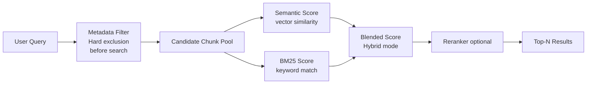
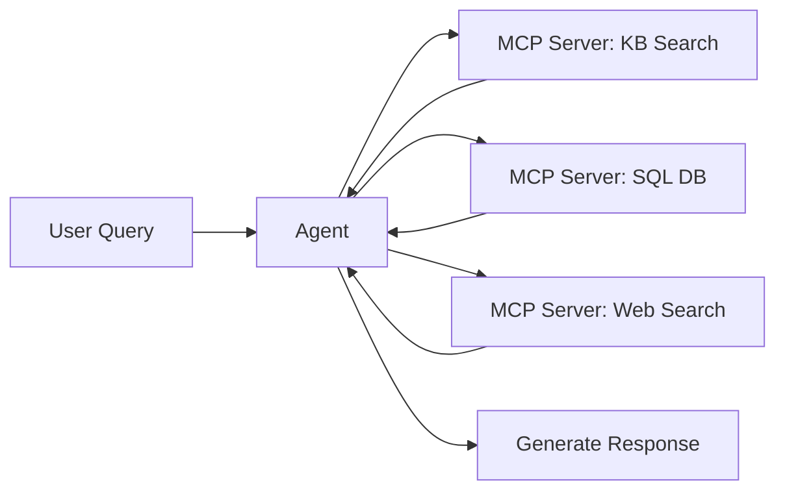

# Lecture 09 — Query Handling: Expansion, Decomposition, and MCP

## Concept Overview

Raw user queries are often too short, ambiguous, or multi-part to retrieve the best chunks. Query handling is the set of techniques applied between the user's question and the vector search to improve retrieval quality. Three major strategies: query expansion, query decomposition, and routing via MCP (Model Context Protocol) servers.

## Key Points

- **Query expansion** rewrites/enriches a single query before embedding — HyDE, multi-query generation, reformulation
- **Query decomposition** (`QUERY_DECOMPOSITION`) splits one multi-part query into independent sub-queries, runs each separately, and merges results
- `QUERY_DECOMPOSITION` is the only natively supported `QueryTransformationType` in Bedrock Knowledge Bases
- When decomposition is enabled, `numberOfRerankedResults` can be up to **5×** `numberOfResults`; without decomposition it is capped at `numberOfResults`
- **Metadata filtering** is a hard exclusion applied **before** retrieval — filters on structured attributes, not chunk text
- **BM25 keyword search** (Hybrid mode) is a soft relevance signal applied **during** retrieval — scores exact token matches in chunk text
- Hybrid search requires OpenSearch Serverless, Aurora pgvector (with filterable text field), or MongoDB — not all vector stores
- **MCP servers** are query routing endpoints — agents invoke them to fan out queries to heterogeneous data sources; they are not a vector search mechanism
- Default `numberOfResults` = 5; hierarchical chunking may return fewer (child→parent deduplication)

## AWS Services Involved

| Service | Role |
|---------|------|
| Amazon Bedrock Knowledge Bases | Retrieve, RetrieveAndGenerate, QueryDecomposition, metadata filtering |
| Amazon Bedrock Agents | MCP server integration for multi-source query routing |
| Amazon OpenSearch Serverless | Hybrid search (semantic + BM25); binary vectors |
| Amazon Aurora PostgreSQL / pgvector | Semantic or hybrid search for transactional workloads |
| Amazon Redshift | Structured data queries via GenerateQuery API (NL → SQL) |

## Core Retrieve APIs

| API | What It Does |
|-----|-------------|
| `Retrieve` | Returns ranked source chunks (text/image) with relevance scores |
| `RetrieveAndGenerate` | Chains Retrieve → InvokeModel; returns answer with citations |
| `RetrieveAndGenerateStream` | Streaming variant of RetrieveAndGenerate |
| `GenerateQuery` | Converts natural language → SQL for structured data stores (Redshift) |

`RetrieveAndGenerate` internally calls `GenerateQuery` (structured), `Retrieve`, and `InvokeModel` in sequence.

## Query Handling Techniques

### Query Expansion (pre-retrieval)

| Technique | What It Does | When to Use |
|-----------|-------------|-------------|
| HyDE | LLM generates hypothetical answer → embed the answer instead of the question | Short queries where question embedding doesn't match document style |
| Multi-query generation | LLM generates N paraphrased versions → run all → deduplicate | When user phrasing may not match corpus vocabulary |
| Query reformulation | Rewrite ambiguous/colloquial query into precise form | Conversational inputs |

### Query Decomposition (native Bedrock)

Enable via `orchestrationConfiguration.queryTransformationConfiguration`:

```json
"orchestrationConfiguration": {
  "queryTransformationConfiguration": {
    "type": "QUERY_DECOMPOSITION"
  }
}
```

### Metadata Filtering vs BM25 Keyword Search

| | Metadata Filtering | BM25 Keyword Search (Hybrid) |
|---|---|---|
| **What it searches** | Structured attributes stored alongside the chunk | Raw text content of the chunk itself |
| **Effect** | Hard filter — excludes non-matching chunks **before ranking** | Soft score — blended with semantic score **during ranking** |
| **Use when** | You know a structured attribute value at query time (date, category, region) | Query contains exact tokens that lack semantic meaning (codes, IDs, acronyms) |
| **Availability** | All vector stores | OpenSearch Serverless, Aurora pgvector (with filterable text field), MongoDB only |



### MCP (Model Context Protocol) Query Routing



MCP enables agents to fan out query sub-tasks to heterogeneous data sources simultaneously. It is a transport/routing protocol — Knowledge Bases remain the vector retrieval engine.

## Common Misconceptions

- **Query expansion vs decomposition are the same** — Expansion rewrites one query into a richer form; decomposition splits one query into multiple independent sub-queries
- **MCP replaces Knowledge Bases** — MCP is a routing protocol; Knowledge Bases remain the vector retrieval engine
- **`numberOfRerankedResults` can always exceed `numberOfResults`** — Only when query decomposition is enabled (up to 5×)
- **Metadata filters apply after reranking** — Filters apply before ranking — they reduce the candidate pool
- **Use metadata filter for exact product codes in document text** — Wrong; filters only work on structured attributes. Use BM25/hybrid for in-text tokens

## Exam Tips

- Know the three Retrieve APIs: `Retrieve`, `RetrieveAndGenerate`, `GenerateQuery` — and what each is for
- `QUERY_DECOMPOSITION` is the only natively supported query transformation type in Bedrock
- The 5× reranking multiplier with decomposition is a key exam detail
- `RetrieveAndGenerateStream` = streaming variant; relevant for UX/latency questions
- `GenerateQuery` is specific to structured data stores (Redshift) — not vector search
- Guardrails apply to input and generated output — NOT to retrieved chunks

## Gotchas

- `startsWith` and `stringContains` metadata filters are **not supported** with S3 Vectors
- Guardrails apply to input and LLM output only — retrieved chunks are not filtered by guardrails
- Without decomposition: `numberOfRerankedResults > numberOfResults` → silently capped at `numberOfResults` (no error)
- HYBRID search falls back to semantic search silently if the vector store lacks a filterable text field
- Setting `overrideSearchType: HYBRID` on a non-supported vector store (e.g., Pinecone) → validation error

## Source

- [Retrieving information from data sources using Amazon Bedrock Knowledge Bases](https://docs.aws.amazon.com/bedrock/latest/userguide/kb-how-retrieval.html)
- [Query a knowledge base and retrieve data](https://docs.aws.amazon.com/bedrock/latest/userguide/kb-test-retrieve.html)
- [Configure and customize queries and response generation](https://docs.aws.amazon.com/bedrock/latest/userguide/kb-test-config.html)
