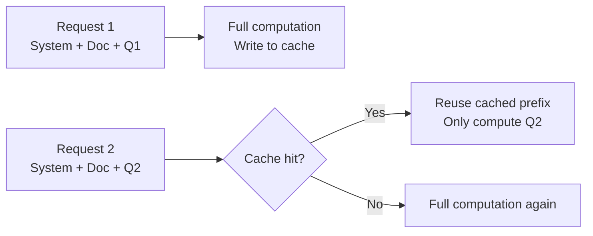

# Lecture 10 — Prompt Management and Governance

## Concept Overview

Amazon Bedrock Prompt Management is a centralized service for creating, storing, versioning, and reusing prompts across GenAI applications. Rather than hardcoding prompts in application code, you store them in Bedrock with version control — enabling governance, auditability, and team-wide standardization. Prompts are first-class resources referenced by ARN at runtime.

## Key Points

- Prompts are stored as **ARN-addressable resources** — reference them by ARN, not copy-paste text
- **Variables** use `{{double_curly_braces}}` syntax — values supplied at runtime
- **Variants** allow testing up to 3 configurations side-by-side (different model, params, or text)
- **Versioning lifecycle:** DRAFT (mutable) → VERSION (immutable); production apps pin to a version
- **Template types:**
  - `TEXT` — simple text prompt
  - `CHAT` — Converse API: supports system prompt, conversation history, tool use, and prompt caching
- **Prompt caching** on CHAT templates caches token prefixes (reduces cost for large repeated prompts)
- **Encryption** — prompts can be encrypted with a customer-managed KMS key
- Integrates with **Bedrock Flows** — versioned prompts consumed as prompt nodes in a Flow

## AWS Services Involved

| Service | Role |
|---------|------|
| Amazon Bedrock Prompt Management | Create, store, version, govern prompts |
| Amazon Bedrock Prompt Builder | Console UI to edit, test, and compare variants |
| Amazon Bedrock Flows | Consumes versioned prompts via prompt nodes |
| AWS KMS | Optional customer-managed encryption of prompt resources |
| AWS IAM | Access control — who can read/create/version prompts |
| AWS CloudTrail | Audit log of prompt lifecycle events (create, update, version) |

## Workflow


## Prompt Caching Deep Dive

### How It Works

Every model call reprocesses all input tokens from scratch. Prompt caching saves computed internal state (KV cache) from a static prefix and reuses it on subsequent calls — skipping recomputation of the prefix.



### Cache Checkpoints

A cache point marks the boundary — everything **before** it is cached; everything after is computed fresh:

```
[SYSTEM PROMPT — 500 tokens]          ← static
[LARGE DOCUMENT — 5,000 tokens]       ← static
[CACHE POINT]                         ← boundary marker
[USER QUESTION — 20 tokens]           ← dynamic, not cached
```

Call 1: 5,520 tokens computed + cached. Calls 2–N: only 20 tokens computed.

### Converse API Example

```json
{
  "system": [
    { "text": "You are a helpful legal analyst." },
    { "text": "<contract>... 4000 tokens ...</contract>" },
    { "cachePoint": { "type": "default" } }
  ],
  "messages": [
    { "role": "user", "content": [{ "text": "What are the termination clauses?" }] }
  ]
}
```

### TTL

| TTL | When to Use | Models |
|-----|-------------|--------|
| **5 min** (default) | High-frequency chatbots, live sessions | All supported models |
| **1 hour** | Long agentic workflows, infrequent access within an hour | Claude Haiku/Sonnet/Opus 4.5 |

- TTL **resets on every cache hit**
- **Constraint:** 1-hour entries must appear **before** any 5-minute entries in the prompt

### Cost Model

| Token type | Cost |
|------------|------|
| Cache write | **Higher** than normal input |
| Cache read | **Lower** than normal input |
| Uncached input | Standard rate |

Break-even: savings on cache reads outweigh the write premium when the same prefix is reused many times.

### Minimum Token Requirements

- Claude models: **1,024 tokens** minimum per checkpoint
- Prevents wasteful caching of small prefixes

### What Can Be Cached

| Field | Cacheable? |
|-------|-----------|
| `system` prompt | Yes |
| `messages` (conversation history) | Yes |
| `tools` definitions | Yes |
| User's latest message | No (dynamic per request) |

### Prompt Caching vs Semantic Caching

| | Prompt Caching | Semantic Caching |
|--|----------------|------------------|
| **What matches** | Exact token prefix | Similar meaning / embedding distance |
| **Where it runs** | Inside the model (KV cache) | Outside the model (vector store lookup) |
| **Use case** | Same large context, different questions in a session | Different users asking essentially the same question |
| **Example** | All users loading the same 10k-token knowledge base | "Return policy?" ≈ "How do I return an item?" |
| **Saves** | Input tokens + latency | Full model invocation |

## Common Misconceptions

| Misconception | Reality |
|---------------|---------|
| "I can edit a version if I catch a mistake" | Versions are **immutable** — update the draft, create a new version |
| "Variants are separate prompts" | Variants are **configurations of the same prompt** — same resource, different model/params/text |
| "Prompt caching = semantic caching" | Prompt caching caches an **identical token prefix**; semantic caching matches **similar but different queries** |
| "Variables are optional at runtime" | If variables are defined in the prompt, they **must** be supplied at runtime or the call fails |
| "1-hour TTL is always better than 5-min" | 1-hour TTL is for infrequent access; if questions come every 30–60s, 5-min TTL stays warm and is sufficient |

## Exam Tips

- **Centralize + version + audit trail** scenario → Bedrock Prompt Management + CloudTrail
- Know the **DRAFT → VERSION** lifecycle — draft is mutable, version is immutable
- `{{variable}}` syntax is testable — values provided at inference time
- **CHAT template + Converse API** = path to multi-turn, tool use, and prompt caching
- Prompt Management integrates with **Bedrock Flows** via prompt nodes
- **Customer-managed KMS key** = compliance/data residency scenarios
- CloudTrail captures all prompt lifecycle events = audit trail for governance questions
- Cache the **static prefix** (system + document); the dynamic user question is never cached

## Gotchas

- Up to **3 variants** side-by-side in the console — not unlimited
- Prompt caching tiers in CHAT: None → Tools only → Tools + System → Tools + System + Messages (each is a superset)
- `additionalModelRequestFields` allows model-specific params (e.g. `top_k` for Anthropic) beyond base inference config
- A prompt can be created **without specifying a model** — useful when agent/flow determines the model at runtime
- Cache write cost is **higher** than uncached input — caching is only cost-effective when the prefix is reused many times

## Source

- https://docs.aws.amazon.com/bedrock/latest/userguide/prompt-management.html
- https://docs.aws.amazon.com/bedrock/latest/userguide/prompt-management-create.html
- https://docs.aws.amazon.com/bedrock/latest/userguide/prompt-caching.html
