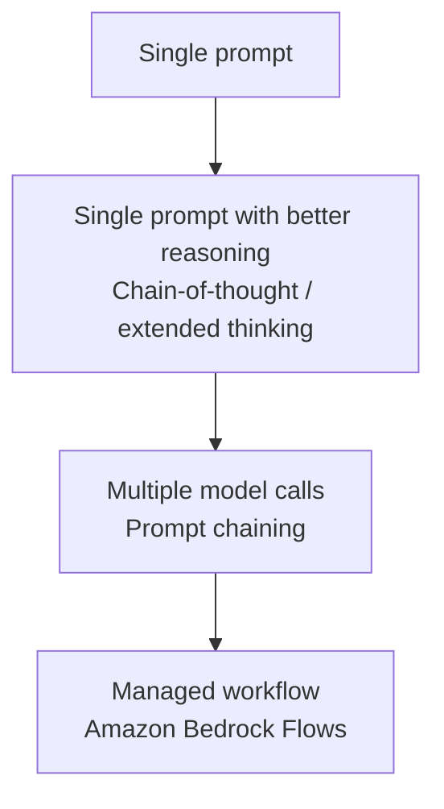
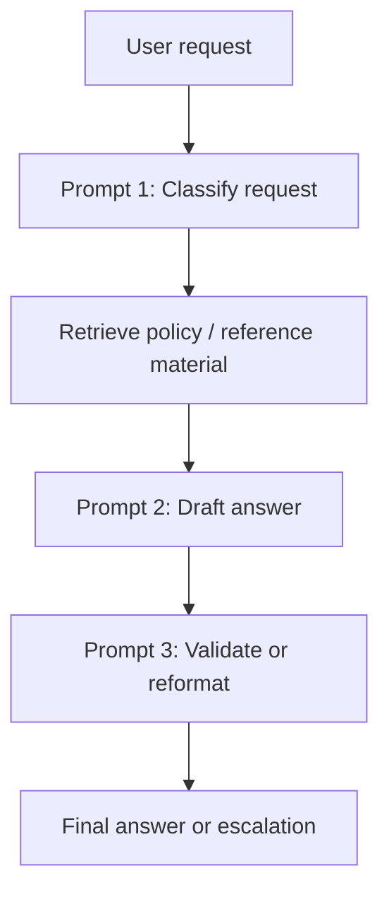

# Lecture 11 — Advanced Prompting: CoT, Bedrock Flows, Chaining

## Why This Topic Matters

Advanced prompting is the point where generative AI design starts to feel less like writing clever instructions and more like building a system. A simple prompt can work for straightforward tasks such as summarization or classification, but real applications usually need more structure. A production assistant might need to understand the request, retrieve supporting context, generate a draft, validate tone or compliance, and then return a final answer. That is too much responsibility to place on a single model invocation.

AWS frames this topic inside **Domain 1, Task 1.6**, which covers prompt engineering strategies, quality improvement beyond basic prompting, and the design of complex prompt systems. The exam does not just want you to recognize prompt engineering as a concept. It wants you to understand when a better prompt is enough, when a task should be broken into multiple stages, and when you should move to a managed orchestration model such as **Amazon Bedrock Flows**.

The big mental model for this lecture is simple:

> Basic prompting shapes one answer. Advanced prompting shapes how the whole task gets solved.

## Concept Overview

There are three connected layers to this topic, and it helps to see them as a progression rather than three separate ideas.

The first layer is **chain-of-thought prompting**. Amazon Bedrock documentation explicitly includes chain-of-thought reasoning as one of the tasks supported by prompt engineering. At this level, you are still inside a single model call, but you are improving how the model reasons. This matters when the problem involves logic, analysis, math, or code and the model benefits from being guided through a step-by-step path rather than being asked for an immediate answer.

The second layer is **prompt chaining**. AWS Prescriptive Guidance describes prompt chaining as decomposing a complex task into a sequence of LLM invocations, where each step processes or builds on the output of the previous one. This is the moment when you acknowledge that the user’s request is not one problem but several. Instead of asking one model call to classify, retrieve, synthesize, and validate all at once, you break the job into stages.

The third layer is **managed orchestration**. Once multiple prompt stages become part of an application, you need structure around them. You need branching, validation, reusable components, deployment discipline, and clear execution flow. This is where **Amazon Bedrock Flows** comes in. AWS describes Bedrock Flows as a way to build end-to-end generative AI workflows by linking prompts, foundation models, knowledge bases, and other AWS services.

So the progression looks like this:

Each step adds control and transparency. Each step also adds design complexity, latency, and operational responsibility.

## Architecture Walkthrough

Imagine you are building a regulated customer-support assistant. A user asks a question about a billing dispute. The company does not want the model to improvise refund promises or invent policy language.

If you send the entire request to one prompt and hope for the best, the model has to do too much at once. It must infer the issue type, find the relevant policy, interpret the rules, draft a customer-friendly answer, and avoid prohibited language. That is possible in theory, but brittle in practice.

A more robust design breaks the problem into stages.

1. First, identify what kind of issue the user is asking about.
2. Then retrieve the relevant policy or knowledge base content.
3. Then draft an answer using only the approved context.
4. Then validate or transform the result for tone, structure, or risk.
5. Finally, return the answer or route it for escalation.

This is the architectural picture behind prompt chaining.

Now connect that architecture to AWS. If you want full custom orchestration, you might pair **Amazon Bedrock** with **AWS Lambda** and **AWS Step Functions**. If you want a Bedrock-native, visual, managed orchestration model focused on prompt-based workflows, **Amazon Bedrock Flows** is often the cleaner fit.

This is why the exam may describe the same business need in two different ways and expect different answers. If the question emphasizes a general workflow with retries, broader service coordination, and deterministic control, Step Functions may be the better answer. If it emphasizes a prompt-centric workflow with Bedrock components such as prompt nodes, knowledge base nodes, and agent nodes, then Bedrock Flows becomes the better fit.

## Real-World Example

Consider an insurance company building an internal claims assistant for adjusters. The company wants the assistant to answer questions such as:

> “Can this claim be reimbursed under the customer’s policy, and what wording should I use when responding?”

This is not just a language task. It is a workflow problem.

The assistant needs to identify the claim type, retrieve the correct policy documents, generate a draft answer, and avoid language that would imply a legal commitment beyond what the policy allows. In a regulated setting, the company also wants visibility into how the answer was constructed. That makes prompt chaining attractive, because each stage can be inspected and improved separately.

If the company is still experimenting, it might start with Bedrock model calls connected through Step Functions or Lambda. If the team wants a Bedrock-native visual builder for prompt-centric orchestration, it can move that design into **Bedrock Flows**, where the same logic is represented as a graph of nodes rather than as hand-written orchestration code.

The important lesson is that advanced prompting is not about making one prompt huge. It is about deciding how much of the problem should be solved in one reasoning pass and how much should be externalized into an explicit workflow.

## AWS Services Involved

| Service                        | Role                                                                      |
| ------------------------------ | ------------------------------------------------------------------------- |
| Amazon Bedrock                 | Runs FM inference and supports prompt engineering patterns                |
| Amazon Bedrock Flows           | Managed visual orchestration for prompt-centric workflows                 |
| Amazon Bedrock Knowledge Bases | Retrieval step for grounding context in a flow                            |
| AWS Step Functions             | Deterministic orchestration for multi-step AI workflows                   |
| AWS Lambda                     | Custom preprocessing, validation, transformation, or integration logic    |
| Amazon S3                      | Stores prompt assets, flow inputs, or outputs                             |
| Amazon Bedrock Agents          | Can be invoked when tool-using agent behavior is needed within a workflow |

---

## Trade-offs and Design Choices

### Chain-of-thought vs prompt chaining

Use **chain-of-thought** when the problem is still one task, but the model needs help reasoning more carefully.
Use **prompt chaining** when the problem is actually multiple tasks stitched together.
A good rule:

- If you need **better reasoning**, improve the prompt.
- If you need **better system control**, split the workflow.

### Prompt chaining vs Bedrock Flows

Use plain prompt chaining with code, Lambda, or Step Functions when you want maximum flexibility and custom logic.
Use **Bedrock Flows** when you want:

- a visual Bedrock-native workflow
- managed orchestration
- easier composition of prompt, KB, and service nodes
- version and alias based deployment

### Bedrock Flows vs Step Functions

This is a classic exam comparison.
**Bedrock Flows**

- optimized for prompt-centric generative AI workflows
- native integration with prompt, knowledge base, and agent nodes
- easier to model Bedrock-first pipelines
  **Step Functions**
- stronger general-purpose workflow orchestration
- richer state-machine semantics
- better fit when deterministic workflow, retries, branching, and auditability are central beyond Bedrock itself

### Extended thinking trade-offs

Extended thinking can improve complex reasoning quality, but AWS documentation is clear that it increases:

- latency
- token usage
- cost
  So don’t treat it as “always on.”  
  Treat it as a targeted quality lever for complex reasoning tasks.

---

## Key Points

- Amazon Bedrock documentation explicitly includes **chain-of-thought reasoning** as a supported prompt engineering task.
- AWS Prescriptive Guidance defines **prompt chaining** as a sequence of LLM calls where each step builds on the previous output.
- Use better prompting when one task needs better reasoning; use prompt chaining when the overall request is actually multiple tasks.
- **Amazon Bedrock Flows** is the Bedrock-native way to build managed prompt-centric workflows.
- **AWS Step Functions** is often the better choice when the workflow needs broader deterministic orchestration, retries, and non-Bedrock-centric control.
- Advanced prompting improves output quality, but it does not replace RAG when the model needs current or private facts.

## Common Misconceptions

- **“Advanced prompting just means writing longer prompts.”**  
  No. The real shift is from better wording to better workflow design.

- **“Chain-of-thought and prompt chaining are the same.”**  
  No. Chain-of-thought improves reasoning within one model call. Prompt chaining coordinates multiple model calls.

- **“Bedrock Flows replaces all workflow orchestration on AWS.”**  
  No. Bedrock Flows is excellent for Bedrock-native prompt workflows, but Step Functions remains important for broader deterministic orchestration.

- **“Better prompting removes the need for retrieval.”**  
  No. Prompting shapes behavior; RAG supplies facts the model does not already know.

## Exam Tips

- If the question emphasizes **improving reasoning quality inside a single interaction**, think chain-of-thought or extended thinking.
- If the question emphasizes **multiple prompt stages with intermediate outputs**, think prompt chaining.
- If the question emphasizes **visual, managed, Bedrock-native orchestration**, think **Amazon Bedrock Flows**.
- If the question emphasizes **deterministic state transitions, retries, or general AWS workflow control**, think **AWS Step Functions**.
- Watch for wording that hints at **auditability**, **branching**, **reusable prompt components**, or **conditional logic**. Those are often cues that the correct answer is a workflow pattern, not just a better prompt.

## Gotchas

- Stronger reasoning usually means more tokens, more latency, or both.
- Chaining can improve reliability, but poor stage boundaries can make the system slower without making it better.
- Bedrock-native orchestration and general AWS orchestration are related but not interchangeable; the exam may test the distinction.
- A well-structured prompt still cannot compensate for missing enterprise data. That remains a RAG problem, not merely a prompting problem.

## Practice Question

A financial-services company is building a customer-support assistant. For each request, the system must classify the intent, retrieve relevant policy guidance, generate a draft answer, and route high-risk outputs for additional review. The architects want a **Bedrock-native**, visually managed workflow with reusable prompt components and conditional branching.

**Which AWS capability is the best fit, and why?**

## Source

- https://docs.aws.amazon.com/aws-certification/latest/ai-professional-01/ai-professional-01-domain1.html
- https://docs.aws.amazon.com/bedrock/latest/userguide/what-is-prompt-engineering.html
- https://docs.aws.amazon.com/bedrock/latest/userguide/prompt-engineering-guidelines.html
- https://docs.aws.amazon.com/bedrock/latest/userguide/claude-messages-extended-thinking.html
- https://docs.aws.amazon.com/bedrock/latest/userguide/flows.html
- https://docs.aws.amazon.com/bedrock/latest/userguide/flows-nodes.html
- https://docs.aws.amazon.com/prescriptive-guidance/latest/agentic-ai-patterns/workflow-for-prompt-chaining.html
- https://docs.aws.amazon.com/step-functions/latest/dg/sample-bedrock-prompt-chaining.html
