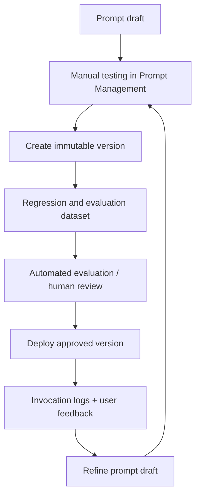
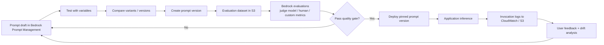

# Lecture 12 — Prompt QA, Regression Testing, and Feedback Loops

## Why This Topic Matters

Prompt engineering is easy to misunderstand because a prompt can look successful long before it is actually production-ready. A prompt that works on three hand-picked examples in a console test can still fail badly when traffic becomes more diverse, the model changes, the retrieval context shifts, or the business asks for stricter output control.

That is why this topic exists. In AWS terms, prompt engineering does not end when you write a good instruction. It becomes an operational discipline: version the prompt, test it systematically, evaluate it on representative datasets, deploy immutable versions, observe real usage, collect feedback, and refine again.

This lecture closes **Domain 1, Task 1.6** and connects directly into **Domain 5, Task 5.1 and 5.2**. The exam wants you to see that prompt quality assurance is not just “better wording.” It is the bridge between prompt design, model evaluation, observability, and continuous improvement.

The mental model is:

> A prompt is not just text. In production, it is a versioned artifact that needs testing, monitoring, and feedback loops.

## Concept Overview

There are four layers to understand, and they build on each other.

The first layer is **manual prompt testing**. Amazon Bedrock Prompt Management gives you a controlled place to create prompts, add variables, choose models, configure inference parameters, test with temporary values, and compare variants. This is where you do fast iteration. It is useful, but it is only the start.

The second layer is **prompt versioning and governance**. AWS distinguishes between a mutable **draft** and deployable **versions**. The draft is where you iterate. A version is the immutable snapshot you pin in an application. This matters because generative AI systems are non-deterministic. If you do not version the prompt, you cannot reliably answer a basic production question: “What exact prompt configuration produced this behavior?”

The third layer is **regression testing and formal evaluation**. The AWS exam guide explicitly calls out quality assurance systems, regression testing, automated quality gates, and continuous evaluation workflows. This is where you stop asking, “Does this prompt feel better?” and start asking, “Did this prompt improve correctness, consistency, and safety across a representative dataset?”

The fourth layer is **feedback loops in production**. AWS Well-Architected guidance recommends periodic evaluations, stratified sampling, custom metrics, and model invocation logging so that you can detect performance drift and continuously improve. In other words, the system should keep teaching you where the prompt fails.

These layers connect like this:

This is the core idea of prompt QA on AWS: treat prompt improvement as a closed-loop system, not a one-time authoring task.

## A Deeper Look at Automatic Evaluation Metrics

While Bedrock Evaluations offer powerful judge models and human review workflows, it's crucial to understand the automatic metrics that form the foundation of many text-based evaluations. These metrics provide a fast, scalable, and cost-effective way to score model outputs against reference answers. The most common ones are BLEU, ROUGE, and BERTScore.

### BLEU (Bilingual Evaluation Understudy)

- **What is it?** BLEU is a metric originally designed for evaluating the quality of machine-translated text. It measures how similar a candidate text (the model's output) is to one or more reference texts (the "gold standard" answers).
- **How it works:** It's based on **precision**. It looks at the n-grams (sequences of n words) in the model's output and checks how many of them appear in the reference answers. It then calculates a precision score for different n-gram sizes (e.g., 1-grams, 2-grams, etc.) and combines them into a single score. It also includes a "brevity penalty" to penalize model outputs that are much shorter than the reference answers, as this would artificially inflate the precision score.
- **Strengths:**
  - Fast and inexpensive to compute.
  - Correlates reasonably well with human judgment for tasks like translation and summarization.
  - Good for measuring fluency and the presence of correct phrases.
- **Weaknesses:**
  - It's a precision-based metric, meaning it doesn't care about **recall**. It won't penalize the model for omitting important information from the reference text.
  - It struggles with semantic meaning. A synonym or a rephrased sentence will be penalized because the exact n-grams don't match.
- **Exam Cue:** If a question mentions evaluating machine translation quality or requires a metric that focuses on the precision of generated n-grams, think BLEU.

### ROUGE (Recall-Oriented Understudy for Gisting Evaluation)

- **What is it?** ROUGE is a set of metrics designed for evaluating automatic summarization. As the name implies, it's focused on recall.
- **How it works:** It's the conceptual opposite of BLEU. It looks at the n-grams in the _reference_ text and checks how many of them appear in the _model's output_.
  - **ROUGE-N:** Measures the overlap of n-grams (e.g., ROUGE-1 for unigrams, ROUGE-2 for bigrams).
  - **ROUGE-L:** Measures the "Longest Common Subsequence" (LCS). This is more flexible than n-grams because it doesn't require the words to be consecutive, just in the same order. This makes it better at handling rephrasing.
- **Strengths:**
  - Focuses on **recall**, making it excellent for tasks where capturing all key information is critical (like summarization).
  - ROUGE-L is more flexible than strict n-gram matching.
  - Fast and inexpensive to compute.
- **Weaknesses:**
  - Like BLEU, it doesn't understand semantics. It only performs lexical (word-level) matching.
  - It doesn't heavily penalize for lack of fluency or grammatical errors in the generated text.
- **Exam Cue:** If a scenario involves evaluating summarization tasks or requires ensuring all key points from a source document are included, ROUGE is the metric to choose.

### BERTScore

- **What is it?** BERTScore is a more modern, semantic evaluation metric. It leverages contextual embeddings from BERT-like models to compare the meaning of the model's output and the reference text.
- **How it works:** Instead of matching exact words, it represents each token (word or sub-word) in both the candidate and reference sentences as a high-dimensional vector (an embedding). It then computes the cosine similarity between tokens in the two sentences. This allows it to recognize that "boat" and "ship" are similar, something BLEU and ROUGE cannot do. It computes precision, recall, and an F1 score based on these semantic similarities.
- **Strengths:**
  - Captures **semantic similarity**, not just lexical overlap. It understands synonyms and paraphrasing.
  - Provides a more nuanced and often more human-aligned score than BLEU or ROUGE.
  - It's the foundation for many "judge model" evaluations.
- **Weaknesses:**
  - More computationally expensive and slower than BLEU or ROUGE.
  - The quality of the score depends on the quality of the underlying embedding model (e.g., BERT).
- **Exam Cue:** When an evaluation requires understanding paraphrasing, synonyms, or the true semantic meaning of a response, BERTScore or a similar embedding-based metric (often used by a judge model) is the superior choice.

### Summary of Metrics

| Metric        | Core Idea               | Good For...                        | Bad For...                                 |
| ------------- | ----------------------- | ---------------------------------- | ------------------------------------------ |
| **BLEU**      | N-gram **Precision**    | Translation, fluency               | Capturing all key points, semantic meaning |
| **ROUGE**     | N-gram **Recall**       | Summarization, information capture | Fluency, grammatical correctness           |
| **BERTScore** | **Semantic** Similarity | Paraphrasing, nuanced meaning      | Speed, low-cost computation                |

These metrics are often available as "automatic" or "built-in" evaluation types within Amazon Bedrock Evaluations, providing a powerful first pass before moving to more expensive judge model or human evaluations.

## Architecture Walkthrough

Imagine you are building an internal policy assistant for HR. The assistant answers employee questions about leave, expenses, and travel policy. The team updates the prompt to make answers more concise.

If they only test one or two examples in the console, they might think the change is good. But once the prompt reaches production, maybe the shorter format removes important caveats, becomes overly confident, or stops citing the right policy section. That means the prompt did not just change the writing style. It changed business behavior.

So a safer AWS architecture looks like this:

1. Author and refine the prompt in **Amazon Bedrock Prompt Management**.
2. Test the draft with representative variable values.
3. Compare variants or versions side by side.
4. Create an immutable prompt version for candidate release.
5. Run regression-style evaluation on a custom prompt dataset.
6. Score the results with built-in metrics, a judge model, custom metrics, or human reviewers.
7. If the prompt passes quality gates, deploy that version in the application.
8. Turn on **model invocation logging** to CloudWatch Logs and/or Amazon S3.
9. Collect user feedback and real production traces.
10. Feed those failures and edge cases back into the next evaluation set.

That full cycle is what turns prompt design into an engineering process.

Notice the architectural separation:

- **Prompt Management** helps you author, test, version, and compare prompts.
- **Bedrock evaluations** helps you evaluate quality more systematically.
- **Invocation logging** helps you observe real usage and build a production feedback loop.

Each solves a different problem. The exam often tests whether you can keep those roles separate.

## Real-World Example

Consider a customer-support assistant for a telecom provider. The business wants to improve first-contact resolution while avoiding hallucinated policy promises.

The team starts with a prompt that explains tone, escalation rules, and response format. They test it manually and it looks good. But after deployment, they discover three recurring failures:

- refund questions are answered too confidently
- plan-comparison answers omit disclaimers
- angry users trigger inconsistent escalation language

Now the team needs more than prompt editing. They need a feedback loop.

They create a custom evaluation dataset in Amazon S3 with prompts and reference responses. They use Bedrock evaluations to score new prompt candidates. For built-in metrics, they can use Bedrock’s evaluation workflows. When built-in metrics do not capture the business requirement well enough, they define a **custom metric** using a judge model and an optional rating scale. After the best candidate is selected, they deploy a specific prompt version instead of the mutable draft. In production, Bedrock model invocation logging sends request and response data to CloudWatch Logs and S3 so the team can inspect failures and feed new examples into the next regression set.

This is a realistic production pattern because it separates:

- **authoring** from **deployment**
- **subjective prompt preferences** from **measurable quality criteria**
- **one-time testing** from **continuous improvement**

## AWS Services Involved

| Service                          | Role                                                                                                      |
| -------------------------------- | --------------------------------------------------------------------------------------------------------- |
| Amazon Bedrock Prompt Management | Create prompts, configure variables, test drafts, compare versions, and manage deployable prompt versions |
| Amazon Bedrock Evaluations       | Run automatic, judge-model, human, and RAG evaluations                                                    |
| Amazon S3                        | Store custom prompt datasets, evaluation outputs, and large invocation log payloads                       |
| Amazon CloudWatch Logs           | Query invocation logs and support rapid troubleshooting with Logs Insights                                |
| AWS Lambda                       | Build custom regression harnesses, validation steps, or automated quality gates                           |
| AWS Step Functions               | Orchestrate multi-step regression or approval workflows                                                   |
| AWS CloudTrail                   | Audit prompt and Bedrock management activity                                                              |

## Trade-offs and Design Choices

### Manual prompt testing vs automated evaluation

Manual testing is fast and useful during early iteration. But it does not scale well, and it often overfits to the examples the builder already expects.

Automated evaluation is slower and costs more, but it is far better for:

- regression testing
- comparing prompt candidates consistently
- gating production deployment
- catching drift over time

### Built-in metrics vs custom metrics

Use **built-in metrics** when AWS already provides a good fit for the task and you want faster setup.

Use **custom metrics** when the business cares about something more specific, such as “does the response clearly state escalation criteria?” or “does it preserve mandatory compliance language?” Bedrock supports this by letting you provide detailed judge instructions and an optional rating scale.

### Judge model vs human evaluation

Use a **judge model** when you need scale, speed, and lower cost.

Use **human workers** when quality criteria are nuanced, domain-specific, subjective, or high-risk. Human review is slower and more expensive, but often more trustworthy for regulated or customer-facing scenarios.

### CloudWatch Logs vs Amazon S3 for feedback loops

Use **CloudWatch Logs** when you want quick operational troubleshooting and log queries.

Use **Amazon S3** when you want durable storage, larger payload handling, Athena analysis, ETL, or downstream analytics. AWS notes that large input/output bodies and binary outputs are handled in S3, not CloudWatch Logs alone.

### Prompt draft vs version

Use the **draft** for iteration.

Use a **version** for deployment. A version is the stable release artifact. If the exam asks for controlled rollout, reproducibility, or easy switching between prompt configurations, that is a strong signal for Prompt Management versions.

## Key Points

- The exam guide explicitly ties prompt engineering to **quality assurance**, **regression testing**, and **feedback loops**.
- In Prompt Management, the **draft** is mutable and the **version** is the deployable snapshot.
- Bedrock Prompt Management supports testing prompts with variables and comparing versions side by side.
- Bedrock evaluations can evaluate models and knowledge bases with automatic metrics, a judge model, or human workers.
- Custom evaluation datasets in S3 use **JSONL** format and can include `prompt`, `referenceResponse`, and optional `category`.
- AWS Well-Architected guidance recommends **periodic evaluation**, **stratified sampling**, **custom metrics**, and **model invocation logging**.
- Model invocation logging can publish to **CloudWatch Logs**, **Amazon S3**, or both.

## Common Misconceptions

- **“If the prompt works in the console, it is ready for production.”**  
  No. Console testing is useful, but production readiness requires regression testing, version control, and observability.

- **“Prompt Management is the full evaluation system.”**  
  No. Prompt Management helps author, test, compare, and version prompts. Formal evaluation is a separate concern.

- **“A better prompt automatically means the whole system got better.”**  
  No. Retrieval quality, model choice, context formatting, and user traffic patterns can all affect the outcome.

- **“Logs are the same thing as feedback loops.”**  
  No. Logs give you raw evidence. A feedback loop exists only when you use that evidence to update datasets, metrics, prompt versions, or deployment decisions.

## Exam Tips

- If the question emphasizes **parameterized reusable prompts, versioning, comparison, and governance**, think **Amazon Bedrock Prompt Management**.
- If the question emphasizes **continuous evaluation, regression, LLM-as-a-Judge, human review, or RAG evaluation**, think **Amazon Bedrock Evaluations**.
- If the question emphasizes **production troubleshooting and real request/response visibility**, think **model invocation logging**, CloudWatch Logs, and Amazon S3.
- If the question emphasizes **ongoing performance drift detection**, look for **periodic evaluations**, **stratified sampling**, and **ground truth datasets**.
- If the requirement is “deploy the exact tested prompt configuration,” do **not** rely on the mutable draft. Use a **prompt version**.

## Gotchas

- Test variable values in Prompt Management are temporary and are not saved with the prompt.
- When you deploy a prompt, you should pin a **version**, not keep pointing at a draft that may change.
- Custom prompt datasets for Bedrock automatic evaluations must be stored in **Amazon S3** as **`.jsonl`** and can include up to **1000 prompts** per automatic evaluation job.
- Evaluation results are available after the job reaches **Ready**, and the report is accessible in the console or in the specified S3 bucket.
- CloudWatch Logs can hold invocation metadata and JSON bodies up to 100 KB, but large payloads and binary data require S3.
- If your prompt seems to regress, the real issue might be retrieval or context formatting rather than the prompt text itself. Prompt QA and retrieval QA are related but not identical.

## Practice Question

A company uses Amazon Bedrock Prompt Management for a customer-support prompt. The team wants to release prompt changes safely. They need to compare prompt candidates, deploy only an immutable tested version, run repeatable evaluations against a representative dataset, and use production traces to improve the next revision.

Which combination is the best fit?

**A.** Keep editing the draft prompt, manually spot-check in the console, and deploy once responses look good  
**B.** Use Prompt Management versions, evaluate candidates with Bedrock evaluations on an S3 dataset, and enable model invocation logging to feed future refinements  
**C.** Store prompts in S3 text files and use CloudTrail as the primary regression-testing service  
**D.** Use only CloudWatch Logs because observability removes the need for offline evaluation

## Source

- https://docs.aws.amazon.com/aws-certification/latest/ai-professional-01/ai-professional-01-domain1.html
- https://docs.aws.amazon.com/aws-certification/latest/ai-professional-01/ai-professional-01-domain5.html
- https://docs.aws.amazon.com/bedrock/latest/userguide/prompt-management-create.html
- https://docs.aws.amazon.com/bedrock/latest/userguide/prompt-management-test.html
- https://docs.aws.amazon.com/bedrock/latest/userguide/prompt-management-version-compare.html
- https://docs.aws.amazon.com/bedrock/latest/userguide/prompt-management-deploy.html
- https://docs.aws.amazon.com/bedrock/latest/userguide/evaluation.html
- https://docs.aws.amazon.com/bedrock/latest/userguide/model-evaluation-prompt-datasets.html
- https://docs.aws.amazon.com/bedrock/latest/userguide/model-evaluation-custom-metrics-create-job.html
- https://docs.aws.amazon.com/bedrock/latest/userguide/model-evaluation-report.html
- https://docs.aws.amazon.com/bedrock/latest/userguide/model-invocation-logging.html
- https://docs.aws.amazon.com/wellarchitected/latest/generative-ai-lens/genops01-bp01.html
