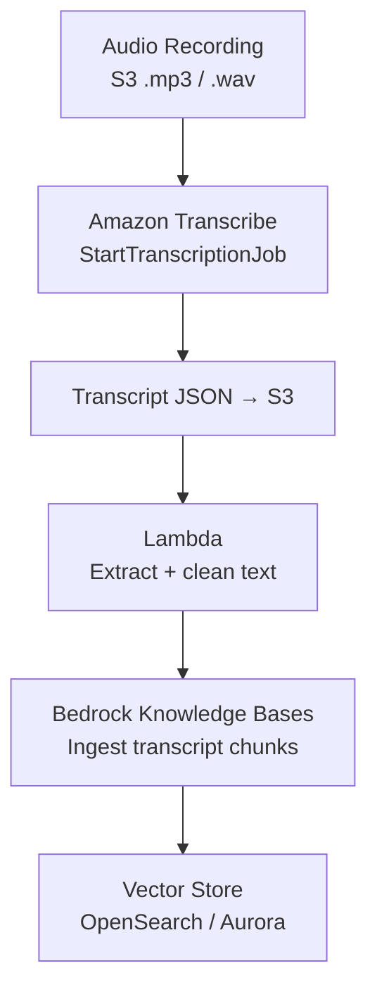
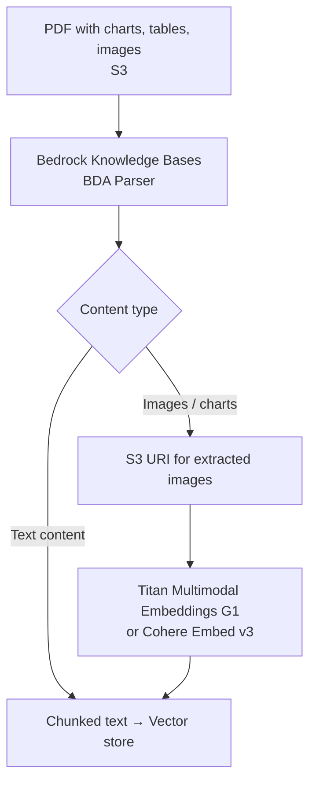
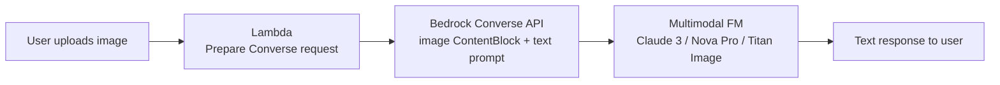
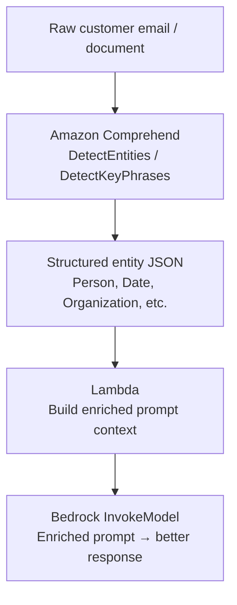
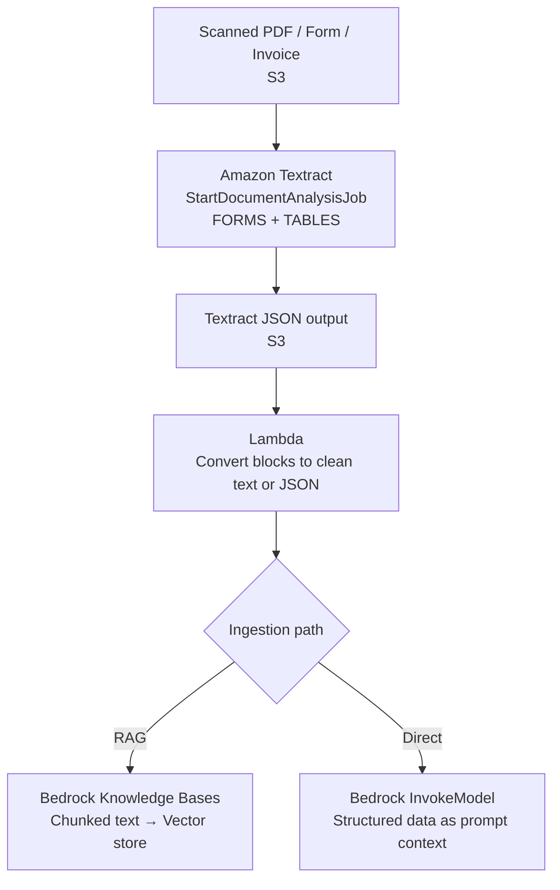
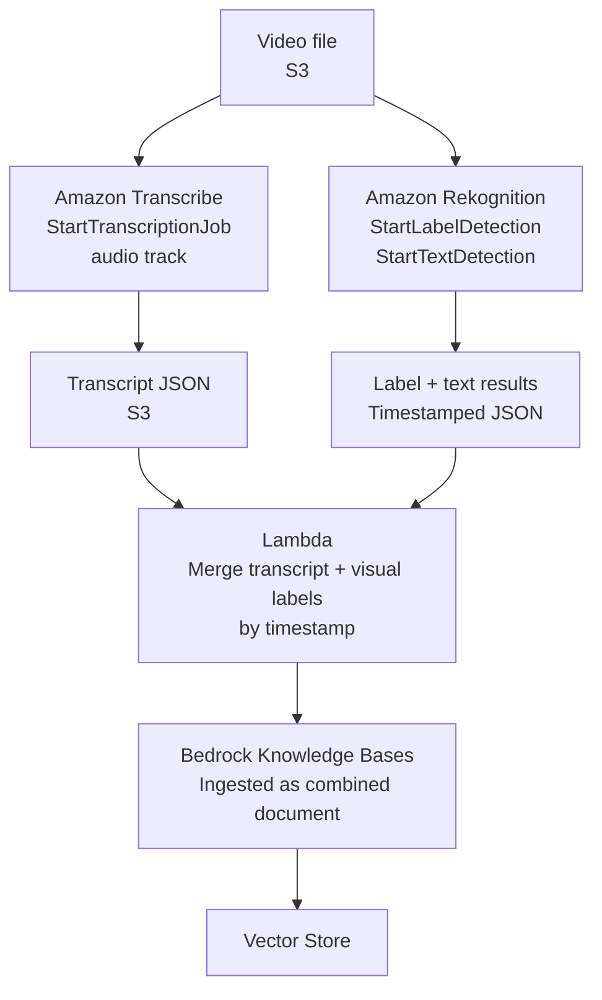

# Lecture 13 — Multimodal Data Pipelines for FM Consumption

## Why This Topic Matters

Most real-world content is not plain text. Enterprises store knowledge in audio recordings of customer calls, scanned PDF invoices with embedded tables, images of product catalogs, and spreadsheets of operational data. A production GenAI system must ingest and process all of these modality types before an FM can reason over them.

The AIP-C01 exam tests whether you can select the right AWS service for each modality, design a preprocessing pipeline that routes data correctly, and understand when a multimodal FM is required versus a single-modality pipeline. Skill 1.3.2 explicitly names Amazon Bedrock multimodal models, SageMaker Processing, AWS Transcribe, and advanced multimodal pipeline architectures.

## Concept Overview

A **multimodal pipeline** converts heterogeneous input types — text, audio, image, and tabular data — into a format that an FM can consume. The pipeline usually terminates in one of three outcomes:

1. **Direct FM invocation** — Structured prompt with inline media (images) passed to a multimodal FM via the Converse API.
2. **Vector store ingestion** — Processed text (transcripts, extracted text from images) chunked and embedded for RAG retrieval.
3. **Structured query path** — Tabular or structured data routed to a SQL-capable retrieval path, bypassing vector embeddings.

Each modality has a preferred AWS processing service. The exam tests your ability to match modality to service.

## Modality-to-Service Mapping

| Input Modality | Primary Service | Output |
|---|---|---|
| Audio / speech | Amazon Transcribe | Text transcript |
| Images, charts, scanned PDFs | Amazon Bedrock Data Automation (BDA) or FM parser | Extracted text + image embeddings |
| Scanned documents, forms, invoices | Amazon Textract | Extracted text, key-value pairs, tables |
| Text documents (PDF, HTML, DOCX) | Bedrock Knowledge Bases default parser | Chunked text |
| Tabular / structured (CSV, Redshift) | AWS Glue / Redshift / SageMaker Processing | SQL-ready or normalized text |
| Video | Amazon Transcribe (audio track) + Amazon Rekognition (frames) | Combined transcript + object/scene labels |
| Multi-format complex docs | SageMaker Processing (custom container) | Preprocessed text |

## Architecture Walkthrough

### Path A — Audio Ingestion Pipeline

**Key details:**
- `StartTranscriptionJob` is async; use S3 event notification to trigger Lambda when the output lands.
- Transcribe supports speaker diarization (`ShowSpeakerLabels: true`) to attribute turns in a call transcript.
- Output is a JSON file; Lambda must extract the `transcript` field before passing to Bedrock.

### Path B — Image / Chart Ingestion via BDA

### Path C — Real-Time Multimodal FM Invocation

For scenarios where you want the FM to see an image at inference time (not pre-indexed):

Use the `image` field in the `ContentBlock` when calling `Converse` or `InvokeModel`. Supported formats: PNG, JPEG, GIF, WebP. Max image size varies by model.

### Path D — Entity Extraction to Improve Input Quality (Comprehend)

Amazon Comprehend addresses Skill 1.3.4: enhancing input data quality before FM invocation.

**Why this matters:** Without entity extraction, an FM receives unstructured text and must infer entities. Pre-extracting entities with Comprehend improves response accuracy, allows metadata tagging at ingestion time, and enables structured filtering during retrieval.

Comprehend API calls relevant to the exam:
- `DetectEntities` — identify named entities (Person, Location, Organization, Date, Quantity)
- `DetectKeyPhrases` — extract key phrases for metadata tagging
- `DetectDominantLanguage` — route to language-appropriate FM or translator
- `DetectSentiment` — categorize tone for downstream routing decisions

### Path E — Structured Document Extraction via Amazon Textract

Many enterprise documents — invoices, tax forms, loan applications, medical records — contain structured data in tables, key-value form fields, and multi-column layouts. BDA and the Bedrock Knowledge Bases default parser handle narrative text well, but they are not purpose-built to extract form fields or table cells with their structural relationships intact. Amazon Textract solves this: it reads the visual structure of a document page and returns text with precise spatial and semantic context.

Textract exposes three main analysis operations relevant to the exam:
- `DetectDocumentText` — raw text lines and words, no structure
- `AnalyzeDocument` with `FORMS` — returns key-value pairs (field label → field value)
- `AnalyzeDocument` with `TABLES` — returns rows, columns, and cell values as structured data
- `AnalyzeExpense` — specialized extraction for invoices and receipts (vendor name, line items, totals)

For FM ingestion, the pipeline typically calls Textract asynchronously on S3-resident PDFs, converts the structured output (key-value pairs and table cells) into clean text or JSON, then ingests that into a Bedrock Knowledge Base or passes it directly as prompt context.

**Key details:**
- Textract's async API (`StartDocumentAnalysis`) returns a job ID; use SNS/SQS notification or polling to retrieve results.
- The output is a flat list of `Block` objects — Lambda must traverse parent-child relationships to reconstruct table rows or form key-value pairs.
- `AnalyzeExpense` is purpose-built for invoices; use it instead of `AnalyzeDocument` when processing financial documents to get structured line-item output without custom parsing logic.
- Textract complements BDA: use Textract when you need structured field extraction from standardized forms; use BDA when you need an end-to-end managed pipeline with image/chart handling inside Knowledge Bases.

### Path F — Video Analysis via Amazon Rekognition

Video is a composite modality: it carries an audio track (dialogue, narration) and a visual stream (scenes, objects, text on screen, faces). Amazon Rekognition analyzes the visual stream — detecting objects, scenes, printed/handwritten text, and faces across video frames — while Amazon Transcribe handles the audio track. Combining both services produces a rich, searchable representation of video content.

Amazon Rekognition Video exposes two analysis modes:
- **Stored video** (`StartLabelDetection`, `StartTextDetection`, `StartFaceDetection`) — asynchronous, processes S3-resident video files, returns per-frame labels with timestamps.
- **Streaming video** (`CreateStreamProcessor`) — real-time analysis via Amazon Kinesis Video Streams.

For Knowledge Base ingestion the stored-video path is the norm: Rekognition detects object/scene labels and any overlaid text per frame, then Lambda serializes the timestamped labels alongside the Transcribe transcript so the combined document can be chunked and indexed.

**Key details:**
- Rekognition Label Detection returns confidence scores per label per timestamp — Lambda can filter to high-confidence labels before ingestion to reduce noise.
- `StartTextDetection` extracts overlaid text (captions, slides, product names) that Transcribe would miss because it processes only the audio channel.
- For the exam: Rekognition handles the **visual** dimension of video; Transcribe handles the **audio** dimension. Both are needed for a complete video ingestion pipeline.
- Rekognition does not transcribe speech — do not confuse `StartTextDetection` (on-screen printed/handwritten text) with speech-to-text.

## AWS Services Involved

| Service | Role |
|---|---|
| Amazon Transcribe | Convert audio and video speech to transcript text |
| Amazon Rekognition | Detect objects, scenes, overlaid text, and faces in images and video frames |
| Amazon Textract | Extract typed/handwritten text, key-value form fields, and tables from scanned documents and PDFs |
| Amazon Comprehend | Entity extraction, key phrase detection, sentiment, language detection for unstructured text |
| Amazon Bedrock Data Automation | Managed multimodal parser inside Knowledge Bases — handles PDFs, images, charts, tables |
| Amazon Bedrock Converse API | Inline multimodal FM invocation (image + text at inference time) |
| SageMaker Processing | Custom container-based preprocessing for non-standard or large-scale formats |
| Amazon Titan Multimodal Embeddings G1 | Embed both text and image content for cross-modal vector search |
| AWS Lambda | Orchestrate pipeline steps, parse service outputs, build enriched prompts |
| Amazon S3 | Store raw media, transcripts, Textract output, BDA extracted images |

## Real-World Example

A financial services firm wants a GenAI assistant that can answer questions about quarterly earnings calls. Their data includes:

1. **Audio recordings** of analyst calls — Amazon Transcribe produces speaker-diarized transcripts, Lambda cleans and segments by speaker, Bedrock KB ingests as text chunks.
2. **PDF slide decks** with embedded charts — Bedrock Data Automation parser extracts chart captions and tables, Titan Multimodal Embeddings indexes image content.
3. **Scanned financial disclosure forms** with key-value fields and tables — Amazon Textract `AnalyzeDocument` (FORMS + TABLES) extracts structured data, Lambda converts Block output to clean JSON, Bedrock KB ingests as metadata-rich chunks.
4. **Analyst emails** with complex terminology — Comprehend `DetectEntities` tags company names, dates, and financial figures, Lambda attaches as chunk metadata for filtered retrieval.

At query time, a user asks "What did the CFO say about margins in Q3?" — retrieval uses speaker-labeled transcript chunks, Textract-extracted table data, and entity-tagged metadata to return precise answers spanning multiple content types.

## Trade-offs and Design Choices

| Decision | When to use | Trade-off |
|---|---|---|
| Transcribe batch job | Bulk historical audio | Async latency; output in S3 |
| Transcribe streaming | Live customer calls | Higher complexity; WebSocket-based |
| BDA parser in Bedrock KB | Standard document types with images and charts | Less control but fully managed |
| Textract AnalyzeDocument | Scanned forms with key-value fields or tables; invoices | Purpose-built structured extraction; requires Block parsing in Lambda |
| Textract AnalyzeExpense | Invoices and receipts | Pre-built expense schema; no custom parsing needed |
| FM parser (prompt-based) | Custom or unusual document layouts | Higher cost per doc; more flexible |
| Rekognition stored video | Batch video indexing (object labels, overlaid text) | Async; combine with Transcribe for full video coverage |
| Rekognition streaming | Real-time video monitoring | Requires Kinesis Video Streams; higher operational complexity |
| SageMaker Processing | Non-standard formats, large-scale batch | Requires container management |
| Comprehend pre-processing | Improve input quality for any unstructured text | Adds latency and cost per call |

## Key Points

- Skill 1.3.2 explicitly requires understanding of text, image, audio, and tabular data processing.
- Amazon Transcribe converts audio to text; use `StartTranscriptionJob` (batch) or streaming for real-time.
- Amazon Rekognition analyzes the visual dimension of images and video — object/scene labels, overlaid text (`StartTextDetection`), and faces. It does not process speech.
- Amazon Textract extracts structured content from scanned documents: use `AnalyzeDocument` with FORMS for key-value pairs, TABLES for table data, and `AnalyzeExpense` for invoices.
- Amazon Comprehend adds structure to unstructured text via entity extraction, key phrases, sentiment, and language detection.
- Bedrock Converse API supports inline image input via `image` ContentBlock — no pre-indexing required.
- Bedrock Data Automation (BDA) is the managed multimodal parser inside Knowledge Bases; it handles charts, tables, and images in a single pipeline.
- Titan Multimodal Embeddings G1 and Cohere Embed v3 embed both text and images for cross-modal search.
- For video, combine Transcribe (audio) + Rekognition (visual frames) — neither service alone covers the full modality.
- Tabular data (CSV, Redshift) uses Text-to-SQL inside Bedrock KB — no vector embeddings needed.

## Common Misconceptions

- **"Bedrock models can process audio natively"** — Bedrock FMs do not accept raw audio. Audio must first be transcribed to text via Amazon Transcribe.
- **"BDA replaces Transcribe"** — BDA handles document parsing (PDFs, images). Transcribe handles audio/video speech-to-text. They address different modalities.
- **"BDA and Textract are interchangeable"** — BDA is a managed pipeline optimized for Knowledge Base ingestion with image handling. Textract is a purpose-built structured extraction API for forms, tables, and invoices. For highly structured documents (tax forms, contracts, loan applications), Textract provides more precise field-level extraction.
- **"Rekognition transcribes speech in videos"** — Rekognition handles the visual stream only (labels, text on screen, faces). Speech requires Transcribe.
- **"Comprehend is only for NLP tasks separate from Bedrock"** — Comprehend integrates into GenAI pipelines as a preprocessing step to enrich prompts and attach metadata to chunks.
- **"Multimodal FM = the FM accepts any file type"** — Multimodal FMs accept inline images and text together via the Converse API. Audio and video are always pre-processed to text first.

## Exam Tips

- Audio → FM: always goes through **Amazon Transcribe** first.
- Images at inference time (ad hoc): use **Converse API with image ContentBlock**.
- Images at ingestion time (RAG): use **BDA parser + Titan Multimodal Embeddings** inside Knowledge Bases.
- Scanned forms with key-value fields or tables: use **Amazon Textract** (`AnalyzeDocument` FORMS/TABLES). For invoices specifically, use `AnalyzeExpense`.
- Video: **Transcribe** handles audio track, **Rekognition** handles visual frames — combine both for complete video coverage.
- Input data quality improvement: **Amazon Comprehend** for entity extraction before FM invocation (Skill 1.3.4).
- Custom or complex preprocessing at scale: **SageMaker Processing** with a custom container.
- `DetectEntities` output → attach as metadata during POST_CHUNKING Lambda → enables metadata filtering at retrieval time.
- Rekognition `StartTextDetection` finds text overlaid on video frames (captions, slides); this is distinct from `StartTranscriptionJob` which processes the audio channel.

## Gotchas

- Transcribe output is a JSON object — you must extract the `transcript` string; the raw JSON is not suitable as FM input.
- Bedrock BDA parser requires an S3 URI for storing extracted images; missing this causes ingestion failures for image-heavy documents.
- Comprehend `DetectEntities` has a 5,000 UTF-8 byte limit per request — split long documents before calling.
- The `image` ContentBlock in Converse API supports base64-encoded bytes or an S3 URI (model-dependent); confirm support in the target model card.
- Not all Bedrock models support multimodal input — check the model card before designing the pipeline.
- Textract `AnalyzeDocument` returns `Block` objects — the output is a flat array; you must traverse parent-child relationships (`Relationships`) in Lambda to reconstruct table rows or form key-value pairs. Do not treat the raw output as clean text.
- Textract async operations (`StartDocumentAnalysis`) require polling or SNS notification — there is no synchronous response for multi-page PDFs.
- Rekognition `StartTextDetection` detects text that appears visually in video frames (titles, captions, overlays) — it does not process the audio track and will miss spoken words.

## Practice Question

A company processes customer support calls (MP3 audio) and wants to build a RAG system that lets agents query call history using natural language. A solution architect needs to design the ingestion pipeline.

Which combination of AWS services correctly processes the audio data for ingestion into a Bedrock Knowledge Base?

A. Amazon Polly → Lambda → Bedrock Knowledge Bases  
B. Amazon Transcribe → Lambda → Bedrock Knowledge Bases  
C. Amazon Rekognition → Lambda → Bedrock Knowledge Bases  
D. Amazon Bedrock Data Automation → Bedrock Knowledge Bases

**Answer: B**  
Transcribe converts audio to text transcripts. Lambda cleans and optionally enriches the transcript. Bedrock Knowledge Bases ingests the text. Polly is text-to-speech (wrong direction). Rekognition handles images/video frames, not audio. BDA is a document parser for structured files, not audio.

## Source

- [Inference using Converse API — Amazon Bedrock](https://docs.aws.amazon.com/bedrock/latest/userguide/conversation-inference.html)
- [Amazon Transcribe Developer Guide](https://docs.aws.amazon.com/transcribe/latest/dg/what-is.html)
- [Amazon Comprehend Developer Guide](https://docs.aws.amazon.com/comprehend/latest/dg/what-is.html)
- [Bedrock Data Automation — supported document types](https://docs.aws.amazon.com/bedrock/latest/userguide/bda.html)
- [Amazon Textract Developer Guide — What is Amazon Textract?](https://docs.aws.amazon.com/textract/latest/dg/what-is.html)
- [Amazon Rekognition Developer Guide — What is Amazon Rekognition?](https://docs.aws.amazon.com/rekognition/latest/dg/what-is.html)
- [AIP-C01 Domain 1 — Skill 1.3.2, 1.3.4](https://docs.aws.amazon.com/aws-certification/latest/ai-professional-01/ai-professional-01-domain1.html)
