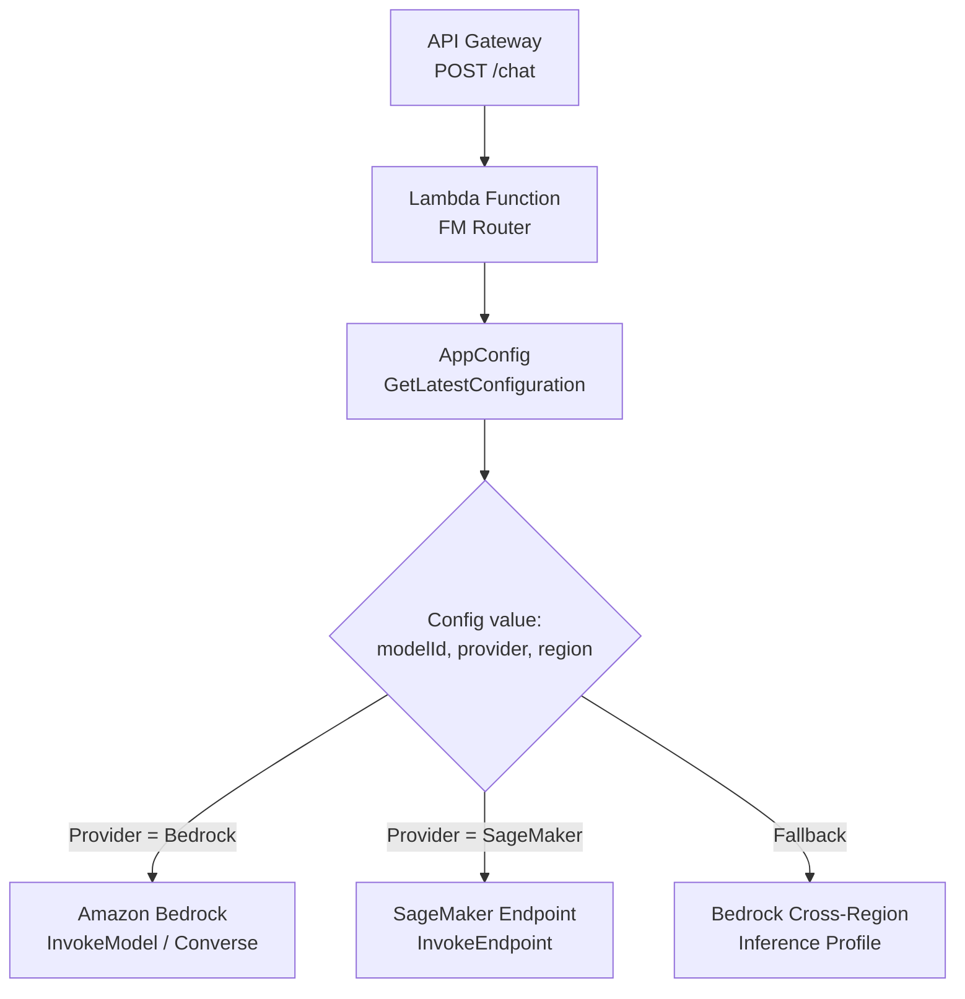
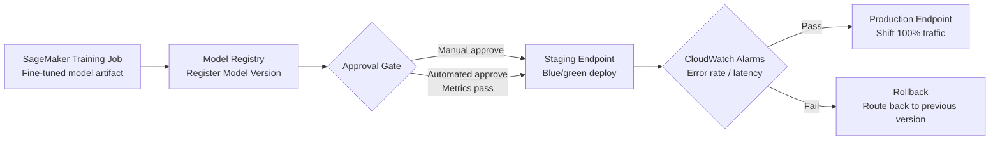
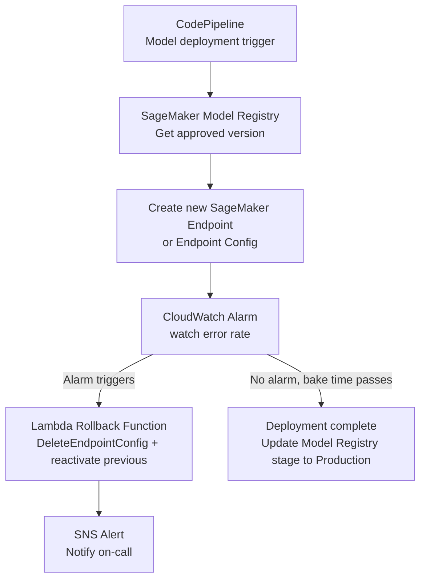

# Lecture 14 — Dynamic Model Selection, AppConfig, Rollback, and Lifecycle Management

## Why This Topic Matters

Production GenAI systems rarely lock in a single FM forever. Models get deprecated, better models are released, regional availability shifts, and cost constraints require switching between providers at runtime. The AIP-C01 exam tests whether you can design systems that change which FM is used without deploying new code, and whether you can manage the full deployment lifecycle of customized models — including rollback when a deployment goes wrong.

Skill 1.2.2 explicitly names **AWS Lambda, Amazon API Gateway, and AWS AppConfig** as tools for dynamic model selection. Skill 1.2.4 expands Lecture 03's coverage of LoRA and Model Registry to include **rollback strategies for failed deployments** and **lifecycle management to retire and replace models**.

## Concept Overview

### Dynamic Model Selection with AppConfig

**AWS AppConfig** is a feature flag and dynamic configuration service. For GenAI applications, it solves a specific problem: how do you change which FM you call without redeploying your Lambda functions?

The pattern is:
1. Store the model ID (e.g., `anthropic.claude-3-5-sonnet-20241022-v2:0`) as a configuration value in AppConfig.
2. Lambda reads the configuration value via the **AWS AppConfig Agent Lambda extension**, which runs as a companion process and maintains a local cache at `localhost:2772`.
3. When you need to switch models, update the AppConfig deployment — the extension polls for changes in the background and updates the local cache without a Lambda redeploy.

This is called **decoupling model identity from application code**.

### Model Deployment Lifecycle

A fine-tuned or customized model goes through a lifecycle:

```
Development → Testing → Staging → Production → Retirement
```

SageMaker Model Registry tracks model versions through these stages. The exam tests understanding of how to automate promotions, detect failures, and trigger rollbacks.

## Architecture Walkthrough

### Pattern A — AppConfig-Driven Model Selection



**AppConfig configuration structure (freeform JSON):**

```json
{
  "primaryModelId": "anthropic.claude-3-5-sonnet-20241022-v2:0",
  "fallbackModelId": "amazon.titan-text-express-v1",
  "provider": "bedrock",
  "region": "us-east-1",
  "maxTokens": 2048
}
```

Lambda accesses this configuration by calling the **AWS AppConfig Agent Lambda extension** at `localhost:2772`. The extension runs as a companion process, maintains a local cache, and polls AppConfig in the background. On each Lambda invocation, the extension checks whether the configured poll interval has elapsed; if so, it fetches any updated configuration. When you deploy a new model ID in AppConfig, all Lambda instances pick it up within the next poll cycle — no code redeploy required.

**Key benefit:** Model identity is an operational concern, not a code concern. This enables gradual rollouts (deploy new model to 10% of traffic via AppConfig deployment strategy) and instant rollback (revert AppConfig to prior version).

### Pattern B — SageMaker Model Registry Lifecycle



### Pattern C — Automated Deployment Pipeline with Rollback



**Rollback trigger conditions** the exam expects you to know:
- Invocation error rate exceeds threshold
- Model latency p99 exceeds SLA
- Custom CloudWatch metric (e.g., low confidence scores from model response parsing)

### Model Retirement Pattern

When a model version is superseded:

1. Tag the Model Registry version as `Deprecated` — signals to downstream pipelines to stop using it.
2. Drain traffic: shift 100% to the new version, monitor for a bake period (e.g., 7 days).
3. Delete the old endpoint configuration.
4. Archive the model artifact in S3 with a lifecycle policy (transition to Glacier after 90 days).

## AWS Services Involved

| Service | Role |
|---|---|
| AWS AppConfig | Store and distribute model configuration (model ID, provider, parameters) without code deploys |
| AWS Lambda | Execute FM routing logic; read AppConfig at runtime via the AWS AppConfig Agent Lambda extension |
| Amazon API Gateway | Standardized HTTP interface that decouples callers from FM routing Lambda |
| SageMaker Model Registry | Version, track approval status, and promote/retire custom model versions |
| Amazon CloudWatch | Monitor invocation error rate, latency alarms to trigger rollback |
| AWS CodePipeline | Automate model deployment and promotion across environments |
| Amazon SNS | Notify operations team when rollback fires |
| Amazon S3 | Store model artifacts; lifecycle policies for archiving deprecated versions |

## Real-World Example

A healthcare company runs a fine-tuned clinical summarization model in production. When Anthropic releases a better base model, they want to test it for 20% of traffic before full cutover — with automatic rollback if error rate spikes.

1. A new fine-tune is trained and registered in SageMaker Model Registry as `Pending Manual Approval`.
2. Evaluation metrics pass automated checks; the version is promoted to `Approved`.
3. CodePipeline deploys the new endpoint. AppConfig is updated with a deployment strategy: 20% traffic to new model, 80% to old.
4. Lambda reads AppConfig per-invocation and routes accordingly.
5. CloudWatch monitors the new endpoint. If error rate exceeds 2%, an alarm fires, Lambda rollback function resets AppConfig to 100% old model, and SNS alerts on-call.
6. After 48 hours with no alarm, AppConfig shifts to 100% new model. Old endpoint is terminated. Model Registry version is marked `Production`.

## Trade-offs and Design Choices

| Approach | When to use | Trade-off |
|---|---|---|
| AppConfig Agent Lambda extension | Low-latency config reads via local cache; background polling for updates | Extension adds cold start weight; poll interval must be tuned (shorter = fresher config but more API calls) |
| Hardcoded model ID in Lambda env vars | Simple fixed deployments | Requires Lambda redeploy to change model |
| SageMaker blue/green endpoint | Safe cutover with instant rollback capability | Doubles endpoint cost during transition |
| SageMaker canary deployment | Gradual traffic shift with early signal | More complex monitoring setup required |
| Bedrock cross-region inference profile | Model unavailable in primary region | Adds latency; higher per-token cost in some regions |

## Key Points

- AWS AppConfig decouples model identity from application code — change the FM in use without a Lambda redeploy.
- AppConfig supports deployment strategies (linear, exponential ramp) for gradual rollouts.
- The **AWS AppConfig Agent Lambda extension** runs as a companion process inside the Lambda execution environment, caches configuration locally, and serves it to the function via HTTP at `localhost:2772`. It polls AppConfig in the background on a configurable interval — reducing API calls and latency.
- SageMaker Model Registry tracks model versions through `PendingManualApproval` → `Approved` → `Rejected` states.
- Rollback is triggered by CloudWatch alarms monitoring invocation error rate and latency against production baselines.
- Model retirement involves draining traffic, deleting endpoints, and applying S3 lifecycle policies to artifact storage.

## Common Misconceptions

- **"Rollback means retraining"** — No. Rollback redirects traffic to the previous endpoint config; the old model artifact is still in S3 and was never deleted.
- **"AppConfig is only for feature flags"** — AppConfig supports freeform JSON configurations, making it suitable for any runtime-configurable value including model IDs and inference parameters.
- **"SageMaker Model Registry is only for custom models"** — The registry can track any model version including fine-tuned Bedrock custom models and third-party checkpoints.
- **"You need to redeploy Lambda to switch Bedrock models"** — If the model ID is stored in AppConfig, no Lambda redeploy is required.

## Exam Tips

- Scenario: "Change which FM the app uses without a code deployment" → **AWS AppConfig** (Skill 1.2.2).
- Scenario: "Deployment pipeline needs automatic rollback on errors" → **CloudWatch alarm → Lambda rollback function** (Skill 1.2.4).
- Scenario: "Gradually shift 10% of traffic to a new fine-tuned model" → **AppConfig deployment strategy** or **SageMaker canary deployment** (Skill 1.2.4).
- Scenario: "Decommission an old model version" → **Model Registry status update + S3 lifecycle policy** (Skill 1.2.4).
- API Gateway in these patterns is the **stable external interface** — callers never know which underlying FM is active.

## Gotchas

- AppConfig's automatic rollback is alarm-driven, not instant. AppConfig monitors CloudWatch alarms during the **bake time** window (after reaching 100% deployment). If an alarm triggers during bake time, AppConfig rolls back automatically. Rollback outside bake time requires a manual re-deployment of the previous configuration version.
- SageMaker endpoints incur cost while running — blue/green doubles endpoint costs during the transition window.
- The AWS AppConfig Agent Lambda extension requires adding the extension ARN as a Lambda layer; it is not included by default.
- Model Registry approval can be manual or automated via a Lambda callback from an evaluation job — the exam may ask you to identify the trigger.

## Practice Question

A company uses a Lambda function to invoke an Amazon Bedrock FM. They want to switch to a different, newly released FM across all Lambda instances without deploying new Lambda code or restarting executions. Which approach satisfies this requirement?

A. Update the model ID in a Lambda environment variable and redeploy the function.  
B. Store the model ID in AWS AppConfig and have Lambda read it using the AppConfig Lambda Extension.  
C. Hardcode the new model ID in the Lambda function and publish a new version.  
D. Use Amazon EventBridge to send a model switch event to Lambda.

**Answer: B**  
AppConfig stores the model ID as a dynamic configuration. The AWS AppConfig Agent Lambda extension runs as a companion process, caches the value inside the execution environment at `localhost:2772`, and polls for updates in the background. Changing the AppConfig deployment propagates to all Lambda instances without redeployment. Options A and C both require a code deployment. Option D does not solve the model ID storage problem.

## Source

- [What is AWS AppConfig?](https://docs.aws.amazon.com/appconfig/latest/userguide/what-is-appconfig.html)
- [Using AWS AppConfig Agent with AWS Lambda](https://docs.aws.amazon.com/appconfig/latest/userguide/appconfig-integration-lambda-extensions.html)
- [Register a model with SageMaker Model Registry](https://docs.aws.amazon.com/sagemaker/latest/dg/model-registry.html)
- [AIP-C01 Domain 1 — Skills 1.2.2 and 1.2.4](https://docs.aws.amazon.com/aws-certification/latest/ai-professional-01/ai-professional-01-domain1.html)
- [Working with deployment strategies — AWS AppConfig](https://docs.aws.amazon.com/appconfig/latest/userguide/appconfig-creating-deployment-strategy.html)
- [Update the approval status of a model — SageMaker Model Registry](https://docs.aws.amazon.com/sagemaker/latest/dg/model-registry-approve.html)
