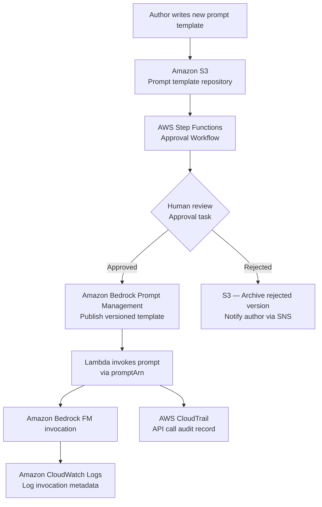
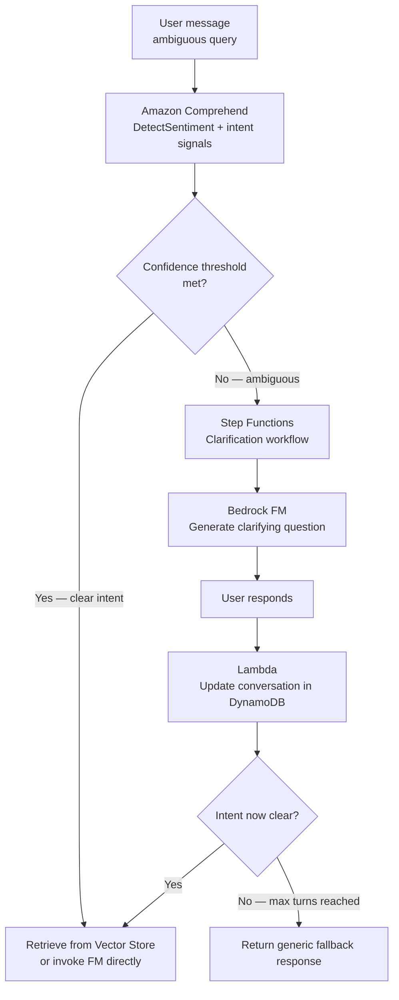

# Lecture 15 — Prompt Governance, Audit Trails, and Clarification Workflows

## Why This Topic Matters

At scale, prompts become a governance risk. An organization might have hundreds of parameterized prompt templates, multiple teams modifying them, and regulatory requirements to demonstrate that only approved prompts reached production. A single rogue or poorly tested prompt can expose PII, generate harmful content, or violate a compliance policy.

Skill 1.6.2 tests your ability to design **interactive AI systems that clarify user intent** before retrieval or FM invocation. Skill 1.6.3 tests your ability to implement **comprehensive prompt governance systems** including audit logging, approval workflows, and template repositories. Both are explicitly named in the AIP-C01 exam guide with specific services: **AWS CloudTrail, Amazon CloudWatch Logs, DynamoDB for conversation history, Step Functions for clarification workflows, and S3 for template repositories**.

## Concept Overview

Prompt governance covers three concerns:

1. **Template management and approval** — Only vetted prompts reach production. Changes go through an approval workflow.
2. **Audit and access logging** — Every prompt invocation is logged with who called it, when, and with what parameters.
3. **Interactive clarification** — When user intent is ambiguous, the system asks a follow-up question before invoking the FM, avoiding wasted tokens and improving response quality.

## Architecture Walkthrough

### Pattern A — Prompt Governance Pipeline



**Key services in this pattern:**
- **S3** stores the raw prompt templates as a source-of-truth repository. Versioned S3 enables rollback to prior template text.
- **Step Functions** orchestrates the approval workflow — it can pause for a human task token (using `waitForTaskToken` integration) and resume when a reviewer approves via a callback.
- **Bedrock Prompt Management** stores the approved, versioned prompt as a managed resource accessible via `promptArn`.
- **CloudTrail** logs every `InvokeModel` or `Converse` API call as an immutable audit record including the caller's IAM identity, timestamp, and request parameters.
- **CloudWatch Logs** captures application-level invocation metadata: which template was used, which parameters were injected, and the response latency.

### Pattern B — Interactive Clarification Workflow

When a user query is ambiguous, invoking the FM immediately wastes tokens and produces a low-quality response. The clarification pattern asks a targeted follow-up question first.



**DynamoDB conversation history table:**

```json
{
  "sessionId": "user-abc-123",
  "turns": [
    {"role": "user", "content": "Tell me about the policy", "timestamp": "..."},
    {"role": "assistant", "content": "Which policy — IT security or HR leave?", "timestamp": "..."},
    {"role": "user", "content": "HR leave policy", "timestamp": "..."}
  ],
  "clarificationStatus": "resolved",
  "intentLabel": "hr_leave_policy_query"
}
```

DynamoDB is preferred over other storage for conversation history because:
- Single-digit millisecond reads enable low-latency context retrieval per turn.
- TTL attribute automatically expires sessions after a configurable period (e.g., 24 hours).
- Scales horizontally with user concurrency.

### CloudTrail Audit Record Structure

Bedrock API calls are captured by CloudTrail in two categories that differ in how they are enabled:

**Management events (logged by default):** `InvokeModel`, `InvokeModelWithResponseStream`, `Converse`, `ConverseStream`, and `ListAsyncInvokes`. These are recorded automatically once a trail exists — no additional configuration required.

**Data events (require explicit opt-in):** `InvokeAgent`, `InvokeInlineAgent`, `InvokeFlow`, `Retrieve`, `RetrieveAndGenerate`, and `RenderPrompt` (which renders a Bedrock Prompt Management template before invocation). Data events must be enabled via advanced event selectors using the appropriate resource type — for example, `AWS::Bedrock::AgentAlias` for `InvokeAgent`, and `AWS::Bedrock::Prompt` for `RenderPrompt`.

For prompt governance, the key fields in each event record are:

| Field | Value | Why it matters |
|---|---|---|
| `eventName` | `InvokeModel` or `Converse` | What operation was performed |
| `userIdentity.arn` | `arn:aws:iam::123:role/GenAIApp` | Who called it |
| `requestParameters.modelId` | `anthropic.claude-...` | Which model was used |
| `sourceIPAddress` | `10.0.1.4` | Origin of the call |
| `eventTime` | ISO 8601 timestamp | When it occurred |

CloudTrail logs are immutable once written. They are delivered to S3 and can be queried with Athena for compliance reporting.

## AWS Services Involved

| Service | Role |
|---|---|
| Amazon Bedrock Prompt Management | Store, version, and publish approved prompt templates |
| AWS Step Functions | Orchestrate approval workflow; pause for human task token |
| Amazon S3 | Prompt template repository; CloudTrail log delivery target |
| AWS CloudTrail | Immutable API call audit records for every Bedrock invocation |
| Amazon CloudWatch Logs | Application-level invocation logging (template ID, parameters, latency) |
| Amazon DynamoDB | Conversation history storage — low-latency, TTL-enabled |
| Amazon Comprehend | Intent and sentiment signals for routing to clarification workflow |
| Amazon SNS | Notifications for approval decisions and policy violations |
| AWS Lambda | Handle callback tokens, write conversation turns to DynamoDB |

## Real-World Example

A bank deploys a GenAI assistant for internal compliance staff. Prompts must pass a legal review before deployment. Every invocation must be auditable for regulatory examination.

1. A compliance officer authors a new prompt template and commits it to an S3-versioned bucket.
2. Step Functions triggers an approval task — a legal reviewer receives an email with a task token link.
3. The reviewer approves via an API Gateway callback; Step Functions resumes and publishes the prompt to Bedrock Prompt Management.
4. Lambda invokes the prompt via `promptArn` with parameterized variables.
5. CloudTrail captures the `Converse` API call. Monthly, a compliance team runs an Athena query over CloudTrail logs to produce an invocation report.
6. If a user asks an ambiguous question ("What are my obligations?"), Comprehend detects low-confidence intent. Step Functions enters the clarification workflow, and the FM asks a follow-up. The full turn history is persisted in DynamoDB.

## Trade-offs and Design Choices

| Approach | When to use | Trade-off |
|---|---|---|
| Step Functions for approval | Complex multi-step workflows with pause/resume | Adds latency to prompt deployment |
| Manual IAM policy gates | Simple access control without workflow | No audit trail for who approved what |
| DynamoDB for conversation history | High-concurrency chat with TTL | Cost scales with active sessions |
| Redis / ElastiCache for session state | Sub-millisecond latency required | No built-in TTL-based expiry; higher ops overhead |
| CloudTrail + Athena for audit | Compliance reporting over time | Athena query cost; slight delivery delay |
| CloudWatch Logs Insights | Real-time operational queries | Not immutable; logs can be deleted |

## Key Points

- **CloudTrail** is the immutable audit source for every Bedrock API call — use it for compliance reporting.
- **CloudWatch Logs** is the operational log for application-level metadata (template ID, parameters) — not immutable.
- **DynamoDB** stores multi-turn conversation history — single-digit millisecond reads, built-in TTL for session expiry.
- **Step Functions `waitForTaskToken`** enables human-in-the-loop approval workflows that pause execution and resume on callback.
- **Bedrock Prompt Management** stores approved templates as versioned resources — invoke via `promptArn` not raw strings.
- **Amazon Comprehend** provides intent signals (`DetectSentiment`, `DetectDominantLanguage`) that route queries to the clarification workflow before FM invocation.

## Common Misconceptions

- **"CloudWatch Logs can serve as an audit trail"** — CloudWatch Logs can be deleted or overwritten; CloudTrail is the tamper-evident, immutable audit source for compliance.
- **"Bedrock Prompt Management has built-in approval workflows"** — Bedrock Prompt Management handles versioning and publishing, but the approval workflow must be built externally using Step Functions.
- **"Conversation history can be stored in Lambda memory"** — Lambda is stateless; conversation history must be persisted in DynamoDB or another external store between invocations.
- **"Clarification questions should always be used"** — Clarification adds latency and friction. Route to clarification only when intent signals fall below a confidence threshold.

## Exam Tips

- "Prompt approval workflow before production" → **Step Functions with `waitForTaskToken`** for the human review step.
- "Immutable audit log of all Bedrock API calls" → **AWS CloudTrail** (not CloudWatch Logs).
- "Store conversation history across turns" → **Amazon DynamoDB** (not in-memory, not S3, not Lambda context).
- "Detect ambiguous user queries before FM invocation" → **Amazon Comprehend** + Step Functions clarification workflow.
- "Parameterized, versioned prompt templates" → **Bedrock Prompt Management** invoked via `promptArn`.
- Skill 1.6.3 explicitly pairs S3 (template repos) + CloudTrail (usage tracking) + CloudWatch Logs (access logs) as the full governance stack.
- `InvokeModel` and `Converse` are CloudTrail **management events** (logged by default). `InvokeAgent` and `RenderPrompt` are **data events** — auditing these requires enabling advanced event selectors. Exam questions may test whether you know which Bedrock calls need opt-in configuration.

## Gotchas

- Step Functions `waitForTaskToken` integrations must include the token in the task notification (email/Slack) so the reviewer can callback — missing this causes the workflow to hang indefinitely.
- DynamoDB TTL deletion is eventual (not instantaneous) — sessions may persist up to 48 hours past expiry before DynamoDB removes them.
- CloudTrail logs Bedrock API calls at the service level, not the application level — the `promptArn` or template ID used is not a native CloudTrail field; log it separately via CloudWatch Logs in the Lambda.
- Bedrock Prompt Management versioning is immutable — you cannot edit a published version; create a new version instead.
- `InvokeModel` and `Converse` are CloudTrail **management events** logged by default. `InvokeAgent`, `RenderPrompt`, and `Retrieve` are **data events** and require explicit advanced event selector configuration — if you need to audit agent or prompt-template invocations, you must opt in or those calls will not appear in CloudTrail.

## Practice Question

A company requires that every production prompt template be reviewed by a compliance officer before deployment, and that all Amazon Bedrock API calls be auditable for a regulatory body. Which combination of services satisfies both requirements?

A. Amazon Bedrock Prompt Management + Amazon CloudWatch Logs  
B. AWS Step Functions (approval workflow) + AWS CloudTrail  
C. AWS Lambda (approval logic) + Amazon S3 (invocation logs)  
D. Amazon Bedrock Guardrails + Amazon CloudWatch Metrics

**Answer: B**  
Step Functions provides the human-in-the-loop approval workflow (with `waitForTaskToken`). CloudTrail provides the immutable audit record of every Bedrock API call. CloudWatch Logs is operational, not immutable — it does not satisfy a regulatory audit requirement. Lambda + S3 is a custom build without the tamper-evident guarantee CloudTrail provides. Guardrails controls content, not governance workflow.

## Source

- [Amazon Bedrock Prompt Management](https://docs.aws.amazon.com/bedrock/latest/userguide/prompt-management.html)
- [Deploy a prompt using versions in Prompt management](https://docs.aws.amazon.com/bedrock/latest/userguide/prompt-management-deploy.html)
- [AWS CloudTrail — Log Amazon Bedrock API calls](https://docs.aws.amazon.com/bedrock/latest/userguide/logging-using-cloudtrail.html)
- [AWS Step Functions waitForTaskToken integration](https://docs.aws.amazon.com/step-functions/latest/dg/connect-to-resource.html#connect-wait-token)
- [AIP-C01 Domain 1 — Skills 1.6.2 and 1.6.3](https://docs.aws.amazon.com/aws-certification/latest/ai-professional-01/ai-professional-01-domain1.html)
