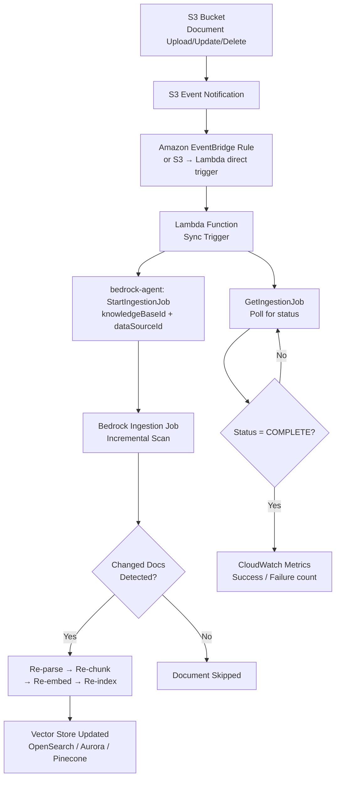
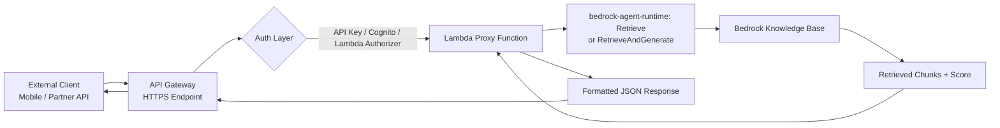
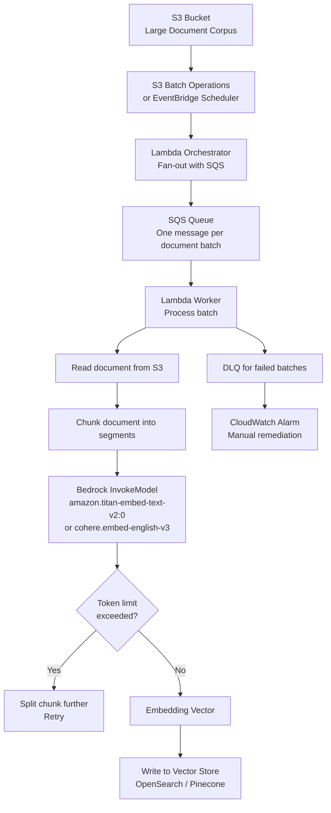

# Lecture 16 — KB Automated Sync, API Gateway for Retrieval, and Lambda Batch Embeddings

## Why This Topic Matters

A Bedrock Knowledge Base is only as useful as the freshness of the data it contains. When your enterprise documents, policies, or product catalogs change, you need a reliable mechanism to push those changes into the vector store without manual intervention or full re-ingestion. At the same time, many organizations need to expose KB retrieval capabilities to external consumers — mobile apps, third-party integrations, or other microservices — without giving those consumers direct AWS API access. Finally, when you first populate a knowledge base with thousands of documents, you need an efficient way to generate embeddings at scale.

This lecture addresses all three operational concerns: event-driven automated sync to keep the KB current, API Gateway as a controlled retrieval facade, and Lambda-based batch embedding to handle initial or bulk document ingestion efficiently.

## Concept Overview

Bedrock Knowledge Bases do not watch S3 for changes automatically. Every sync must be explicitly triggered by calling the `StartIngestionJob` API. The practical implication is that for a production system to stay current, you must wire up an event-driven pipeline: S3 emits object events, EventBridge routes them to a Lambda function, and that function calls `StartIngestionJob` for the affected data source. This approach gives you incremental sync — Bedrock re-processes only documents that were added, modified, or deleted since the last sync.

The `Retrieve` and `RetrieveAndGenerate` APIs are part of the Bedrock Agent Runtime endpoint. They are AWS-signed IAM APIs, not public HTTP endpoints. This means external consumers — partner services, mobile clients, or SaaS integrations — cannot call them directly unless they have AWS credentials. Placing API Gateway in front of a Lambda proxy function solves this: the Lambda function holds the IAM permissions, API Gateway handles authentication (API keys, Cognito, or Lambda authorizers), throttling, and logging, and callers use a standard HTTPS endpoint.

Lambda batch embeddings address the initial population problem. When you have tens of thousands of documents and need them embedded before the knowledge base is live, invoking Bedrock's embedding model document by document is too slow and prone to throttling. A Lambda function (or Step Functions workflow using Lambda) processes documents in controlled batches, respects service quotas, handles transient errors with exponential backoff, and can be monitored through CloudWatch.

## Architecture Walkthrough

### Automated KB Sync Pipeline

The event-driven sync pipeline connects S3 object lifecycle events to the Bedrock ingestion API.

Key design notes:

- S3 can trigger Lambda directly via S3 Event Notifications, or you can route events through EventBridge for more routing flexibility (e.g., filtering on prefix, applying dead-letter queues, or fanning out to multiple targets).
- `StartIngestionJob` is called against the **Agents for Amazon Bedrock build-time endpoint**, not the runtime endpoint. The Lambda needs IAM permission `bedrock:StartIngestionJob`.
- The ingestion job response returns an `ingestionJobId`. You call `GetIngestionJob` to poll until `status` becomes `COMPLETE` or `FAILED`.
- The `statistics` field in the response reports `numberOfNewDocumentsIndexed`, `numberOfModifiedDocumentsIndexed`, `numberOfDocumentsDeleted`, and `numberOfDocumentsFailed` — useful for alerting.

### API Gateway as Retrieval Facade

API Gateway sits between the external consumer and the Bedrock runtime API. The Lambda proxy function:

1. Validates and sanitizes the incoming query from API Gateway.
2. Constructs the `Retrieve` or `RetrieveAndGenerate` request body, including `retrievalConfiguration` with `numberOfResults` and optional `overrideSearchType` (SEMANTIC or HYBRID).
3. Calls the Bedrock Agent Runtime endpoint using the SDK. The Lambda's IAM execution role holds `bedrock:Retrieve` or `bedrock:RetrieveAndGenerate` permissions.
4. Returns the structured response back through API Gateway.

This pattern separates authentication concerns (handled at the API Gateway layer) from the AWS IAM authorization (held by the Lambda role), making it safe to expose retrieval to non-AWS consumers.

### Lambda Batch Embeddings for Initial Population

When you need to embed a large corpus of documents before the knowledge base is live, or when you are building a custom vector pipeline outside of Bedrock's managed ingestion:

The SQS-based fan-out pattern lets you control Lambda concurrency. You set a maximum concurrency on the Lambda function to avoid exhausting Bedrock's embedding model token-per-minute quota. Each worker processes a batch of document chunks, calls the embedding model once per chunk, and writes the resulting vectors directly to the vector store.

## Real-World Example

Consider a large financial institution that maintains an internal policy library in S3 — thousands of PDF files covering compliance procedures, product guidelines, and risk frameworks. The compliance team updates these files several times a week.

When a compliance officer uploads a revised document to the `s3://policy-library/` bucket, S3 emits an `ObjectCreated` event. EventBridge routes this event to a Lambda function that calls `StartIngestionJob` for the KB data source pointing at that S3 prefix. Bedrock identifies the changed document, re-chunks and re-embeds only that file, and updates the vector store — the other ten thousand documents are untouched. The whole operation completes in under two minutes.

External consumers — the bank's mobile app, the risk dashboard, and a third-party audit tool — query the knowledge base through a REST API hosted on API Gateway. The API Gateway uses a Cognito authorizer tied to the bank's employee identity provider. The Lambda proxy function calls `RetrieveAndGenerate` with HYBRID search enabled (combining semantic and keyword search for better precision on regulatory text) and returns a cited, grounded answer.

For the initial load of 15,000 documents when the system was first deployed, the team used a Lambda batch pipeline triggered by S3 Batch Operations. The pipeline embedded all documents over approximately four hours, respecting the Titan Embeddings V2 token quota, and loaded vectors directly into OpenSearch Serverless before the KB data source sync was ever run.

## AWS Services Involved

| Service | Role |
| ------- | ---- |
| Amazon S3 | Document storage; emits object lifecycle events |
| Amazon EventBridge | Routes S3 events to Lambda; supports filtering by prefix, event type |
| AWS Lambda | Triggers ingestion jobs; acts as API Gateway proxy; runs batch embedding workers |
| Amazon Bedrock Knowledge Bases | Manages vector store, chunking config, embedding model selection |
| Bedrock Agent Runtime (`StartIngestionJob`) | Begins incremental data ingestion on demand |
| Bedrock Agent Runtime (`Retrieve` / `RetrieveAndGenerate`) | Query API for KB retrieval and RAG responses |
| Amazon API Gateway | Exposes KB retrieval as a secured, throttled HTTPS endpoint |
| Amazon SQS | Buffers batch embedding tasks; controls Lambda concurrency |
| Amazon OpenSearch Serverless / Aurora / Pinecone | Vector store backend |
| Amazon CloudWatch | Monitors ingestion job metrics, Lambda errors, embedding throughput |

## Trade-offs and Design Choices

**Automated sync: direct S3 trigger vs. EventBridge**

S3 Event Notifications can invoke Lambda directly, which is simpler to set up. However, routing through EventBridge adds filter expressions (e.g., only trigger for `.pdf` and `.docx` files under a specific prefix), fan-out to multiple targets, and archive/replay for operational recovery. For production systems with multiple consumers of S3 events, EventBridge is almost always the better choice despite the additional configuration overhead.

**Incremental sync limitations**

Bedrock's incremental sync is document-level, not chunk-level. If a 100-page document changes by one sentence, the entire document is re-parsed, re-chunked, and re-embedded. This is fine for most use cases but can be expensive if your documents are very large or change very frequently. In such cases, consider splitting documents into smaller files at upload time to minimize re-ingestion scope.

**API Gateway type: REST API vs. HTTP API**

HTTP APIs (API Gateway v2) have lower latency and lower cost, but REST APIs offer more fine-grained usage plans, per-method throttling, request/response transformation, and richer logging. For a retrieval facade that may serve both internal and external consumers with different rate limits, REST APIs give you more control. For a simple internal integration, HTTP APIs are the pragmatic choice.

**Batch embedding: managed ingestion vs. custom pipeline**

Bedrock's managed ingestion pipeline (`StartIngestionJob`) is easier to operate — you do not manage chunking logic, vector writes, or embedding retries yourself. The trade-off is less control over chunk boundaries, embedding model parameters, and vector metadata structure. A custom Lambda batch pipeline gives you full control but requires you to implement retry logic, dead-letter handling, and vector schema management. Choose managed ingestion unless your requirements exceed what the managed pipeline supports.

**Lambda concurrency for batch embeddings**

Bedrock embedding models have token-per-minute (TPM) and requests-per-minute (RPM) service quotas that vary by model and region. Setting Lambda reserved concurrency on your embedding workers, combined with SQS visibility timeout tuning, prevents your batch pipeline from overwhelming the embedding endpoint. A safe starting point is to calculate your expected tokens per document chunk, divide your TPM quota by that number to get the safe chunks-per-minute rate, and set concurrency accordingly.

## Key Points

- `StartIngestionJob` is the only API to trigger KB sync — Bedrock does **not** watch S3 automatically.
- Sync is incremental: Bedrock compares the current data source state with the last indexed state and only re-ingests added, modified, or deleted documents.
- The ingestion response includes a `statistics` object with per-document counts (`numberOfNewDocumentsIndexed`, `numberOfModifiedDocumentsIndexed`, `numberOfDocumentsDeleted`, `numberOfDocumentsFailed`).
- Use `GetIngestionJob` with the returned `ingestionJobId` to poll for job completion. Terminal states are `COMPLETE` and `FAILED`.
- Only one ingestion job per data source can run at a time. A second `StartIngestionJob` call while a job is in progress returns a `ConflictException`.
- `Retrieve` returns raw chunks with relevance scores. `RetrieveAndGenerate` returns chunks plus a model-generated grounded response.
- API Gateway REST APIs support per-method throttling, usage plans, and request transformation — features not available in HTTP APIs.
- Lambda batch embedding workers should use SQS as a buffer and set reserved concurrency to avoid exhausting Bedrock embedding model quotas.
- Bedrock's metadata-only optimization skips re-embedding when only `.metadata.json` files change, saving embedding API costs.
- `clientToken` in `StartIngestionJob` ensures idempotency — duplicate triggers from EventBridge retry logic will not start duplicate jobs.

## Common Misconceptions

- **"S3 triggers KB sync automatically."** — False. S3 changes are never picked up until you call `StartIngestionJob`. Automated sync requires you to build the event-driven pipeline explicitly.
- **"Full sync re-embeds all documents."** — Bedrock sync is always incremental. There is no "full re-sync" option in the API; Bedrock determines what has changed by comparing checksums.
- **"You can call `Retrieve` directly from a browser or mobile app with just an API key."** — The Bedrock runtime API uses AWS Signature V4, not simple API keys. External consumers need either AWS credentials or a proxy (Lambda + API Gateway) that holds IAM permissions.
- **"Lambda batch embeddings and `StartIngestionJob` are equivalent."** — They serve different purposes. `StartIngestionJob` triggers Bedrock's managed pipeline (chunking + embedding + indexing). Custom Lambda batch embeddings give you a raw embedding vector that you write to the vector store yourself — useful when you need non-standard chunking, metadata enrichment, or a vector store not supported by Bedrock KB.
- **"Concurrent ingestion jobs run in parallel."** — Only one ingestion job per data source can be in a `STARTING` or `IN_PROGRESS` state at a time. Attempting to start a second returns `ConflictException`.

## Exam Tips

- Know the two API endpoints involved: the **Agents for Amazon Bedrock build-time endpoint** for `StartIngestionJob`/`GetIngestionJob`/`ListIngestionJobs`, and the **Agents for Amazon Bedrock runtime endpoint** for `Retrieve`/`RetrieveAndGenerate`.
- The exam will test whether you know that `StartIngestionJob` is incremental by default and that Bedrock skips unchanged documents.
- Expect a scenario where an external SaaS partner needs to query a KB. The correct answer pattern is: API Gateway → Lambda → Bedrock runtime `Retrieve` API. Not: direct IAM federation, not: VPC peering.
- For cost optimization questions, recognize that the metadata-only optimization avoids embedding calls when only metadata changes.
- Hybrid search (`overrideSearchType: HYBRID`) is only supported on OpenSearch Serverless, Aurora RDS, and MongoDB Atlas vector stores — not all backends.
- `RetrieveAndGenerate` counts as both a KB retrieval call and a model invocation — both are billed.

## Gotchas

- After `StartIngestionJob` completes, newly embedded vectors may not be immediately queryable in vector stores other than Aurora RDS. There can be a propagation delay of a few minutes for OpenSearch Serverless.
- The `clientToken` parameter in `StartIngestionJob` must be between 33 and 256 characters matching `[a-zA-Z0-9](-*[a-zA-Z0-9]){0,256}`. A short UUID string works; an empty string will fail validation.
- Lambda batch embedding functions that call Bedrock embedding models are subject to the 15-minute Lambda execution limit. For very large batches, use Step Functions or SQS fan-out to avoid timeout.
- `RetrieveAndGenerate` returns up to 5 results by default. Setting `numberOfResults` higher increases context for the model but also increases latency and token cost.
- If a document fails ingestion (e.g., unsupported format, oversized), it appears in `numberOfDocumentsFailed` but does not fail the entire job — other documents continue to be ingested. Check `failureReasons` in `GetIngestionJob` to diagnose.
- CSV files are always fully re-ingested when their metadata file changes, because Bedrock cannot determine whether the `documentStructureConfiguration` changed without re-processing.

## Practice Question

A media company stores thousands of article files in S3. They want their Bedrock Knowledge Base to reflect new and updated articles within five minutes of upload, without running unnecessary re-embedding on unchanged articles. A partner company also needs to search the KB from their own application, but the partner cannot use AWS IAM credentials.

Which architecture correctly satisfies both requirements?

A. Configure S3 Inventory to generate daily manifests, and use AWS Glue to call `StartIngestionJob` nightly. Publish the `RetrieveAndGenerate` endpoint in AWS PrivateLink for the partner.

B. Enable Bedrock KB auto-sync mode in the console. Create a public API Gateway endpoint with no authentication that proxies `Retrieve` calls to Bedrock.

C. Configure an S3 Event Notification to invoke a Lambda function on `ObjectCreated` and `ObjectRemoved`. The Lambda calls `StartIngestionJob`. Create a REST API Gateway endpoint with a Lambda authorizer that validates the partner's token; the Lambda proxy calls `Retrieve` with the IAM role.

D. Use S3 Replication to copy articles to a second bucket and configure a scheduled EventBridge rule every five minutes to call `StartIngestionJob`. Give the partner an IAM cross-account role.

**Correct answer: C**

Option C uses event-driven S3 notifications to trigger incremental sync immediately on document change (satisfying the five-minute SLA), and places API Gateway with a Lambda authorizer in front of Bedrock retrieval so the partner uses standard HTTPS with token authentication rather than IAM credentials. Option A is too slow (nightly). Option B has no authentication for the partner. Option D uses polling every five minutes which may exceed the SLA, and cross-account IAM roles for a partner are more complex and harder to revoke than token-based API Gateway authorization.

## Source

- [Sync your data with your Amazon Bedrock knowledge base](https://docs.aws.amazon.com/bedrock/latest/userguide/kb-data-source-sync-ingest.html)
- [StartIngestionJob API Reference](https://docs.aws.amazon.com/bedrock/latest/APIReference/API_agent_StartIngestionJob.html)
- [GetIngestionJob API Reference](https://docs.aws.amazon.com/bedrock/latest/APIReference/API_agent_GetIngestionJob.html)
- [Retrieve API Reference](https://docs.aws.amazon.com/bedrock/latest/APIReference/API_agent-runtime_Retrieve.html)
- [RetrieveAndGenerate API Reference](https://docs.aws.amazon.com/bedrock/latest/APIReference/API_agent-runtime_RetrieveAndGenerate.html)
- [Configure and customize queries and response generation](https://docs.aws.amazon.com/bedrock/latest/userguide/kb-test-config.html)
- [Invoking a Lambda function using an Amazon API Gateway endpoint](https://docs.aws.amazon.com/lambda/latest/dg/services-apigateway.html)
