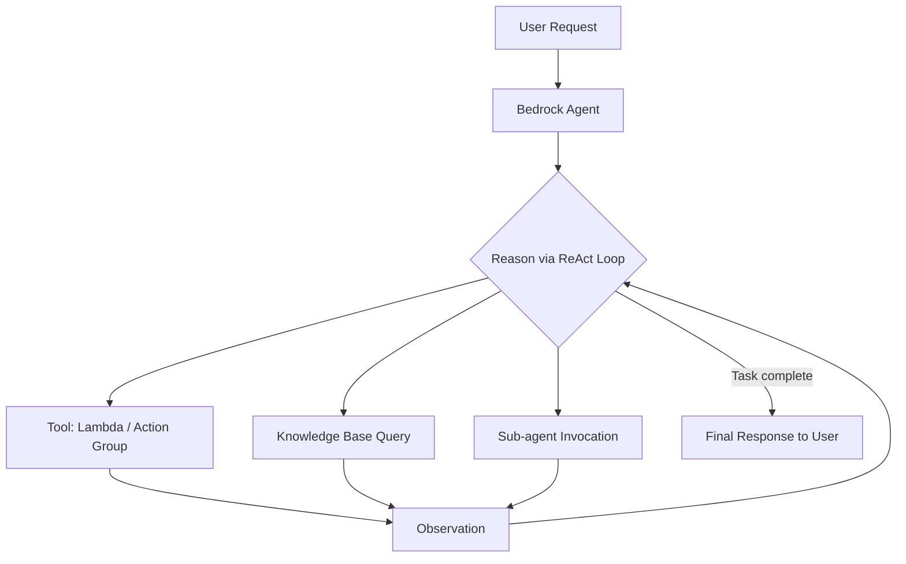
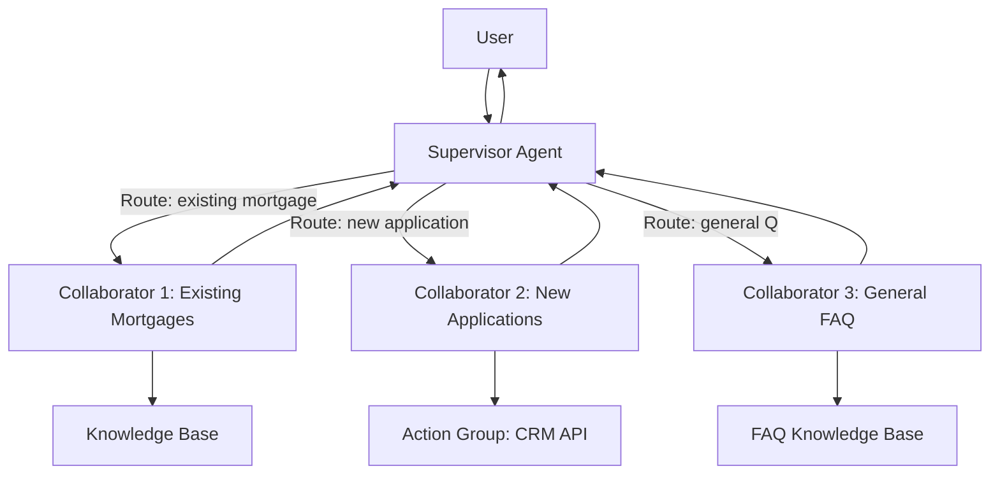
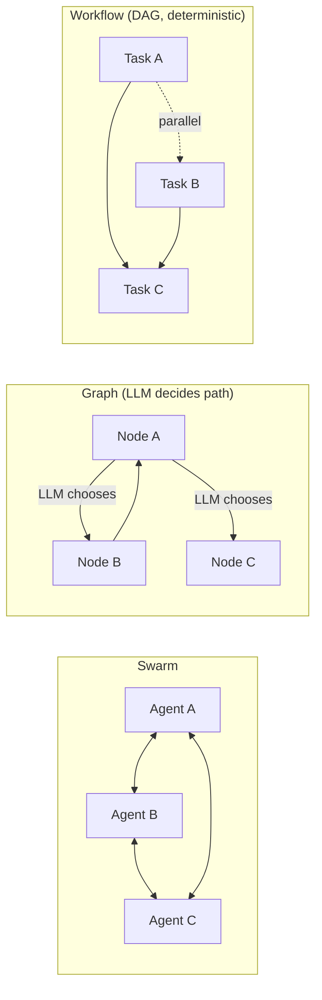
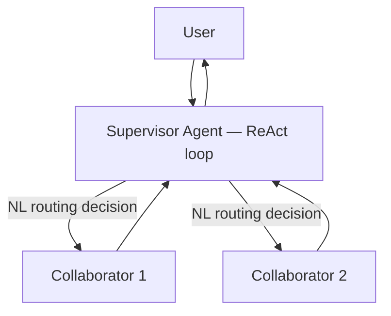
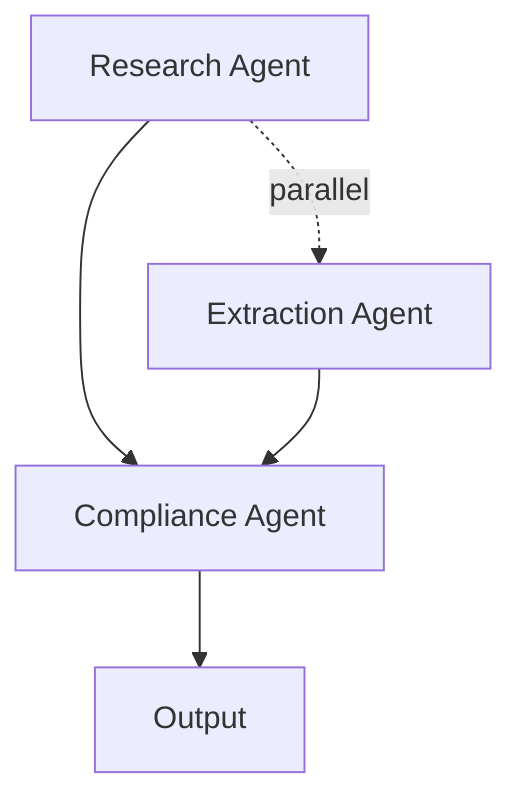
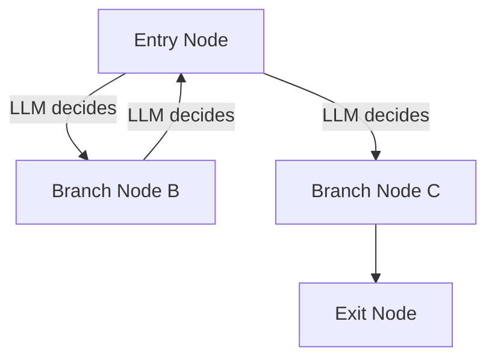
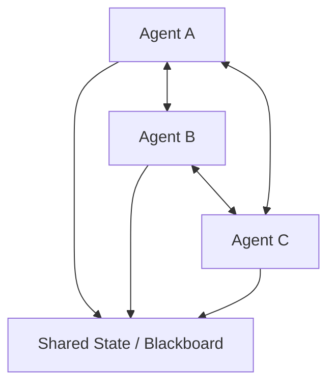
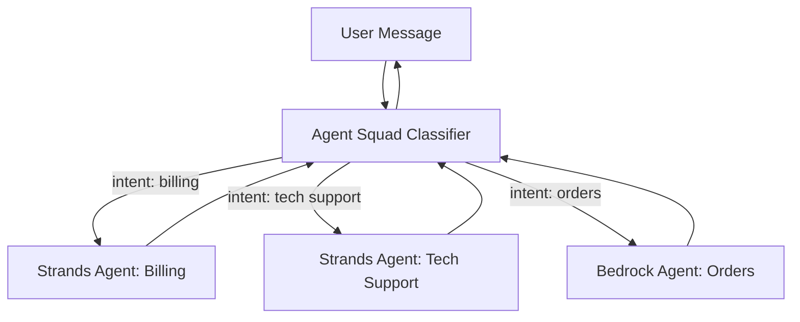

# Lecture 01 — Agentic AI: Strands Agents, Agent Squad, Multi-Agent Systems

## Why This Topic Matters

Every earlier lecture covered the building blocks — RAG, embeddings, prompt management. Now those components get assembled into *systems that act*. An agent doesn't just answer a question; it reasons through a problem, decides which tools to call, executes actions, observes results, and iterates until the goal is met.

Domain 2 opens with agentic AI because **agents are the primary delivery mechanism for GenAI applications on AWS**. The exam will test your ability to choose the right agentic framework, design the right topology (single vs multi-agent), and identify when each pattern applies.

## Concept Overview

### What Makes an Agent an Agent?

A standard LLM call is stateless: input → output. An **agent** wraps that call in a loop:

1. **Perceive** — receive a goal or task
2. **Reason** — use the model to decide what to do next
3. **Act** — call a tool, API, or sub-agent
4. **Observe** — get the result back
5. **Repeat** — until the task is complete or a stopping condition fires

This loop is called the **agent loop** (or **ReAct loop** — Reason + Act). Agents have:
- A **system prompt** defining their role and constraints
- **Tools** they can invoke (Lambda functions, APIs, knowledge bases)
- **Memory** — within-session context, optionally external (DynamoDB, S3)
- **Guardrails** — to enforce safe and compliant behavior

### Single-Agent vs Multi-Agent

A **single agent** handles everything end-to-end. This works for focused, well-scoped tasks but breaks down when:
- The problem space is too large for one context window
- Specialized domain knowledge is needed across multiple areas
- Tasks can be parallelized

**Multi-agent systems** decompose the work. Different agents have distinct roles and collaborate to solve the overall goal.

## Architecture Walkthrough

### Single Bedrock Agent — ReAct Loop

### Bedrock Multi-Agent Collaboration: Supervisor-Collaborator Model

The **supervisor** is a full Bedrock Agent that routes to **collaborator agents** via natural language instructions. Every collaborator is itself a complete Bedrock Agent with its own tools, knowledge bases, and guardrails.

### Strands Agents: Multi-Agent Patterns

Strands Agents supports three built-in coordination patterns. The key differentiator between them is **how the path of execution is determined**.

| Pattern | Structure | Execution Flow | Cycles | Parallelism |
|---------|-----------|----------------|--------|-------------|
| **Workflow** | Pre-defined task DAG | Deterministic — fixed by dependency graph | No | Yes — independent tasks run in parallel |
| **Graph** | Developer-defined nodes + edges | Controlled but dynamic — LLM decides path at each node | Yes | Possible via graph structure |
| **Swarm** | Pool of agents, no fixed topology | Sequential & autonomous — agents hand off to peers | Yes | Emergent |

## Real-World Example

A financial services company builds an enterprise assistant handling three domains: loan origination (complex multi-step with CRM API calls), account inquiries (simple KB lookups), and regulatory compliance (precise citation required).

**Architecture:** Bedrock multi-agent collaboration with one supervisor routing to three collaborator agents. Each collaborator has its own Bedrock Guardrails configuration — the Compliance Agent has a citation grounding guardrail independent of the others. The supervisor uses natural language role descriptions to route; adding a fourth agent requires no changes to the supervisor's logic.

## AWS Services Involved

| Service | Role |
|---------|------|
| Amazon Bedrock Agents | Managed agent hosting, ReAct orchestration, session management |
| AWS Lambda | Action group implementations (tools the agent calls) |
| Amazon Bedrock Knowledge Bases | RAG integration for agent retrieval |
| Amazon Bedrock Guardrails | Content safety, per-agent configuration |
| Amazon DynamoDB | Agent session state / external memory (Agent Squad) |
| AWS Step Functions | Deterministic workflow orchestration alongside agents |
| Amazon SQS / EventBridge | Async messaging between agents in distributed multi-agent systems |

## Coordination Topologies: Bedrock vs Strands

Bedrock multi-agent collaboration supports **exactly one topology**: the hierarchical supervisor-collaborator model. Strands Agents provides three additional patterns that Bedrock cannot replicate natively.

### Bedrock Agents: Supervisor-Collaborator Only

The Bedrock supervisor:
- Is itself a full Bedrock Agent running a ReAct loop
- Routes to collaborators using **natural language role descriptions** at runtime
- Is **synchronous** — waits for each collaborator before proceeding
- Provides **no peer-to-peer communication** — collaborators cannot call each other

### Strands Agents: Three Additional Patterns

#### Workflow — Deterministic DAG with Parallel Execution

- A **pre-defined Task DAG** — all tasks and dependencies are declared in code before execution starts
- Independent tasks run **in parallel automatically**; dependent tasks wait for their upstream tasks
- Execution flow is **deterministic**: the path is fixed by the dependency graph, not by any LLM reasoning
- No cycles allowed — it is strictly a DAG
- Use when: structured, repeatable processes with known dependencies (e.g. ingest → [extract + validate in parallel] → format)
- **Key difference from Graph:** Workflow execution follows a fixed DAG; no LLM decides which path to take at runtime

#### Graph — Developer-Defined Flow with LLM Path Selection

- Developer defines all **nodes (agents)** and **edges (transitions)** in advance
- At each node, an **LLM decides which edge to follow** — the path is controlled but dynamic
- Cycles are **allowed** — the graph can loop back to earlier nodes
- Use when: the problem requires dynamic reasoning to determine the next step, or the flow may need to revisit earlier stages
- **Key difference from Workflow:** Graph uses LLM reasoning to navigate the graph at runtime; Workflow executes a fixed dependency DAG deterministically

#### Swarm — Peer-to-Peer Emergent Coordination

- No supervisor — agents communicate directly and self-assign tasks
- Coordination is emergent, not pre-defined
- Use when: open-ended, exploratory problems benefiting from independent diverse perspectives
- **Key difference from Bedrock:** Bedrock has no concept of peer-to-peer agent communication

### Pattern Comparison

| Pattern | Topology | Control | Parallelism | Cycles | Bedrock support |
|---------|----------|---------|-------------|--------|-----------------|
| Supervisor-collaborator | Hierarchical tree | Runtime NL reasoning | Limited (fan-out) | No | Yes (native) |
| Workflow | DAG (pre-defined) | Deterministic (dep graph) | Yes — independent tasks | No | No — use Step Functions |
| Graph | Developer-defined nodes + edges | Dynamic — LLM selects path at each node | Possible | Yes | No |
| Swarm | Peer mesh | Emergent — agents self-assign | Yes | Yes | No |

> **Note:** For deterministic orchestration alongside Bedrock Agents, AWS recommends **Step Functions** — it provides managed DAG execution equivalent to the Workflow pattern.

### Agent Squad + Strands: Complementary Layers

Agent Squad and Strands Agents operate at different layers and can be combined:

- **Agent Squad** = routing and multi-turn memory layer (the dispatcher)
- **Strands Agents** = agent execution layer (the workers)
- Agent Squad's classifier is more predictable at scale than a Bedrock supervisor's NL reasoning for intent-based routing

## Trade-offs and Design Choices

**Bedrock Agents vs Strands Agents:**
- Bedrock Agents = managed infra, less code, faster to deploy, constrained to supervisor-collaborator topology only
- Strands Agents = full control, any model provider, all four topologies available, but you own infra (DIY deployment)

**Supervisor-collaborator vs Agent Squad routing:**
- Supervisor-collaborator: hierarchical, explicit — supervisor reasons its way to the routing decision at runtime
- Agent Squad: dedicated classifier layer — more predictable at scale for intent-based routing; maintains multi-turn memory across routing decisions

**When NOT to use multi-agent:**
- Single-domain focused tasks — adds latency and cost with no benefit
- Cost-sensitive workloads — each collaborator invocation charges tokens independently
- Highly deterministic pipelines — use Step Functions; agents are non-deterministic

## Key Points

- An **agent loop** = Perceive → Reason → Act → Observe → Repeat (the ReAct pattern)
- **Bedrock Agents** is fully managed; **Strands Agents** and **Agent Squad** are open-source SDKs (DIY deployment)
- Bedrock multi-agent supports **only one topology**: supervisor-collaborator hierarchy; routing is done via natural language instructions at runtime
- Bedrock supervisor is **synchronous and hierarchical** — no peer-to-peer; collaborators cannot call each other
- **Strands Agents** supports four topologies: supervisor-collaborator, Workflow (pipeline), Graph (DAG), Swarm (peer mesh)
- **Strands Workflow** = pre-defined Task DAG; deterministic; **independent tasks run in parallel**; no cycles; no LLM path selection at runtime
- **Strands Graph** = developer-defined nodes + edges; **LLM decides which edge to follow at each node**; cycles allowed; controlled but dynamic
- **Strands Swarm** = no supervisor; agents hand off tasks to peers; emergent coordination; cycles allowed
- **Agent Squad** = classifier-based router + multi-turn memory; sits in front of agents; not an agent execution framework
- Every collaborator in Bedrock multi-agent has its own tools, knowledge bases, and guardrails
- Supported models for Bedrock multi-agent: Anthropic Claude and Amazon Nova families

## Common Misconceptions

- **"Strands Agents replaces Bedrock Agents"** — they serve different needs and are complementary
- **"Supervisor does all the work"** — the supervisor routes and coordinates; collaborators do the domain work; overlapping responsibilities is an explicit anti-pattern
- **"Agent Squad is just a router"** — it also manages multi-turn conversation memory and supports multiple agent backends (Bedrock, Lambda, Lex)
- **"Multi-agent = better"** — multi-agent is more expensive and complex; only use when tasks genuinely decompose into specialized domains
- **"Workflow = sequential, no parallelism"** — incorrect; Strands Workflow is a DAG and **independent tasks run in parallel automatically**; it is deterministic but not strictly sequential
- **"Graph = DAG with parallel execution"** — incorrect; Graph uses **LLM reasoning to select the path at each node**, cycles are allowed; Workflow is the DAG pattern

## Exam Tips

- "Minimal infrastructure management" → **Bedrock Agents** (managed)
- "Dynamic routing of diverse queries to specialized agents" → **Agent Squad** (classifier)
- "Autonomous task execution, full customization, AWS-native, code-level control" → **Strands Agents**
- "Agents need to communicate as peers / no central supervisor" → **Strands Swarm**
- "Sub-tasks can run in parallel, dependencies between agents" → **Strands Graph**
- "Deterministic parallel tasks with known dependencies" → **Strands Workflow** (DAG, parallel, no LLM path selection)
- "Dynamic flow where an LLM decides which step comes next, cycles possible" → **Strands Graph**
- "Agents need to communicate as peers / no central supervisor" → **Strands Swarm**
- Strands Agents supports **non-Bedrock providers** (OpenAI, etc.) — key differentiator vs pure Bedrock solutions
- **Overlapping agent responsibilities** = anti-pattern explicitly called out in AWS docs

## Gotchas

- **Workflow ≠ sequential-only**: the Workflow pattern is a DAG — independent tasks run in parallel; only the dependency order is fixed
- **Graph allows cycles**: unlike Workflow (strict DAG, no cycles), Graph can loop back to earlier nodes because the LLM navigates the edges
- Bedrock supervisor routing is **runtime NL reasoning** — not a static topology; this makes it flexible but non-deterministic

## Practice Question

> A retail company wants to build a customer service assistant that handles three distinct query types: order tracking (requires API calls to fulfillment systems), product recommendations (requires knowledge base retrieval), and billing disputes (requires multi-step investigation with human escalation). The team wants a fully managed solution with minimal infrastructure code. They expect each domain to have independent content safety controls.
>
> **Which architecture should they choose?**
>
> A. Strands Agents with a Graph pattern connecting three specialized agent nodes
>
> B. Amazon Bedrock Agents with multi-agent collaboration: one supervisor + three collaborator agents, each with independent guardrails
>
> C. Agent Squad with three agents (Lambda, Bedrock KB, and Bedrock Agent) and a DynamoDB classifier cache
>
> D. AWS Step Functions orchestrating three Lambda functions, each calling Bedrock Converse API directly

**Answer: B** — "Fully managed" and "minimal infrastructure code" eliminate A, C (DIY SDKs) and D (raw Lambda). Bedrock multi-agent collaboration is the only fully managed option. Each collaborator agent supports independent Bedrock Guardrails configuration.

## Source

- [Strands Agents — AWS Prescriptive Guidance](https://docs.aws.amazon.com/prescriptive-guidance/latest/agentic-ai-frameworks/strands-agents.html)
- [Comparing agentic AI frameworks — AWS Prescriptive Guidance](https://docs.aws.amazon.com/prescriptive-guidance/latest/agentic-ai-frameworks/comparing-agentic-ai-frameworks.html)
- [Use multi-agent collaboration with Amazon Bedrock Agents](https://docs.aws.amazon.com/bedrock/latest/userguide/agents-multi-agent-collaboration.html)
- [Multi-agent collaboration patterns — AWS Prescriptive Guidance](https://docs.aws.amazon.com/prescriptive-guidance/latest/agentic-ai-patterns/multi-agent-collaboration.html)
- [Multi-agent Patterns — Strands Agents SDK documentation](https://strandsagents.com/docs/user-guide/concepts/multi-agent/multi-agent-patterns/)
