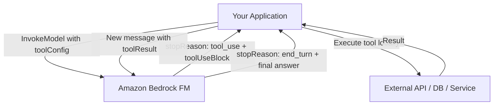
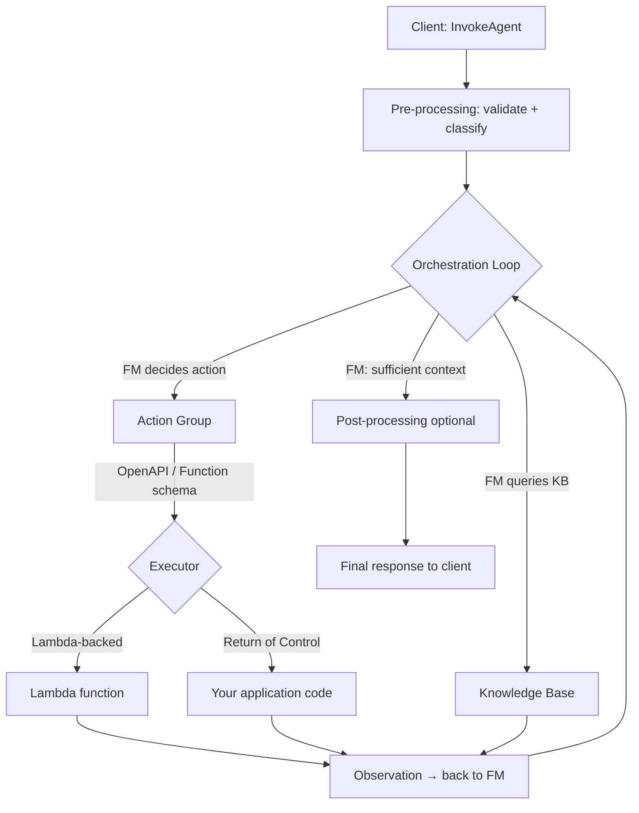
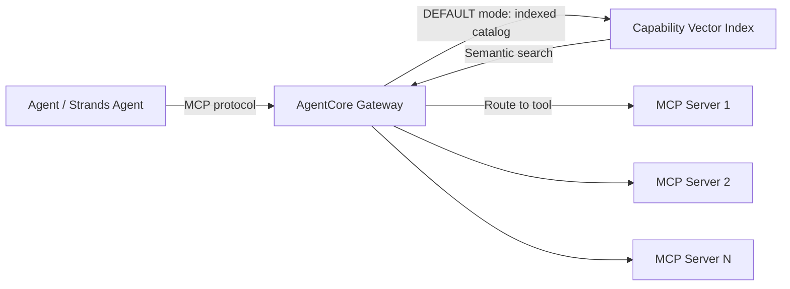

# Lecture 02 — Agent Tool Integration: MCP Servers, Function Calling

## Why This Topic Matters

An agent without tools is just a chatbot. Tools are what transform a language model into a system that can *act* — reading a database, calling an API, triggering a workflow, or writing a record. Domain 2 tests whether you know the three distinct integration models AWS provides and when each is the right fit.

The exam will present scenarios requiring you to distinguish between client-managed tool loops (Converse API), fully-managed agent orchestration (Bedrock Agents action groups), and standardised multi-tool registries (MCP via AgentCore Gateway). Getting these confused is a reliable way to lose points.

## Concept Overview

AWS provides three layers of tool integration, each trading control for management overhead:

**Converse API function calling** puts you in control. You define tools as JSON schemas, send them with every request, and run the loop yourself. The model tells you which tool to call; your code calls it; you send the result back. Nothing is managed for you.

**Bedrock Agents action groups** hand orchestration to the service. You define what tools the agent can use (via schema), AWS handles the ReAct loop, Lambda optionally executes the tool, and the agent continues until it reaches a final answer. You configure; the service operates.

**MCP via AgentCore Gateway** solves a different problem: how does an agent discover and authenticate to *many* tools at once? MCP standardises the protocol; AgentCore Gateway manages the registry, authentication, and — optionally — semantic search over capabilities.

## Architecture Walkthrough

### Converse API Function Calling



1. Your application calls `converse` with a `toolConfig` block containing one or more `toolSpec` definitions.
2. The model decides a tool is needed and returns `stopReason: "tool_use"` plus a `toolUseBlock` with the tool name and input arguments.
3. Your code extracts the tool name and arguments, executes the function, and captures the result.
4. You send a new `converse` call with the `toolResult` block. The model resumes and either calls another tool or returns `stopReason: "end_turn"`.

```python
toolConfig = {
  "tools": [{
    "toolSpec": {
      "name": "get_top_song",
      "description": "Get the top song for a radio station",
      "inputSchema": {
        "json": {
          "type": "object",
          "properties": {
            "sign": {"type": "string", "description": "Station call sign, e.g. WZPZ"}
          },
          "required": ["sign"]
        }
      }
    }
  }]
}
```

**`tool_choice` controls whether tool use is optional or mandatory:**
- `auto` — model decides (default)
- `any` — model must call *some* tool from the toolConfig
- `tool` (with name) — model must call *this specific* tool

Use `any` when you need guaranteed structured output. Use `tool` when a specific classification or extraction step must always run before the model answers.

### Bedrock Agents Action Groups



**Schema types:**
- **OpenAPI schema** — full REST definition stored in S3; best for existing HTTP APIs
- **Function detail schema** — define function name, description, parameters inline in console or SDK; best for new tools built for the agent

**Execution modes:**
- **Lambda-backed** — AWS invokes your Lambda synchronously; Lambda returns the result; agent continues. Best for standard integrations under 15 minutes.
- **Return of Control (RoC)** — instead of invoking Lambda, the agent returns `ActionGroupInvocationInput` to *your calling application*. Your code runs the action and responds with `ActionGroupInvocationOutput`. Use when: the action is long-running (Lambda timeout is a constraint), requires caller-side context not available in Lambda, or you need the action result in your application tier before the agent sees it.

**Orchestration pipeline stages:**
1. **Pre-processing** — validates and classifies the input; can be customised with a prompt template
2. **Orchestration loop** — ReAct reasoning: FM decides → invoke action group or query KB → receive observation → repeat until sufficient
3. **Post-processing** — formats the final response; **off by default**; enable only when output needs transformation before reaching the user

### MCP via AgentCore Gateway



**Operating modes:**

| Mode | Catalog | Discovery | Semantic search | Notes |
|------|---------|-----------|-----------------|-------|
| DEFAULT | Pre-indexed via `SynchronizeGatewayTargets` | Semantic (vector embeddings) | Yes | Must call `SynchronizeGatewayTargets` after adding/updating tools |
| DYNAMIC | Live discovery at request time | Exact match | No | Incompatible with semantic search and 3LO OAuth |

**Authentication options:**

| Option | When to use |
|--------|-------------|
| None | Internal VPC tools only — never production-external |
| OAuth 2LO (Client Credentials) | Machine-to-machine; no user context; backend service calling backend tool |
| OAuth 3LO (Authorization Code) | User-delegated; agent acts on behalf of a logged-in user (e.g., calendar, user-specific data) |
| IAM SigV4 | AWS-native services; uses the execution role; simplest for tools that are themselves AWS APIs |

## Real-World Example

A financial services firm builds an expense approval assistant. The agent needs to: look up the employee's expense policy (KB), check their current spend-to-date (tool), and write the approval record (tool).

- The KB lookup uses a Bedrock Agents Knowledge Base — no action group needed.
- The spend lookup uses a Lambda-backed action group with a function detail schema — the Lambda queries DynamoDB.
- The approval write uses **Return of Control** — the approval must be confirmed by the calling application (which holds an audit correlation ID) before the record is written, so Lambda isn't appropriate here.

## AWS Services Involved

| Service | Role |
|---------|------|
| Amazon Bedrock Converse API | Client-managed tool loop; `toolConfig` + `toolResult` |
| Amazon Bedrock Agents | Fully-managed ReAct orchestration with action groups |
| AWS Lambda | Executes action group tools server-side |
| Amazon Bedrock AgentCore Gateway | MCP server registry with auth and semantic discovery |
| Amazon S3 | Stores OpenAPI schemas for Bedrock Agents action groups |

## Trade-offs and Design Choices

| Dimension | Converse API | Bedrock Agents | MCP / AgentCore Gateway |
|-----------|-------------|----------------|------------------------|
| Who runs the loop | Your code | AWS (managed) | Agent framework (Strands etc.) |
| Tool schema location | In-request JSON | S3 (OpenAPI) or inline (function detail) | MCP server manifest |
| Multi-tool discovery | Manual | Configured at build time | Semantic search (DEFAULT mode) |
| Auth management | Your code | Lambda IAM role | AgentCore Gateway (OAuth / SigV4) |
| Best for | Lightweight integrations, custom loops | Production agents with KBs and history | Large tool ecosystems, MCP-native agents |

## Key Points

- Converse API: `stopReason: "tool_use"` → your code runs the tool → send `toolResult` back
- Bedrock Agents: pre-processing → orchestration loop → post-processing (off by default)
- Action group schema: OpenAPI (S3) for existing REST APIs; function detail for new tools
- Return of Control: agent delegates execution back to the caller instead of invoking Lambda
- AgentCore Gateway DEFAULT mode requires `SynchronizeGatewayTargets` after any tool catalog change
- AgentCore Gateway DYNAMIC mode: no semantic search, incompatible with 3LO OAuth
- Auth: None (internal only) / OAuth 2LO (M2M) / OAuth 3LO (user-delegated) / IAM SigV4 (AWS-native)
- `tool_choice: any` forces structured output; `tool_choice: tool` forces a specific tool

## Common Misconceptions

- **"Return of Control bypasses the orchestration loop"** — incorrect; the agent pauses the loop and resumes after receiving the `ActionGroupInvocationOutput` from the caller
- **"OpenAPI schemas are always stored in the agent definition"** — incorrect; they are stored in S3 and referenced by ARN
- **"DYNAMIC mode supports semantic tool discovery"** — incorrect; only DEFAULT mode builds a vector index; DYNAMIC mode uses live exact-match discovery
- **"Post-processing is always active in Bedrock Agents"** — incorrect; it is off by default and must be explicitly enabled

## Exam Tips

- If a question asks which schema type an action group uses: OpenAPI (S3) = existing REST API; function detail = new custom tool
- `stopReason: "tool_use"` is the Converse API signal — your loop must handle it before calling the model again
- Pre-processing → orchestration → post-processing is tested directly; remember post-processing is **off by default**
- `SynchronizeGatewayTargets` must be called after updating the tool catalog in DEFAULT mode
- Auth pattern: user-delegated access → 3LO; machine-to-machine → 2LO; AWS service → SigV4
- `tool_choice: any` = guaranteed structured output; use it when the model must return structured data on every call

## Gotchas

- Lambda 15-minute timeout is a hard limit for action group execution — use Return of Control for long-running actions
- DYNAMIC mode is incompatible with both semantic search *and* 3LO OAuth — these are two separate constraints
- `toolResult` must be sent in the same conversation turn context; starting a new session loses the tool call state
- Post-processing adds latency and cost — only enable it if output transformation is a genuine requirement

## Practice Question

> A travel booking agent built with Bedrock Agents needs to access a third-party flight booking API that already has a full REST OpenAPI specification. The team also wants the agent to write bookings back to an internal DynamoDB table, and this write must be confirmed by the calling application (which holds a transaction ID) before it completes. Which schema type and execution mode should the architect use for each action group?

## Source

- https://docs.aws.amazon.com/bedrock/latest/userguide/tool-use.html
- https://docs.aws.amazon.com/bedrock/latest/userguide/agents-how.html
- https://docs.aws.amazon.com/bedrock/latest/userguide/agents-action-add.html
- https://docs.aws.amazon.com/bedrock/latest/userguide/gateway-target-MCPservers.html
