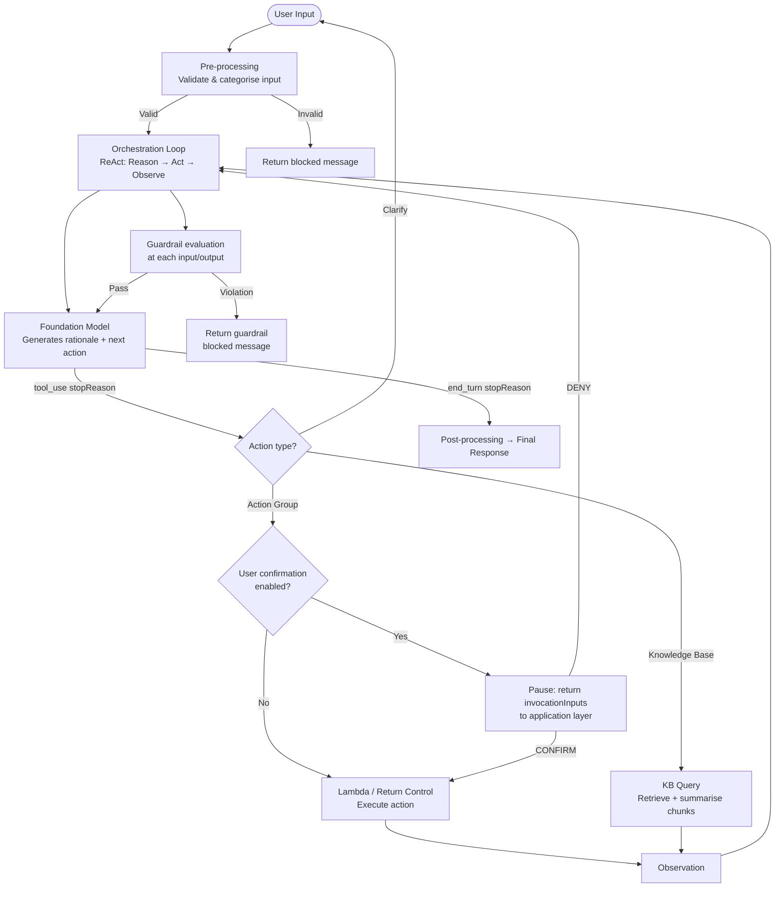

# Lecture 03 — Agent Orchestration: ReAct, Human-in-the-Loop, Guardrails

## Why This Topic Matters

Agents are only useful if they reason reliably, stay within sanctioned boundaries, and pause for human judgement when the stakes are high. Without a well-understood orchestration loop, an agent is a black box that can silently take wrong actions. This lecture unpacks exactly how Amazon Bedrock Agents think and act at runtime — the ReAct loop — and then layers on the two safety mechanisms that make agents production-ready: human-in-the-loop confirmation and guardrails.

For the AIP-C01 exam, this is one of the most scenario-heavy topics in Domain 2. Expect questions that ask you to choose *where* in the agent lifecycle a guardrail fires, *when* to use user confirmation vs. guardrails, and *what* the ReAct loop state machine looks like.

---

## Concept Overview

### The ReAct Orchestration Loop

Bedrock Agents use **ReAct (Reason + Act)** as their default orchestration strategy. The agent alternates between two cognitive steps:

- **Reason** — the FM reads the current context (instructions, conversation history, tool descriptions, KB summaries) and produces a *rationale*: a chain-of-thought explanation of what it should do next.
- **Act** — based on the rationale, the FM predicts the next action: invoke a tool (action group), query a knowledge base, ask the user a clarifying question, or return a final answer.

The output of each Act step is called an **observation**. The observation is fed back into the next Reason step, closing the loop. This continues until the agent decides it has enough to give a final response.

The loop is not infinite — Bedrock enforces a maximum number of orchestration steps per session to prevent runaway agents.

### Four Prompt Templates, Four Stages

The agent's lifecycle has four stages, each backed by a customisable prompt template:

| Stage | What it does | Can be disabled? |
|---|---|---|
| Pre-processing | Validates/categorises user input | Yes |
| Orchestration | The ReAct loop — reason, act, observe | No |
| KB response generation | Summarises retrieved KB chunks | Yes |
| Post-processing | Formats the final response | Yes (off by default) |

You can override any template with **advanced prompts**, inject few-shot examples, or attach a Lambda parser to transform each stage's raw FM output before the agent acts on it.

### Custom Orchestration

When the default ReAct loop is insufficient — for example, you need verification steps, a different planning strategy, or deterministic branching — you can replace the entire orchestration engine with a **custom orchestration Lambda**. Your Lambda receives the current agent state and returns an event that tells Bedrock what to do next (`INVOKE_MODEL`, `INVOKE_ACTION_GROUP`, `FINISH`, etc.). The first state in any session is always `START`.

---

## Architecture Walkthrough

### Step-by-step flow

1. **InvokeAgent** is called with user text and a session ID.
2. **Pre-processing** (if enabled) sends the input to the FM with the pre-processing prompt template. The FM classifies the input and decides whether to proceed.
3. The **orchestration loop** begins. The FM receives the augmented orchestration prompt (instructions + action group descriptions + KB descriptions + conversation history) and produces a rationale.
4. The FM's `stopReason` determines the next step:
   - `tool_use` → the FM wants to call a tool. Bedrock routes to the appropriate action group or KB.
   - `end_turn` → the FM has a final answer. Exit the loop.
5. If the action has **user confirmation** enabled, Bedrock pauses and returns `returnControl` with `invocationInputs` to the calling application. The application presents CONFIRM/DENY to the user. The user's choice is sent back via the next `InvokeAgent` call in `sessionState.returnControlInvocationResults`.
6. The action result (observation) is appended to the context and the loop repeats.
7. **Guardrails** evaluate both the user input and each FM response at every iteration. A violation at any point returns a blocked message and halts that step.
8. **Post-processing** (if enabled) formats the final answer before it reaches the user.

---

## Real-World Example

An internal HR assistant lets employees submit leave requests. The action group `submitLeaveRequest` writes to a leave management system — an irreversible action. The agent developer enables **user confirmation** on that action. When the FM decides to call `submitLeaveRequest`, Bedrock pauses and surfaces: *"I'm about to submit 5 days of annual leave from 20 June. Confirm or deny?"* The employee confirms, and only then does the Lambda execute the write.

Separately, a **guardrail** is attached to the agent configured with a denied topic: *"Do not discuss competitor companies."* If a user asks the HR assistant to compare the company's leave policy to a competitor's, the guardrail fires at the input stage — the FM is never invoked, and the user receives the configured blocked message.

---

## AWS Services Involved

| Service | Role |
|---|---|
| Amazon Bedrock Agents | Hosts and runs the ReAct orchestration loop |
| Foundation Model (via Bedrock) | Generates rationale and predicts next action at each step |
| AWS Lambda | Executes action group logic; also used for custom orchestration and advanced prompt parsers |
| Amazon Bedrock Guardrails | Evaluates inputs and FM outputs; blocks or masks policy violations |
| Amazon Bedrock Knowledge Bases | Queried during the orchestration loop for context retrieval |
| AWS CloudWatch / Trace | Observability — inspect rationale, actions, observations at each step |

---

## Trade-offs and Design Choices

**ReAct vs. custom orchestration**
ReAct works well for open-ended tasks where the FM should determine the plan. Use custom orchestration when you need deterministic branching, external verification steps, or domain-specific planning logic that the FM alone cannot reliably produce.

**User confirmation vs. guardrails**
These are complementary, not alternatives:
- **User confirmation** gates a *specific action* on explicit end-user consent. It is the right tool when an action is irreversible (write, delete, payment) and the user must be informed before it executes.
- **Guardrails** are policy-level filters that apply to all inputs and FM outputs across the agent's lifecycle. They catch harmful content, denied topics, and PII — regardless of which action is being invoked.

Using only guardrails without user confirmation still allows the FM to silently call destructive actions as long as the prompt isn't flagged as harmful. The two mechanisms address different threat models.

**Prompt injection via tool responses**
The AWS docs explicitly warn: if a tool's API response contains instructions (e.g., a malicious web page the agent retrieved), the agent may comply with those instructions in the next ReAct iteration. User confirmation on sensitive actions is a key mitigation — it forces a human checkpoint before the agent acts on potentially injected instructions.

**Advanced prompts vs. custom orchestration**
Advanced prompts let you adjust *what the FM sees* at each stage (few-shot examples, extra constraints). Custom orchestration lets you control *when and whether the FM is called at all*. Advanced prompts are lower effort; custom orchestration gives full control but requires maintaining a Lambda.

**Guardrail cost model**
- Guardrail blocks input → charged for guardrail evaluation only, no FM inference charge.
- Guardrail blocks response → charged for guardrail evaluation *and* FM inference (model already ran).
- No block → charged for guardrail evaluation + FM inference.

---

## Key Points

- Bedrock Agents use **ReAct** (Reason + Act) by default; the FM alternates between producing a rationale and predicting an action until `end_turn`.
- The orchestration loop has four stages: **pre-processing → orchestration → KB response generation → post-processing**. Only orchestration cannot be disabled.
- `stopReason: tool_use` → agent invokes a tool. `stopReason: end_turn` → agent returns final answer.
- **User confirmation** is configured per action, pauses the loop, and returns `returnControl` + `invocationInputs` to the application. The user's CONFIRM/DENY is passed back via `sessionState.returnControlInvocationResults.confirmationState`.
- **Guardrails** evaluate at every input/output boundary. A violation returns a blocked message and that step is aborted — the FM may or may not have run depending on *where* in the flow the violation was detected.
- **Custom orchestration** replaces the default ReAct engine with a Lambda; first state is always `START`.
- Conversation history is preserved across `InvokeAgent` calls within a session, augmenting the orchestration prompt with context.

---

## Common Misconceptions

- **"Guardrails replace user confirmation."** No — guardrails filter content policy; user confirmation gates specific actions on human consent. Both can and should coexist.
- **"Post-processing is on by default."** No — it is off by default. You must explicitly enable it.
- **"The agent always calls Lambda."** Not necessarily — action groups can be configured with `RETURN_CONTROL`, meaning the agent returns parameters to the calling application instead of invoking a Lambda.
- **"Custom orchestration means you write the FM prompts."** No — you write the *state machine logic* (when to call the model, when to call tools, when to finish). Bedrock still handles the FM invocation mechanics.

---

## Exam Tips

- If a question describes an irreversible or high-risk action (payment, deletion, data write) needing a human checkpoint → **user confirmation on the action group**.
- If a question asks how to prevent the agent from discussing off-limits topics across all interactions → **Bedrock Guardrails with a denied topic**.
- If a question mentions "prompt injection via tool response" → the mitigation is **user confirmation** (human checkpoint) or **guardrails** (content filtering).
- The four orchestration stages and which can be disabled is a common exam detail.
- Know the `confirmationState` field values: **CONFIRM** and **DENY**.
- Know that `end_turn` means the FM is done reasoning; `tool_use` means it wants to act.

---

## Gotchas

- Guardrails are charged even when they don't block — evaluation always incurs cost.
- If you disable pre-processing, the agent will not validate user input before entering the orchestration loop — useful for latency but removes a safety check.
- User confirmation does not apply to knowledge base queries — only to action group invocations.
- The orchestration loop has a **maximum step limit**; if reached, the agent returns an error rather than looping indefinitely.
- Advanced prompt templates can break agent behaviour if misconfigured — always test with trace enabled after changes.

---

## Practice Question

A financial services company is building a Bedrock Agent that can execute stock trades on behalf of users. The security team requires that no trade executes without the user seeing the exact trade details and explicitly approving them. The compliance team separately requires that the agent never discuss competitor brokerage products in any response.

Which combination of features should the developer configure?

A. Bedrock Guardrails with a content filter for trade details; denied topic for competitor products  
B. User confirmation on the `executeTrade` action group; Bedrock Guardrails with a denied topic for competitor products  
C. Custom orchestration Lambda to pause before trades; advanced prompts to suppress competitor mentions  
D. User confirmation on the `executeTrade` action group; advanced prompts instructing the FM not to mention competitors  

---

## Source

- [How Amazon Bedrock Agents works](https://docs.aws.amazon.com/bedrock/latest/userguide/agents-how.html)
- [Get user confirmation before invoking action group function](https://docs.aws.amazon.com/bedrock/latest/userguide/agents-userconfirmation.html)
- [Customize agent orchestration strategy](https://docs.aws.amazon.com/bedrock/latest/userguide/orch-strategy.html)
- [Customize your Amazon Bedrock Agent's behavior with custom orchestration](https://docs.aws.amazon.com/bedrock/latest/userguide/agents-custom-orchestration.html)
- [Implement safeguards for your application by associating a guardrail with your agent](https://docs.aws.amazon.com/bedrock/latest/userguide/agents-guardrail.html)
- [How Amazon Bedrock Guardrails works](https://docs.aws.amazon.com/bedrock/latest/userguide/guardrails-how.html)
