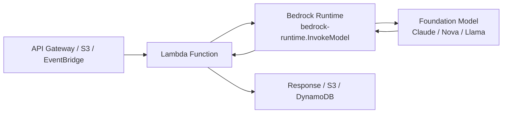
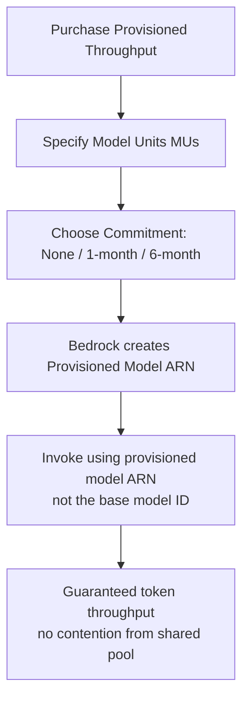
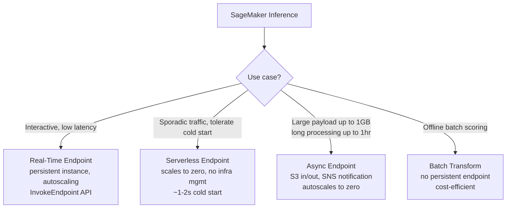
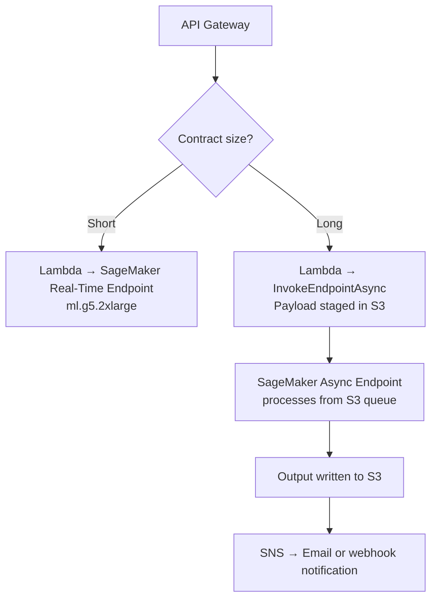

# Lecture 04 — Model Deployment: Lambda, Provisioned Throughput, and SageMaker Endpoints

## Why This Topic Matters

Building a GenAI application is only half the problem. The other half is answering: *how do I serve this model reliably under real production load?* The deployment layer determines cost, latency, throttling risk, and how much operational work your team carries.

This lecture covers the three deployment patterns that appear repeatedly on the AIP-C01 exam:

1. **AWS Lambda** — serverless, event-driven invocation of Bedrock-hosted FMs
2. **Bedrock Provisioned Throughput** — reserved dedicated capacity for predictable or high-volume workloads, and the only way to invoke custom fine-tuned Bedrock models
3. **SageMaker Inference Endpoints** — four distinct endpoint types for deploying models you own and manage

Knowing *when* to reach for each — and why the others are wrong — is the core exam skill.

---

## Concept Overview

The primary decision is model ownership: does AWS host the model (Bedrock), or do you host it (SageMaker)?

Within Bedrock, the secondary decision is traffic pattern: bursty/unpredictable (on-demand) vs. high-volume/predictable (Provisioned Throughput). Custom fine-tuned Bedrock models remove this choice — they always require Provisioned Throughput.

Within SageMaker, the decision is latency and payload characteristics: interactive low-latency (real-time), sporadic traffic tolerating cold starts (serverless), large payloads or long processing times (async), or offline scoring (batch transform).

---

## Architecture Walkthrough

### Pattern 1 — Lambda + Bedrock On-Demand

Lambda acts as the invocation layer. It does not host the model — it calls the Bedrock Runtime API (`InvokeModel` or `Converse`) and handles the surrounding event lifecycle.



**Key mechanics:**
- Lambda max execution timeout is **15 minutes** — sufficient for most Bedrock calls but an absolute ceiling
- Bedrock Runtime is a separate regional endpoint: `bedrock-runtime.<region>.amazonaws.com`
- For streaming, use `InvokeModelWithResponseStream` — Lambda can forward chunks via Lambda streaming + Function URLs
- Lambda execution role must have `bedrock:InvokeModel` on the target model ARN

**When to use:**
- Bursty or unpredictable traffic
- Event-driven workflows (document uploaded → summarize → store)
- Cost-sensitive: pay only per invocation, no reserved capacity
- Lowest operational overhead

**Connecting Strands Agents to this pattern:** Strands connects to Bedrock directly via `BedrockModel` — Lambda is unnecessary middleware unless it adds auth, routing, or transformation logic. If Lambda fronts an OpenAI-compatible endpoint, use `LiteLLMModel` with the Lambda Function URL as `api_base`.

---

### Pattern 2 — Bedrock Provisioned Throughput

Bedrock's on-demand tier shares capacity across all AWS customers. Under sustained high load, accounts risk `ThrottlingException`. Provisioned Throughput solves this by reserving dedicated token processing capacity.



**Model Units (MUs):**
- An MU is a throughput unit that specifies the number of input tokens per minute and output tokens per minute the reservation can process
- Purchase multiple MUs to scale throughput proportionally
- Must request MU quota increases from AWS Support before purchasing

**Commitment tiers:**

| Term | Flexibility | Hourly Cost |
|------|-------------|-------------|
| No commitment | Delete anytime | Highest |
| 1 month | Locked for 1 month | Discounted |
| 6 months | Locked for 6 months | Lowest |

Billing is **hourly and continuous** — you pay whether or not you use the reserved capacity. Billing stops only when you delete the Provisioned Throughput (after any commitment term expires).

**Custom models require Provisioned Throughput.** A fine-tuned Bedrock model cannot be invoked via on-demand inference. PT is mandatory — not optional.

**Two PT types** (as of 2025): by Model Units (original) and by Tokens (newer). Check regional availability in current documentation.

**Strands Agents integration:** Use `BedrockModel` with the provisioned model ARN as the `model_id`:

```python
from strands.models import BedrockModel
model = BedrockModel(model_id="arn:aws:bedrock:us-east-1::provisioned-model/abc123")
```

---

### Pattern 3 — SageMaker Inference Endpoints

SageMaker is for models you own and manage — custom fine-tuned models, open-source models via JumpStart, or any non-Bedrock model. Four endpoint types cover different latency and payload requirements:



**Real-Time Endpoints:**
- Persistent EC2 instances (e.g., `ml.g5.2xlarge` for LLMs)
- Fully managed: SageMaker handles routing, health checks, rolling deployments
- Supports autoscaling via Application Auto Scaling
- Invoked synchronously via `InvokeEndpoint` API

**Serverless Endpoints:**
- Zero infrastructure management; SageMaker provisions compute on demand
- Autoscales to zero during idle periods — no cost when idle
- Cold start latency ~1–2 seconds — unsuitable for latency-sensitive interactive UX

**Asynchronous Endpoints:**
- Request payload placed in S3 first; SageMaker dequeues and processes
- Supports payloads up to **1 GB** and processing times up to **1 hour**
- Output written to S3; optional SNS success/error notification
- Autoscales to zero → cost-efficient for batch-style jobs with near-real-time SLAs
- `AsyncInferenceConfig` in endpoint config makes the endpoint async-only — it cannot accept synchronous calls

**Batch Transform:**
- No persistent endpoint; runs a job over an S3 dataset then terminates
- Most cost-efficient for offline bulk scoring

**Strands Agents integration:** Use `SageMakerAIModel`:

```python
from strands.models.sagemaker import SageMakerAIModel
model = SageMakerAIModel(
    endpoint_config={"endpoint_name": "my-llm-endpoint", "region_name": "us-west-2"},
    payload_config={"max_tokens": 1000, "stream": True},
)
```

---

## Real-World Example

A legal tech company processes contracts with a fine-tuned Llama 3 model on SageMaker. Short contracts (<10 pages) need a response in under 5 seconds; long contracts (>50 pages) can take up to 10 minutes but must trigger a notification when done.



---

## AWS Services Involved

| Service | Role |
|---------|------|
| AWS Lambda | Serverless invocation wrapper; event-driven trigger for Bedrock or SageMaker calls |
| Amazon Bedrock Runtime | Hosts and serves AWS-managed FMs on-demand or via Provisioned Throughput |
| Bedrock Provisioned Throughput | Reserves dedicated token throughput; required for custom fine-tuned Bedrock models |
| Amazon SageMaker Real-Time Inference | Persistent low-latency endpoints with autoscaling |
| Amazon SageMaker Serverless Inference | Zero-infra endpoints that scale to zero; cold start ~1–2s |
| Amazon SageMaker Async Inference | Queue-based endpoints for large payloads and long processing times |
| Amazon S3 | Payload staging and output storage for SageMaker async inference |
| Amazon SNS | Completion or error notification for SageMaker async inference |

---

## Trade-offs and Design Choices

| Dimension | Lambda + On-Demand Bedrock | Bedrock Provisioned Throughput | SageMaker Real-Time |
|-----------|---------------------------|-------------------------------|---------------------|
| **Model ownership** | AWS-managed FMs | AWS-managed or custom FMs | Your model |
| **Cost model** | Pay-per-token invocation | Hourly reservation (used or not) | Per-second instance cost |
| **Throttling risk** | Yes (shared pool) | No (dedicated capacity) | No (you own the instance) |
| **Custom model support** | No | Yes (required) | Yes (primary use case) |
| **Operational burden** | Very low | Low | Medium |
| **Cold start** | None | None | None (persistent) |

---

## Key Points

- **Lambda** invokes Bedrock via `bedrock-runtime` — it does not host models; execution role needs `bedrock:InvokeModel`
- **Bedrock Provisioned Throughput** capacity units are called **Model Units (MUs)**; billed hourly whether used or not
- **Custom fine-tuned Bedrock models require Provisioned Throughput** — on-demand inference is not available for them
- Commitment tiers: **No commitment → 1 month → 6 months** (6 months = lowest hourly rate)
- SageMaker has four inference modes: **Real-Time, Serverless, Async, Batch Transform**
- **SageMaker Async endpoints** accept payloads up to **1 GB**, processing times up to **1 hour**, autoscale to zero
- **SageMaker Serverless endpoints** scale to zero but incur **~1–2s cold start latency**
- Strands Agents connects to Bedrock via `BedrockModel`, to SageMaker via `SageMakerAIModel` — Lambda is not a model provider

## Common Misconceptions

- **"Provisioned Throughput eliminates token costs"** — PT is a throughput reservation billed hourly; the cost structure changes but you still pay for the model
- **"Lambda can host a model"** — Lambda calls Bedrock or SageMaker; it cannot run inference itself (no GPU, 15-min timeout)
- **"SageMaker Serverless is free scale-to-zero with no penalty"** — cold start latency (~1–2s) makes it unsuitable for interactive UX
- **"On-demand Bedrock works for custom models"** — false; fine-tuned Bedrock models require Provisioned Throughput to be invoked
- **"Cross-region inference profiles fix throttling for custom models"** — inference profiles only work with base models, not custom fine-tuned models

## Exam Tips

- Scenario: **custom fine-tuned Bedrock model + need to invoke** → answer always involves **Provisioned Throughput**
- Scenario: **unpredictable bursty traffic + AWS-managed FM** → **Lambda + On-Demand** (lowest cost, no commitment)
- Scenario: **large document payloads + acceptable delay + cost savings** → **SageMaker Async Endpoint**
- Scenario: **sporadic traffic + tolerate cold start + zero infra management** → **SageMaker Serverless**
- Commitment discount order: **No commitment > 1-month > 6-month** (6 months = cheapest per hour)

## Gotchas

- Bedrock PT billing is **continuous** — forgetting to delete a no-commitment PT means ongoing charges
- An endpoint configured with `AsyncInferenceConfig` **cannot accept synchronous calls** — async and sync are mutually exclusive per endpoint
- Lambda + Bedrock streaming requires **Lambda Function URLs** or streaming-capable API Gateway — standard REST API Gateway buffers the full response
- Must **request MU quota from AWS Support** before purchasing Provisioned Throughput
- Strands `SageMakerAIModel` is an **optional dependency** — install with `pip install 'strands-agents[sagemaker]'`

---

## Practice Question

A company runs a customer-support chatbot that uses a fine-tuned Claude model created via Amazon Bedrock custom model training. The chatbot handles 5,000 concurrent conversations during business hours with predictable daily traffic patterns, and the team wants to eliminate throttling during peak hours.

Which deployment option meets these requirements?

- A. Deploy the fine-tuned model using Bedrock on-demand inference with cross-region inference profiles to spread load
- B. Purchase Bedrock Provisioned Throughput with the appropriate number of Model Units and a 1-month or 6-month commitment
- C. Deploy the fine-tuned model to a SageMaker Real-Time Endpoint with autoscaling
- D. Use Lambda to invoke the base Claude model with exponential backoff to handle throttling

**Answer: B.** Fine-tuned Bedrock models require Provisioned Throughput — on-demand is not available. Cross-region inference profiles (A) only work with base models. SageMaker (C) cannot host a Bedrock fine-tuned model. Option D uses the wrong model entirely.

---

## Source

- [Bedrock Provisioned Throughput](https://docs.aws.amazon.com/bedrock/latest/userguide/prov-throughput.html)
- [Purchase Provisioned Throughput](https://docs.aws.amazon.com/bedrock/latest/userguide/prov-thru-purchase.html)
- [SageMaker Deploy Models for Inference](https://docs.aws.amazon.com/sagemaker/latest/dg/deploy-model.html)
- [SageMaker Async Inference](https://docs.aws.amazon.com/sagemaker/latest/dg/async-inference.html)
- [Strands Agents SageMaker Provider](https://github.com/strands-agents/docs/blob/main/src/content/docs/user-guide/concepts/model-providers/sagemaker.mdx)
- [Strands Agents Custom Model Provider](https://github.com/strands-agents/docs/blob/main/src/content/docs/user-guide/concepts/model-providers/custom_model_provider.mdx)
