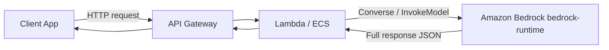
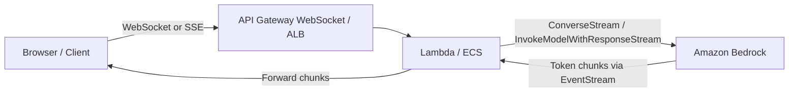
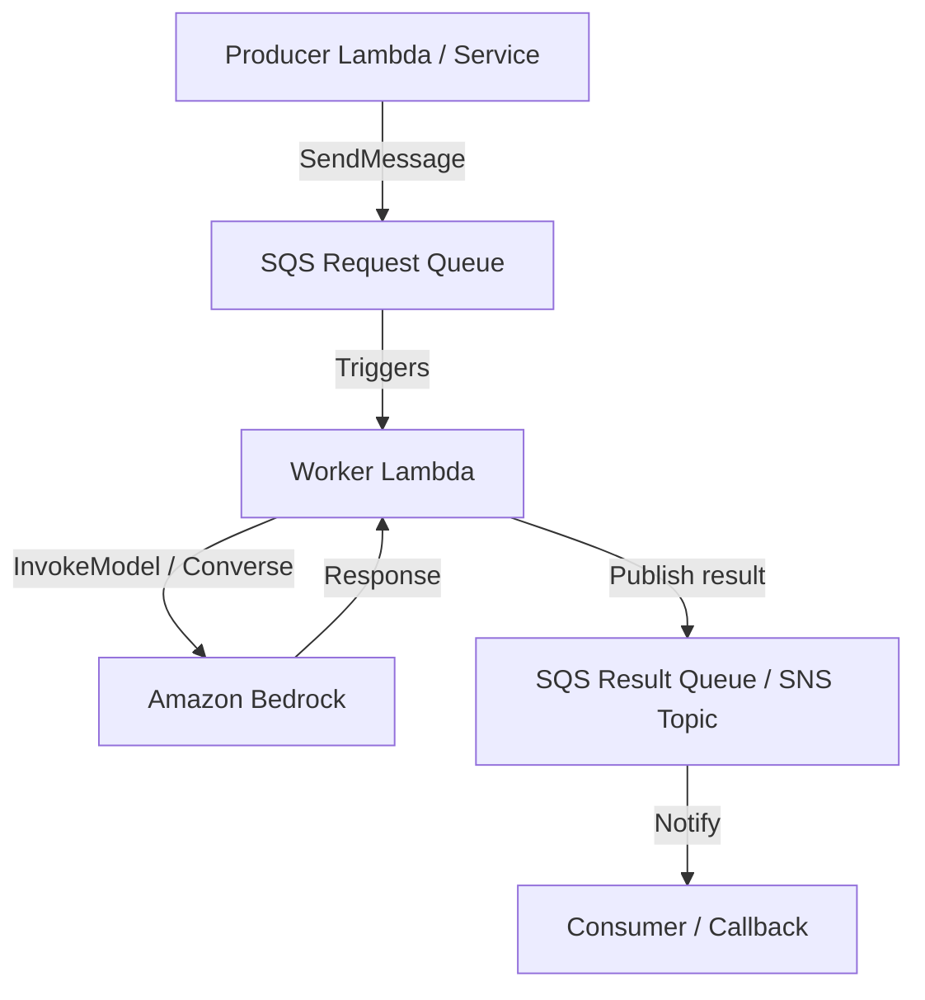
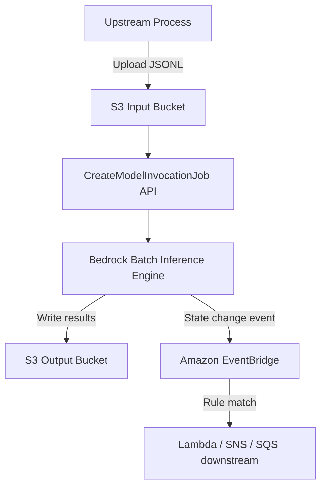
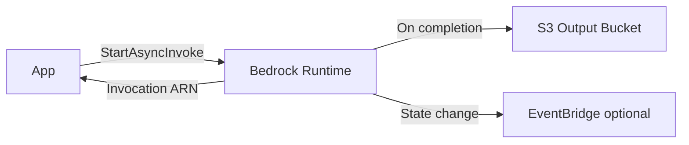

# Lecture 05 — FM API Integration: Sync/Async, Streaming, SQS/SNS, Error Handling

## Why This Topic Matters

Every GenAI application you build on AWS eventually calls a foundation model. The question is *how*: do you wait for the full response, stream tokens as they arrive, fire-and-forget to S3, or decouple the call through a message queue? Each pattern has a different latency profile, cost implication, and failure mode. The exam tests whether you can match an integration pattern to a given workload requirement — and whether you understand the API-level differences between Bedrock's invocation surfaces.

## Concept Overview

Amazon Bedrock exposes model inference through several distinct API surfaces on the `bedrock-runtime` endpoint. Choosing the right surface is the first architectural decision:

- **Converse / ConverseStream** — the recommended, model-agnostic API for conversational applications. Works consistently across all Bedrock models that support messages. Write once, swap models without rewriting call logic. Supports tool use and guardrails.
- **InvokeModel / InvokeModelWithResponseStream** — the lower-level API with model-specific request bodies. Required when you need to pass model-specific parameters not exposed by the Converse abstraction layer.
- **StartAsyncInvoke** — submit a prompt and walk away. Response is written to S3. Primarily used for long-running generation such as video. Not a general-purpose async queue pattern.
- **Batch Inference (CreateModelInvocationJob)** — process many prompts in a single job. Input is JSONL uploaded to S3; output is JSONL written back to S3. Optimized for large-scale offline workloads.

These are not interchangeable — each is designed for a different traffic shape.

## Architecture Walkthrough

### Pattern 1 — Synchronous (Request-Response)

The simplest pattern. Your application calls `Converse` or `InvokeModel`, blocks until the model responds, then returns the result to the caller.

**When to use:** Interactive single-turn queries where response time < Lambda's 15-minute limit. Total end-to-end latency is bounded by the model's time-to-last-token (TTLT).

**IAM permission:** `bedrock:InvokeModel`

---

### Pattern 2 — Streaming (Server-Sent Events)

The model generates tokens incrementally. Your application receives and renders them in real time, dramatically improving perceived latency for long outputs.

**When to use:** Chat UIs, code assistants, any output the user reads as it's generated. `ConverseStream` returns an event-stream; your code iterates over chunk events.

**IAM permission:** `bedrock:InvokeModelWithResponseStream`

**Lambda caveat:** Lambda response streaming (`InvokeWithResponseURL`) is required to proxy token streams to clients — standard Lambda responses buffer the entire payload.

---

### Pattern 3 — Asynchronous via SQS/SNS + Lambda

Bedrock's `StartAsyncInvoke` targets video generation specifically. For general async decoupling of FM calls, the pattern is to put a message on SQS, have a Lambda worker consume it, call `InvokeModel` or `Converse` synchronously, and push results back via another SQS queue, SNS topic, or DynamoDB.

**When to use:**
- Workloads where callers cannot hold an HTTP connection open (mobile apps, third-party webhooks)
- Rate limiting and backpressure — SQS naturally buffers bursts against Bedrock's tokens-per-minute (TPM) quota
- Fan-out: SNS delivers results to multiple downstream consumers simultaneously

**Key design choices:**
- Set SQS `VisibilityTimeout` ≥ expected Bedrock latency to prevent duplicate processing
- Use a Dead Letter Queue (DLQ) for messages that fail after N retries
- For guaranteed ordering with FIFO semantics, use SQS FIFO queues

---

### Pattern 4 — Batch Inference (Offline Large-Scale)

Submit a `CreateModelInvocationJob`. Bedrock processes all records from a JSONL file in S3 and writes outputs back to S3. Use EventBridge to receive job state-change events instead of polling.

**Input format:** Each line in the JSONL is a JSON object with `recordId` and a `modelInput` using either InvokeModel or Converse API format.

**Constraints:**
- Not supported on provisioned throughput models
- Does not support tool calling or structured output (`response_format`)
- Each record is processed independently — no multi-turn conversations
- Discount pricing vs on-demand (check [Bedrock pricing](https://aws.amazon.com/bedrock/pricing/))

---

### Pattern 5 — StartAsyncInvoke (Video Generation)

Purpose-built for long-running generative tasks such as video. Returns an invocation ARN immediately; the output (video file) is deposited in S3 when complete.

**Not a general async queue.** For text/image workloads requiring async, use SQS + Lambda wrapping synchronous `InvokeModel`.

## Real-World Example

A financial services firm needs to summarize 50,000 customer support tickets overnight to identify recurring issues. They cannot afford the per-request latency of 50,000 sequential API calls, and they want simple cost controls.

**Solution:**
1. Export tickets as JSONL (one record per ticket) to S3.
2. Submit a `CreateModelInvocationJob` pointing at that S3 prefix.
3. Configure an EventBridge rule: when the job state transitions to `Completed`, trigger a Lambda that reads the output JSONL, aggregates theme clusters, and posts a summary to an SNS topic subscribed by the analytics team.

This avoids building a custom queuing system, gets batch pricing, and uses event-driven notification instead of polling.

## AWS Services Involved

| Service | Role |
|---------|------|
| Amazon Bedrock (bedrock-runtime) | InvokeModel, InvokeModelWithResponseStream, Converse, ConverseStream, StartAsyncInvoke |
| Amazon Bedrock (bedrock control plane) | CreateModelInvocationJob (batch) |
| Amazon SQS | Async decoupling, rate buffering, DLQ |
| Amazon SNS | Fan-out delivery of results to multiple consumers |
| Amazon S3 | Input/output store for batch inference and async invoke |
| Amazon EventBridge | Job state change events for batch and async workflows |
| AWS Lambda | Worker compute for SQS-triggered FM calls; streaming proxy |
| API Gateway | Entry point for sync/streaming client connections |

## Trade-offs and Design Choices

| Pattern | Latency | Throughput | Use When |
|---------|---------|------------|----------|
| Sync (`Converse`) | Low, bounded by TTLT | Limited by TPM quota per-caller | Interactive chat, single-turn queries |
| Streaming (`ConverseStream`) | Perceived low (first token fast) | Same as sync | Chat UIs, user-facing long output |
| SQS + Lambda (async) | Higher (queue delay) | High — buffer absorbs bursts | Offline pipelines, mobile clients, fan-out |
| Batch (`CreateModelInvocationJob`) | Highest (job scheduling) | Highest, batch discount | Bulk offline processing, cost-sensitive |
| `StartAsyncInvoke` | High, S3 polling/EventBridge | N/A | Video/long-form media generation only |

**Converse vs InvokeModel:** Always prefer `Converse` for new code. It normalizes the request/response shape across models, making it easy to swap models without rewriting integration logic. Use `InvokeModel` only when you need to pass model-specific parameters not exposed by `Converse`.

**SQS VisibilityTimeout:** Must be ≥ the expected model response time. If the worker Lambda times out before completing, SQS will redeliver the message to another worker — causing duplicate invocations and doubled cost.

**Batch vs SQS async:** Batch is for true offline bulk processing where you can tolerate job scheduling overhead and don't need tool use. SQS is better when you need per-message callbacks, fine-grained retries, or tool use in the FM call.

## Key Points

- `Converse` / `ConverseStream` — model-agnostic API, recommended for all new conversational workloads; requires `bedrock:InvokeModel` / `bedrock:InvokeModelWithResponseStream` permissions
- `InvokeModel` — sync, single prompt, model-specific request body; streaming variant is `InvokeModelWithResponseStream`
- `StartAsyncInvoke` — async fire-and-forget to S3; primarily for video generation, not general async text
- `CreateModelInvocationJob` — batch JSONL → S3; not for provisioned throughput; no tool calling; no multi-turn
- SQS + Lambda = the standard pattern for async text/image FM calls with retry, backpressure, and fan-out
- EventBridge for batch/async job state changes — avoids polling `GetModelInvocationJob`
- Lambda streaming (`InvokeWithResponseURL`) is required to forward Bedrock token streams to HTTP clients

## Common Misconceptions

- **"`StartAsyncInvoke` is for async text generation"** — No. It is primarily for video and other long-form media. For async text pipelines, use SQS + Lambda wrapping synchronous `InvokeModel`/`Converse`.
- **"Batch inference supports tool use"** — No. Each JSONL record is processed independently; tool calling and structured output are explicitly not supported.
- **"Converse requires a different IAM permission than InvokeModel"** — Converse maps to `bedrock:InvokeModel`; ConverseStream maps to `bedrock:InvokeModelWithResponseStream`. Same permissions, different API surface.
- **"Batch inference works with provisioned throughput"** — Not supported. Batch uses on-demand pricing (with a batch discount).

## Exam Tips

- Questions will test your ability to choose sync vs async vs streaming vs batch given constraints: latency, cost, workload size, client connection type
- "Mobile app cannot hold connection open" → SQS decoupled async pattern
- "Process 100,000 records overnight at lowest cost" → Batch inference
- "User needs to see response token-by-token" → `ConverseStream` or `InvokeModelWithResponseStream`
- "Video generation" → `StartAsyncInvoke`
- When the exam says "EventBridge notification on job completion" for Bedrock, it means batch or async invoke job state changes — not individual model invocations
- `Converse` is the recommended API for multi-model portability — "write once, use with any supported model"

## Gotchas

- **SQS VisibilityTimeout must exceed FM latency** — otherwise messages redeliver mid-processing, causing duplicates
- **Lambda default timeout is 3 seconds** — you must extend this when calling Bedrock synchronously; large models can take 30–120+ seconds for long completions
- **Batch inference has no tool use** — if your pipeline needs agents or function calling, batch is disqualified
- **Batch JSONL records need a `recordId`** — output lines are keyed back by this; without it you can't correlate inputs to outputs
- **EventBridge Bedrock events are best-effort** — not guaranteed delivery; for critical workflows, also poll `GetModelInvocationJob` as a fallback

## Practice Question

A retail company runs a nightly job that generates personalized product description drafts for 200,000 SKUs. The job starts at midnight and results must be in S3 by 6 AM. The team wants to minimize cost and avoid building a custom queuing system. Which API pattern should they use?

A) Call `InvokeModel` in a for-loop from a Lambda function  
B) Use `ConverseStream` behind API Gateway to stream results to S3  
C) Submit a `CreateModelInvocationJob` with JSONL input in S3  
D) Use `StartAsyncInvoke` for each SKU and poll for results

---

**Answer: C**

`CreateModelInvocationJob` (batch inference) is purpose-built for this pattern. JSONL input in S3, asynchronous processing, S3 output, batch discount pricing, and EventBridge notification on completion. No custom queuing required.

- A: A for-loop in Lambda would hit TPM rate limits, Lambda timeout limits, and pay on-demand pricing per call.
- B: `ConverseStream` is for interactive streaming UIs, not bulk offline output to S3.
- D: `StartAsyncInvoke` is for video/long-form media generation, not text at scale. Polling 200,000 invocations would also be operationally impractical.

## Source

- [Making inference requests — Amazon Bedrock User Guide](https://docs.aws.amazon.com/bedrock/latest/userguide/inference.html)
- [Inference using Invoke API](https://docs.aws.amazon.com/bedrock/latest/userguide/inference-api.html)
- [Inference using Converse API](https://docs.aws.amazon.com/bedrock/latest/userguide/conversation-inference.html)
- [Process multiple prompts with batch inference](https://docs.aws.amazon.com/bedrock/latest/userguide/batch-inference.html)
- [Create a batch inference job](https://docs.aws.amazon.com/bedrock/latest/userguide/batch-inference-create.html)
- [Monitor Amazon Bedrock job state changes using Amazon EventBridge](https://docs.aws.amazon.com/bedrock/latest/userguide/monitoring-eventbridge.html)

